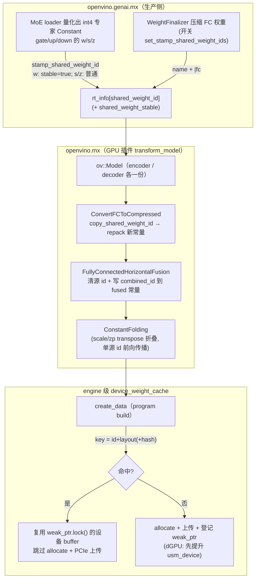

# DiffusionGemma encoder/decoder 权重共享 —— 实现逻辑总结与代码评审

> 配套文档：设计见 [`diffusion_gemma_weight_shared_design.md`](./diffusion_gemma_weight_shared_design.md)。
> 本文基于工作区**当前未提交（uncommitted）**的实现代码梳理「实际落地了什么」、
> 「是否存在问题」、「是否影响原有逻辑」。涉及两个仓库：`openvino.genai.mx`（生产侧/打标记）、
> `openvino.mx`（GPU 插件侧/设备 buffer 去重）。

---

## 0. TL;DR（结论先行）

- **实际落地了两条路径中的「路径1（GPU 设备 buffer 去重）」+「路径2 的 a 子项（GenAI 打稳定身份）」**；
  设计文档里的「路径2b：`SharedQuantWeightCache`（量化产物主机缓存）」**未实现**（暂缓）。
- **机制**：GenAI 侧给跨图复用的权重 `Constant` 写 `rt_info["shared_weight_id"]`（可选 `shared_weight_stable`）；
  GPU 插件 `create_data` 读该 id，在 **engine 级 `device_weight_cache`** 里按
  `id + layout + (内容 hash)` 去重，命中即复用同一块设备 buffer、跳过分配与 PCIe 上传。
- **正确性**：核心安全保证是**内容寻址**——非 stable 权重的 cache key 含**最终字节的 hash**，
  只有逐 bit 相同才命中，跨图字节分叉自动 MISS，按构造不会错配。stable 权重（MoE 专家）跳过 hash 走快路径，
  依赖「确定性量化 + 无 repack ⇒ (id,layout) 已定身」这一前提。
- **对原有逻辑的影响**：**默认零影响**。所有新分支都以「`Constant` 是否带 `shared_weight_id`」为开关，
  只有 DiffusionGemma（且 `use_fused_moe` 开启）才会写该 id；其它任何模型 / 普通常量 key 为空，
  完全走原路径。新增的 `_weight_cache` 成员对非共享模型计数恒 0、不打印。
- **主要残留风险**：① stable 快路径无内容校验，依赖「MoE 专家此后永不被 per-graph repack」的不变式；
  ② 离散 GPU（dGPU）的 `usm_device` 提升分支仅在 iGPU 机器上验证过、dGPU 路径**未端到端实测**；
  ③ 内容 hash 用非密码学 `std::hash`，理论碰撞概率极低但非零（已用 `byte_size` 加固）。

---

## 1. 实际改动文件清单

### 1.1 `openvino.genai.mx`（生产侧：写稳定身份）

| 文件 | 改动 |
|---|---|
| [`modeling_diffusion_gemma_text.cpp`](../../../../openvino.genai.mx/src/cpp/src/modeling/models/diffusion_gemma/modeling_diffusion_gemma_text.cpp) | 新增 `detail::stamp_shared_weight_id(t, id, stable)`；MoE loader 对 9 个专家常量（gate/up/down 的 `w`/`s`/`z`）打 id：`*_w_q_` 传 `stable=true`，scale/zp 不 stable |
| [`safetensors_weight_finalizer.hpp`](../../../../openvino.genai.mx/src/cpp/src/safetensors_utils/safetensors_weight_finalizer.hpp) | 新增开关 `set_stamp_shared_weight_ids(bool)` + 私有成员 `stamp_shared_weight_ids_ = false` |
| [`safetensors_weight_finalizer.cpp`](../../../../openvino.genai.mx/src/cpp/src/safetensors_utils/safetensors_weight_finalizer.cpp) | 两条压缩权重路径（flat / grouped）在 `stamp_shared_weight_ids_` 开启时给 FC 权重 `Constant` 写 `rt_info["shared_weight_id"] = name + "|fc"` |
| [`modeling_diffusion_gemma.cpp`](../../../../openvino.genai.mx/src/cpp/src/modeling/samples/modeling_diffusion_gemma.cpp) | encoder/decoder 两个 finalizer 各调 `set_stamp_shared_weight_ids(use_fused_moe)` 打开 FC 打标记 |

### 1.2 `openvino.mx`（GPU 插件侧：设备 buffer 去重）

| 文件 | 改动 |
|---|---|
| [`runtime/engine.hpp`](../../../../openvino.mx/src/plugins/intel_gpu/include/intel_gpu/runtime/engine.hpp) | 新增 `struct device_weight_cache`（`mutex` + `unordered_map<string, weak_ptr<memory>>` + 4 个原子计数器）；`engine` 加成员 `_weight_cache` 与访问器 `get_weight_cache()` |
| [`plugin/ops/constant.cpp`](../../../../openvino.mx/src/plugins/intel_gpu/src/plugin/ops/constant.cpp) | `create_data` 读 `shared_weight_id`/`shared_weight_stable`，组装内容寻址 key，查/填 engine cache；命中复用 buffer、跳过 allocate+memcpy；dGPU 上把命中 buffer 提升为 `usm_device` |
| [`plugin/program_builder.cpp`](../../../../openvino.mx/src/plugins/intel_gpu/src/plugin/program_builder.cpp) | 顶层 program build 后打**一行** `[weight-cache] cumulative: …` 摘要（`is_inner_program` 时不打） |
| [`transformations/shared_weight_id.hpp`](../../../../openvino.mx/src/plugins/intel_gpu/src/plugin/transformations/shared_weight_id.hpp)（新文件） | `SHARED_WEIGHT_ID_KEY` 常量、`copy_shared_weight_id(from,to)`、`find_weight_constant(node)`（回溯 Reshape/Transpose/Convert 找底层 Constant） |
| [`transformations/convert_fc_to_compressed.cpp`](../../../../openvino.mx/src/plugins/intel_gpu/src/plugin/transformations/convert_fc_to_compressed.cpp) | 重打包出新 `Constant` 后 `copy_shared_weight_id(constant, new_constant)`，把 id 带到 repack 产物上 |
| [`transformations/fc_horizontal_fusion.cpp`](../../../../openvino.mx/src/plugins/intel_gpu/src/plugin/transformations/fc_horizontal_fusion.cpp) | 水平融合时：若所有 constituent 都带 id，则**清掉**源常量 id、把按序拼接的 `combined_id` 写到 `fused_weight` 上 |

---

## 2. 实现机制（端到端数据流）



### 2.1 路径2a：GenAI 写稳定身份

- **身份载体**：`rt_info["shared_weight_id"]`（字符串，由「safetensors key + role 后缀」派生）。
  两次 build（encoder/decoder）对同一逻辑权重得到**完全相同**的 id。**不用** friendly_name（自增、跨图不同）、
  **不用**主机指针（释放后可能被复用 → 错配）。
- **stable 标记**：`rt_info["shared_weight_stable"]="1"` 只打在 3 个 int4 MoE 专家权重 `*_w_q_` 上 ——
  它们由确定性量化产生、被 `MOECompressed` 原样消费、create_data 之前无 repack ⇒ `(id, layout)` 已唯一定身，
  GPU 侧可**跳过算 hash**（省下读 ~12 GB 冷权重的开销）。
- **scale/zp**：也打了 id（**非** stable）。它们会被 `reshape→transpose` 常量折叠成新节点，
  实现依赖 `ConstantFolding` 的**单源 rt_info 前向传播**（`copy_runtime_info_from_input_values` +
  `copy_runtime_info`，见 [`constant_folding.cpp:160-163`](../../../../openvino.mx/src/core/src/pass/constant_folding.cpp#L160)）
  把 id 带到折叠产物上。即便传播失败、id 丢失，也只是退化为「不共享」（无害）。
- **FC 稠密 / fused-QKV 权重**：finalizer 打 `name + "|fc"`（非 stable）。它们会被 GPU 侧 repack/horizontal-fusion，
  字节可能逐图不同 → 必须靠 GPU 侧内容 hash 兜底。

### 2.2 GPU 侧 id 在变换 pass 中的搬运

repack/fusion 会把权重重建成**新 `Constant`（rt_info 为空）**，故 id 必须显式搬运（与既有 `copy_weightless_cache_attr` 同理）：

- **`ConvertFCToCompressed`**：reshape 重打包出 `new_constant` 后 `copy_shared_weight_id(constant, new_constant)`。
- **`FullyConnectedHorizontalFusion`**：把多路 FC 权重 Concat 成一块。
  - 仅当**所有** constituent 都带 id 时启用（即 DiffusionGemma）；
  - 关键细节：**先清掉每个源常量的 id**，再把按序拼接的 `combined_id`（`a+b+c`）写到 `fused_weight`。
    因为折叠会用 `copy_runtime_info_from_input_values` 合并多源 rt_info，**多源同键冲突会被整体丢弃**——
    若不清源、让多个不同 id 撞在一个键上，反而把要保留的 id 一起带走。

### 2.3 路径1：GPU 设备 buffer 去重（`create_data`）

1. **组 key**：读 `op->get_rt_info()["shared_weight_id"]`；无 → `weight_cache_key` 空 → 走原逻辑。
   有则 `key = id + "|" + layout.to_string()`；若**非** stable，再追加 `"|h<hash>|s<byte_size>"`，
   `hash = std::hash<string_view>(data_ptr, byte_size)`（全 buffer 内容寻址）。
2. **图内 `blobMemCache`（保留）**：先按主机指针查图内去重缓存（原有行为，不动）。
3. **engine cache 查表**（miss `blobMemCache` 后）：加锁查 `entries[key]`；`weak_ptr.lock()` 成功即**命中**：
   - 复用该 `memory::ptr`，**跳过 `allocate_memory` + memcpy 上传**，`hint_evict` 后
     `add_primitive(cldnn::data(id, mem))`，登记图内 `blobMemCache`，**提前 return**。
   - 命中计数 `hit_count++`、`bytes_saved += mem->size()`。
4. **未命中**：照原逻辑 `allocate_memory` + 写入（含 f64→f32 / u16/i16→f32 的特殊转换分支，原样保留），
   然后 `miss_count++`、`bytes_uploaded += size`，把 `weak_ptr` 登记进 `entries[key]`。
5. **dGPU 提升**：仅对带 id 的共享权重，在离散 GPU 上把 buffer 预先 `copy_from` 到 `usm_device`，
   规避后续 `program::transfer_memory_to_device` 把 `usm_host` **逐网络私有化**成 device buffer（会破坏跨图共享）。
   iGPU（Xe2+）该 transfer 本就跳过 → 不提升、直接共享 `usm_host`。

### 2.4 生命周期与跨图存活

- `device_weight_cache` 用 **`weak_ptr` 持有**，**不延长** buffer 生命周期；真正 owner 是各 `CompiledModel` 的
  `cldnn::data` primitive。命中后 `weak_ptr` 失效（lock 返回空）则擦除条目、退化为「重新分配」。
- 跨图存活前提：**encoder 先编译且其 `CompiledModel` 全程存活**（sample 中 `compiled_encoder` 不释放，
  生成阶段每 canvas 重跑）→ decoder 编译时 encoder 的设备 buffer 仍被其 `cldnn::data` 持有 → lock 成功。
- engine 单例前提：同 Core+设备的多次 `compile_model` 复用同一 `cldnn::engine`（按设备单例 `RemoteContextImpl` 持有），
  故挂在 engine 上的 cache 天然跨两个 `CompiledModel`。

---

## 3. 与设计文档的差异

| 项 | 设计文档 | 实际实现 | 说明 |
|---|---|---|---|
| 路径2b（量化产物主机缓存 `SharedQuantWeightCache`） | 列为第二步 | **未实现** | 暂缓；只做设备去重已验证收益。主机 RSS 峰值由 build/量化主导，未降（设备侧重复已消除） |
| scale/zp 是否共享 | 早期结论「排除」，列为 Phase 2 待办 | **已打 id（非 stable）** | 实现比文档「最终状态」更进一步，靠内容 hash 兜底安全；即便折叠丢 id 也只是不共享 |
| id 后缀格式 | `|gate|w` | `|gate_w` | 仅命名差异，无功能影响 |
| 内容 hash | 后续「扩展到 FC」章节才引入 | 已落地（非 stable 全部走 hash） | 与文档「content-hash + stable 快路径」一致 |
| stamp 函数名 | `stamp_dg_id` | `detail::stamp_shared_weight_id` | 命名差异；语义一致（写私有 rt_info，不动 `ops::constant`） |

> 一致性结论：实现**遵循了设计的核心决策**（rt_info 私有键、不污染通用 helper、内容寻址 + stable 快路径、
> weak_ptr engine cache、两步解耦可回退），并把 scale/zp 也纳入（hash 保护下安全）。

---

## 4. 正确性与问题分析

### 4.1 安全性论证（为什么不会错配）

1. **非 stable 权重：内容寻址**。key 含最终字节 hash + byte_size，**命中 ⟺ 逐 bit 相同**。
   FC/fused-QKV 跨图字节分叉 → hash 不同 → MISS → 各自上传，按构造正确。
2. **stable 权重（MoE 专家）：依赖不变式**。跳过 hash，靠「确定性量化 + `MOECompressed` 原样消费 + create_data 前无 repack ⇒ (id,layout) 唯一定身」。
   设计 §2 已用源码证三条充要条件（同源字节 / 同变换 / 纯确定性映射）。
3. **layout 指纹**：key 含 `layout.to_string()`（dtype/format/shape/padding），layout 不同必不命中。
4. **id 缺失即降级**：任何环节拿不到 id（含 scale/zp 折叠丢 id、FC 混合 id 冲突被丢）→ key 空 → 走原逻辑，
   只损失去重、不影响正确性。

### 4.2 潜在问题 / 风险（需关注）

- **【中】stable 快路径无运行时内容校验**。`*_w_q_` 跳过 hash，完全信任 (id,layout)。
  若**未来**有 pass 对 MoE 专家做 per-graph 重打包（目前 `post_optimize_weights` 只碰 conv/fc/lstm/gru、不碰 MoE），
  stable 路径会把字节不同的 buffer 错配且**静默**。当前安全，但属维护期不变式，建议加注释/断言守护
  （或对 stable 也保留一个「轻量校验」开关）。设计 §5.4 提到 layout 断言，实现中 key 已含 layout 指纹但**未额外加断言**。
- **【中】dGPU `usm_device` 提升分支未端到端验证**。所有实测在 iGPU（Arc B390/Xe3，integrated）完成，
  该分支在集显上 dormant。离散 GPU 上 `copy_from` + `transfer_memory_to_device` 交互需在真实 dGPU 上回归。
- **【低】内容 hash 为非密码学 `std::hash<string_view>`**。进程内确定（encoder/decoder 同进程同值），
  已用 `byte_size` 加固；不同逻辑权重 id 不同不会撞，同 id 下字节不同碰撞概率约 2⁻⁶⁴，可接受。
- **【低】并发编译下的 TOCTOU**。查表锁释放后到登记之间存在窗口，两线程可能都 MISS 并各自上传、后者覆盖前者条目。
  非正确性问题（两 buffer 字节相同），仅少一次去重；本 pipeline **串行编译**，锁为防御性。
- **【低】hash 读取冷权重的成本**。非 stable 权重要读全 buffer 算 hash；MoE 专家用 stable 规避了这块大头，
  仅 FC（~1.5 GB，repack 本就碰字节）付 hash，符合设计权衡。

### 4.3 是否影响原有代码逻辑

**结论：对非 DiffusionGemma 路径零行为变化。** 逐项核对：

- **总开关是 id**：`weight_cache_key` 为空时，所有新分支（engine cache 查/填、dGPU 提升、计数）全部跳过，
  `create_data` 等价于原实现。只有 DiffusionGemma 且 `use_fused_moe=true` 才会写 id。
- **`create_data` 重构是行为保持的**：原先 `mem_lock` 持有到 else 块末尾，现改为**写完即出作用域**（提前解锁），
  随后才做 dGPU 提升 / `hint_evict` / `add_primitive`。对普通模型只是锁范围收窄（数据已写完），无语义变化；
  f64→f32、u16/i16→f32 等特殊分支原样保留在新作用域内。
- **`blobMemCache` 图内去重保留**：先查图内缓存，未命中才进 engine cache，原有图内去重行为不变。
- **`engine` 新增成员安全**：`_weight_cache`（mutex+atomic+map）不影响 engine 既有可拷贝性（engine 本就含 atomic、非可拷贝）；
  对未用该特性的模型，计数恒 0、`program_builder` 摘要行 `if (hits || misses)` 不触发、不打印。
- **FC 两个 pass 改动是条件触发**：`copy_shared_weight_id` 在源无 id 时是 no-op；horizontal fusion 的 id 合并
  仅当**全部** constituent 带 id 才进入（即仅 DiffusionGemma），其它模型完全不进该分支。
- **GenAI finalizer 开关默认关**：`stamp_shared_weight_ids_ = false`，非 DiffusionGemma sample 不调 setter → 不打 FC id。

---

## 5. 诊断与可观测性

- **engine cache 计数器**：`hit_count / miss_count / bytes_saved / bytes_uploaded`（原子）。
- **每常量命中日志**：`GPU_DEBUG_LOG`（verbose 才出，避免 ~2k 常量刷屏）。
- **一行累计摘要**：`program_builder.cpp` 在顶层 build 后用 `GPU_DEBUG_COUT` 打
  `[weight-cache] cumulative: hits=… misses=… bytes_saved=… bytes_uploaded=…`，
  非共享模型不打印。
- 设计文档实测（iGPU，Config G / 0623）：`hits=248, bytes_saved≈12.97 GB`，decoder 复用约 93% 权重字节，
  decoder GPU 编译 ~31s（vs hash-everything ~114s），峰值工作集 38.59 GiB → 14.89 GiB，吞吐 2.99 → 5.34 tok/s，
  输出逐字节一致、零 NaN/异常。

---

## 6. 回退策略

- 路径1 对「无 id」常量完全透明（直接走原逻辑），即便路径2 没打上 id，也只退回现状（两份显存），不会出错。
- 两步解耦：可单独回退 GPU 侧（删 `create_data` 新分支 + engine cache）或 GenAI 侧（关 `set_stamp_shared_weight_ids` +
  不调 `stamp_shared_weight_id`）。任一侧缺失，另一侧自动降级为「不共享」。
- 总开关：GenAI 侧 `use_fused_moe` / `set_stamp_shared_weight_ids(false)` 即可一键关闭整套特性。

---

## 7. 扩展实现：IR 图缓存（Plan C）下的共享回归修复（2026-06-25，可序列化 `SharedWeightId`）

> 设计见 design 文档「✅ 扩展到 IR 图缓存（Plan C）」一节。本节记录**实际落地了什么代码**、为什么、
> 以及构建/部署/验证流程。核心：让 `shared_weight_id` 活过 `ov::serialize` 往返，**GPU 插件零改动**。

### 7.1 问题（一句话）
`--cache-model` 把 build 后的 `ov::Model` 经 IR 往返（`ov::serialize` → `core.read_model`）以跳过 ~722s
build+量化。但 `shared_weight_id` / `shared_weight_stable` 是**纯字符串 rt_info**，`ov::serialize` 只写
`is_deterministic()==true` 的 `RuntimeAttribute`、**丢弃纯字符串** ⇒ 缓存模型丢失共享身份 ⇒ encoder/decoder
各上传一份 ~12GB MoE ⇒ ~27GB > 16.5GB 显存 ⇒ 换页 ⇒ decoder 14→6 tok/s。

### 7.2 改动文件清单

#### core（`openvino.mx`）
| 文件 | 改动 |
|---|---|
| [`transformations/include/transformations/rt_info/shared_weight_id_attribute.hpp`](../../../../openvino.mx/src/common/transformations/include/transformations/rt_info/shared_weight_id_attribute.hpp)（**新**） | header-only `ov::SharedWeightId : public ov::RuntimeAttribute`；`OPENVINO_RTTI("SharedWeightId","0", ov::RuntimeAttribute)`；成员 `std::string id; bool stable=false;`；`visit_attributes` 内联读写 `id`/`stable` |
| [`transformations/include/transformations/rt_info/attributes.hpp`](../../../../openvino.mx/src/common/transformations/include/transformations/rt_info/attributes.hpp) | `#include` 新头文件 |
| [`transformations/src/transformations/rt_info/attributes.cpp`](../../../../openvino.mx/src/common/transformations/src/transformations/rt_info/attributes.cpp) | `ov::pass::Attributes` 构造里加 `register_factory<ov::SharedWeightId>();` |
| [`ov_ops/moe_compressed.cpp`](../../../../openvino.mx/src/common/transformations/src/ov_ops/moe_compressed.cpp) | `visit_attributes` 在 `MOE::visit_attributes(visitor)` 后补 `static_cast<MOE::Config&>(m_config) = MOE::get_config();`（修复反序列化后派生 config 走错 MoE 路径） |

#### genai（`openvino.genai.mx`）
| 文件 | 改动 |
|---|---|
| [`safetensors_weight_finalizer.cpp`](../../../../openvino.genai.mx/src/cpp/src/safetensors_utils/safetensors_weight_finalizer.cpp) | flat / grouped 两处压缩权重，在写纯字符串 `["shared_weight_id"]=name+"\|fc"` 的**同时**写属性 `[ov::SharedWeightId::get_type_info_static()] = ov::SharedWeightId(name+"\|fc", /*stable=*/false)`（并存、加打） |
| [`modeling_diffusion_gemma_text.cpp`](../../../../openvino.genai.mx/src/cpp/src/modeling/models/diffusion_gemma/modeling_diffusion_gemma_text.cpp) | `stamp_shared_weight_id` helper 末尾并存写 `[SharedWeightId] = ov::SharedWeightId(id, stable)` |
| [`modeling_diffusion_gemma.cpp`](../../../../openvino.genai.mx/src/cpp/src/modeling/samples/modeling_diffusion_gemma.cpp) | 新增 `restore_shared_weight_ids(model)` lambda；`load_or_build` 在**每次** `read_model`（warm 读 + cold 重读）后调用；cold 路径 `ov::serialize` 后重读 IR；`--cache-model` 时注册 `MOECompressed` OpExtension |

### 7.3 关键代码

**core 属性（header-only，仿 `Decompression`，无新 .cpp → 不触发 GLOB 重配置）**
```cpp
class TRANSFORMATIONS_API SharedWeightId : public ov::RuntimeAttribute {
public:
    OPENVINO_RTTI("SharedWeightId", "0", ov::RuntimeAttribute);   // RTTI 名≠纯字符串键，避免撞键
    SharedWeightId() = default;
    SharedWeightId(std::string id, bool stable) : id(std::move(id)), stable(stable) {}
    bool visit_attributes(AttributeVisitor& visitor) override {
        visitor.on_attribute("id", id);
        visitor.on_attribute("stable", stable);
        return true;
    }
    std::string id;
    bool stable = false;
};
```

**genai 加打（并存，fresh 路径行为不变）**
```cpp
node->get_rt_info()["shared_weight_id"] = id;                 // GPU 插件读的工作形态（保留）
if (stable) node->get_rt_info()["shared_weight_stable"] = std::string("1");
node->get_rt_info()[ov::SharedWeightId::get_type_info_static()] = ov::SharedWeightId(id, stable);  // 可序列化镜像
```

**sample 读回还原（GPU 插件因此零改动）**
```cpp
auto restore_shared_weight_ids = [](const std::shared_ptr<ov::Model>& m) {
    if (!m) return;
    for (const auto& node : m->get_ops()) {
        auto& rt = node->get_rt_info();
        auto it = rt.find(ov::SharedWeightId::get_type_info_static());
        if (it == rt.end()) continue;
        const auto& swid = it->second.as<ov::SharedWeightId>();
        rt.emplace("shared_weight_id", swid.id);
        if (swid.stable) rt.emplace("shared_weight_stable", std::string("1"));
    }
};
// load_or_build：warm 读 与 cold 重读 后各调一次
model = core.read_model(xml, bin);
restore_shared_weight_ids(model);
```

### 7.4 为什么 GPU 插件不用改
`constant.cpp` 仍只读纯字符串键 `shared_weight_id` / `shared_weight_stable`。属性只是 IR 往返的**载体**，
读回后由 sample 还原成纯字符串。⇒ `constant.cpp` / `convert_fc_to_compressed.cpp` / `fc_horizontal_fusion.cpp` /
`shared_weight_id.hpp` 全部**不动**，无需重编 `openvino_intel_gpu_plugin.dll`。

### 7.5 blob-key 一致性（不破坏 §"扩展到 FC" 的 blob cache）
- 还原写回的纯字符串**不被序列化**，故 `compute_hash`（blob key）算不到它。
- `SharedWeightId` 属性在 cold-重读 与 warm-读 上**完全一致**（同 IR），且 cold 也走「重读+还原」编译反序列化模型。
- ⇒ cold 导出 blob 的 key 与每个 warm run 的 key 一致 → 首个 warm run 即命中 blob。

### 7.6 构建 / 部署 / 验证
1. **core 重建**：`cmake --build build\build_ov --config Release --parallel 16 --target openvino`
   （仅 `attributes.cpp` 重编 + `openvino.dll` 重链；新头文件随 install 进 `developer_package`，供 genai include）
   → `cmake --install build\build_ov --config Release` → **手动**把
   `build\build_ov\install\runtime\bin\intel64\Release\openvino.dll` 覆盖到 `build\install\...\openvino.dll`。
2. **genai 重建**：`cmake --build build --config Release --parallel 16 --target modeling_diffusion_gemma`
   （链接新 `openvino.dll`；重建前 `taskkill /F /IM modeling_diffusion_gemma.exe` 防 LNK1104）。
3. **验证**：删模型目录旁的旧 IR（属性出现前序列化的）→ cold（build→序列化→重读→还原→编译→导出 blob）→
   warm（读 IR→还原→编译）。看 `[stats] Decoder-only throughput`（目标 ~14，回归态为 6）与
   `[weight-cache] cumulative`（`hits=248 bytes_saved≈12.97GB`）。

### 7.7 验证结果（Arc B390 iGPU，output-tokens 256，`--cache-model`）
| 指标 | COLD | WARM |
|---|---|---|
| decoder-only 吞吐 | **14.22 tok/s** | **14.03 tok/s** |
| 图加载（build/量化 → 读 IR） | ~662s | **~0.4s**（~1685×） |
| 编译（无 `--cache-dir`，全 JIT） | enc 35s + dec 13s | enc 30s + dec 12.5s |
| `[weight-cache]` | hits=248 bytes_saved=12.97GB bytes_uploaded=14.89GB | 同左 |
| GPU 显存（/17.72GB） | 14.89GB（84%，无换页警告） | 同左 |
| 输出 | "Rayleigh scattering…"，`RUN_EXIT=0` | 同左 |

### 7.8 残留 / 注意
- **【低】** `restore_shared_weight_ids` 用 `rt.emplace`：若读回的模型已带同名纯字符串则不覆盖（正常情况 IR 不含纯字符串，故必写入）。
- **【低】** 属性当前只承载 `id` + `stable`；scale/zp 的折叠传播问题（design Phase 2）与本扩展正交，未处理。
- **序列化规则备忘**：只有 `is_deterministic()==true` 的 `RuntimeAttribute` 会被 `ov::serialize` 写入 XML；
  `bool`/`std::string` 经 `RTInfoSerializer`/`RTInfoDeserializer` 可干净往返（bool 读 "true"/"1"/"false"/"0"）；
  反序列化需在 `ov::pass::Attributes` 工厂注册。

---

## 8. 修复：`--cache-dir`（GPU blob 缓存）绕过权重共享，第二次起回归（2026-06-25）

### 8.1 症状与根因
手动测试：**第一次 ~15GB / ~14 tok/s（正常），第二次起 ~28GB / ~6 tok/s（共享失效）**。
根因不在 IR 缓存（`--cache-model` 走 `create_data`、§7 已修好、跨次都共享），而在**编译 blob 缓存**（`--cache-dir`/`ov::cache_dir`）：
第二次起命中 blob → `Plugin::import_model`（[`plugin.cpp:379`](../../../../openvino.mx/src/plugins/intel_gpu/src/plugin/plugin.cpp#L379)）
**直接从 blob 重建权重，不经过 `create_data`** → engine 级 `device_weight_cache` 被绕过 →
encoder/decoder 各 materialize ~14GB → ~28GB > 16.5GB → 换页。

| | RUN1（blob 空→编译+导出） | RUN2（blob 命中→import） |
|---|---|---|
| `[weight-cache]` | `hits=248 bytes_saved=12.97GB` | **无此行**（`create_data` 未运行） |
| decoder 吞吐 | 14.32 tok/s | **6.53 tok/s** |
| Total denoising | 20.4s | 91.6s |

（且 import 53s 比共享 JIT 编译 42s 还慢 → 本模型 `--cache-dir` 纯亏。混用"import encoder + JIT decoder"也不行：被 import 的 encoder 权重不登记进 engine cache、无可命中 → 必须两图都 JIT → 整体禁用 blob 缓存。）

### 8.2 修复（sample 单点，无插件/核心改动）
[`modeling_diffusion_gemma.cpp`](../../../../openvino.genai.mx/src/cpp/src/modeling/samples/modeling_diffusion_gemma.cpp)
生成路径：`use_fused_moe`（GPU 共享激活）为真时**跳过** `core.set_property(ov::cache_dir(...))` 并打印
`[cache-dir] Ignored...`；否则（非 fused-MoE / 非 GPU）维持原 blob 缓存。`--cache-dir` help 文案同步说明互斥。
```cpp
if (opts.cache_dir && use_fused_moe) {
    std::cout << "[cache-dir] Ignored for the fused-MoE GPU path: ..." << std::endl;  // 跳过 blob 缓存
} else if (opts.cache_dir) {
    std::filesystem::create_directories(*opts.cache_dir);
    core.set_property(ov::cache_dir(opts.cache_dir->string()));
}
```
依据：`--cache-model`（IR）已跳过 ~662s build+量化，其 `create_data` 编译**保留共享**，且 JIT 编译（42s）比 blob import（53s）还快 → IR 缓存是该路径唯一正确/最优缓存。

### 8.3 验证（Arc B390，两次连跑 `--cache-model --cache-dir`，output-tokens 256）
| 运行 | `[weight-cache]` | decoder 吞吐 | blob 目录 |
|---|---|---|---|
| FIX1（修复前 RUN1 对应） | `hits=248 bytes_saved=12.97GB` | 13.23 tok/s | 恒空 |
| FIX2（修复前 RUN2 对应，曾 6.5 tok/s） | `hits=248 bytes_saved=12.97GB` | **13.53 tok/s** | 恒空 |
第二次回归消失、跨次稳定在 ~14 tok/s / 14.89GB。
