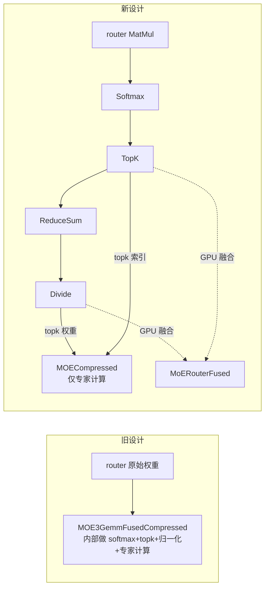

# MoE 重构适配改动总结

> 本文档总结本次 MoE 重构在 `openvino.mx`(核心 + GPU 插件)与 `openvino.genai.mx`(下游 GenAI)
> 两个仓库中的全部改动文件与改动内容,供后续 review / 复现使用。

## 1. 背景与核心设计变更

原先的 `MOE3GemmFusedCompressed` 是一个“大一统”算子:它在 GPU kernel 内部完成路由计算
(`softmax → topk → 归一化`),并直接吃**原始** router 权重。

本次重构将其**拆分**为两部分:

- **`MoERouterFused`**(GPU 插件内部新算子 / primitive):专门负责路由,由图中的
  `MatMul → Softmax → TopK → ReduceSum → Divide` 子图融合而来。
- **`MOECompressed`**(core 内部已有算子,本次扩展):只负责专家计算,吃**已算好**的
  top-k 权重 / 索引。

因此 `MOE3GemmFusedCompressed` **算子类**被删除;但底层 GPU primitive
`moe_3gemm_fused_compressed`(专家计算 kernel)**保留**,只是改由 `MOECompressed` 驱动。



---

## 2. `openvino.mx` 改动(核心 + GPU 插件)

统计:**新增 17 个文件、删除 6 个文件、修改 24 个文件**(tracked 改动合计 +628 / −2286 行)。
策略:MoE 命名文件整体对齐上游;非 MoE 命名的基础设施文件采用**定向精修**(仅改 MoE 相关行,
保留 fork 自有特性)。

### 2.1 新增(17,`MoERouterFused` 相关)

| 类别 | 文件 |
| --- | --- |
| 算子定义 | `src/plugins/intel_gpu/include/intel_gpu/op/moe_router_fused.hpp` |
| primitive 定义 | `src/plugins/intel_gpu/include/intel_gpu/primitives/moe_router_fused.hpp` |
| OCL 实现 | `src/plugins/intel_gpu/src/graph/impls/ocl_v2/moe/moe_router_fused_opt.cpp` |
| OCL 实现 | `src/plugins/intel_gpu/src/graph/impls/ocl_v2/moe/moe_router_fused_opt.hpp` |
| OCL kernel | `src/plugins/intel_gpu/src/graph/impls/ocl_v2/moe_router_fused.cl` |
| graph inst | `src/plugins/intel_gpu/src/graph/include/moe_router_fused_inst.h` |
| graph node | `src/plugins/intel_gpu/src/graph/moe_router_fused.cpp` |
| impl 注册 | `src/plugins/intel_gpu/src/graph/registry/moe_router_fused_impls.cpp` |
| plugin op | `src/plugins/intel_gpu/src/plugin/ops/moe_router_fused.cpp` |
| 融合 pass | `src/plugins/intel_gpu/src/plugin/transformations/fuse_moe_router.cpp` |
| 融合 pass | `src/plugins/intel_gpu/src/plugin/transformations/fuse_moe_router.hpp` |
| 融合 pass(scale) | `src/plugins/intel_gpu/src/plugin/transformations/fuse_moe_router_scale.cpp` |
| 融合 pass(scale) | `src/plugins/intel_gpu/src/plugin/transformations/fuse_moe_router_scale.hpp` |
| plugin op 变换 | `src/plugins/intel_gpu/src/plugin/transformations/op/moe_router_fused.cpp` |
| 单测 | `src/plugins/intel_gpu/tests/unit/test_cases/moe_router_fused_gpu_test.cpp` |
| 单测 | `src/plugins/intel_gpu/tests/unit/transformations/fuse_moe_router_scale_test.cpp` |
| 单测 | `src/plugins/intel_gpu/tests/unit/transformations/fuse_moe_router_test.cpp` |

### 2.2 删除(6,`MOE3GemmFusedCompressed` 算子及其融合 pass)

- `src/common/transformations/include/ov_ops/moe_3gemm_fused_compressed.hpp`
- `src/common/transformations/src/ov_ops/moe_3gemm_fused_compressed.cpp`
- `src/plugins/intel_gpu/include/intel_gpu/op/moe_3gemm_fused_compressed.hpp`
- `src/plugins/intel_gpu/src/plugin/transformations/fuse_moe_3gemm_compressed.cpp`
- `src/plugins/intel_gpu/src/plugin/transformations/fuse_moe_3gemm_compressed.hpp`
- `src/plugins/intel_gpu/tests/unit/transformations/fuse_moe_3gemm_compressed_test.cpp`

### 2.3 修改(24)

**core / common transformations:**

- `src/common/transformations/include/ov_ops/moe_compressed.hpp` —— 扩展 `MOECompressed`(12 输入、校验)
- `src/common/transformations/src/ov_ops/moe_compressed.cpp` —— `validate_and_infer_types` 收紧校验
- `src/common/transformations/src/transformations/common_optimizations/moe_op_fusion.cpp`
- `src/common/transformations/src/transformations/common_optimizations/moe_transpose_weights.cpp`
- `src/common/transformations/tests/common_optimizations/convert_gather_matmuls_moe_block_to_moe_op.cpp`
- `src/core/dev_api/openvino/op/moe.hpp`
- `src/core/src/op/moe.cpp`

**GPU 插件(MoE 命名文件):**

- `src/plugins/intel_gpu/include/intel_gpu/primitives/moe_3gemm_fused_compressed.hpp`
- `src/plugins/intel_gpu/src/graph/impls/ocl_v2/moe/moe_3gemm_base.hpp`
- `src/plugins/intel_gpu/src/graph/impls/ocl_v2/moe/moe_3gemm_gen_micro.cpp`
- `src/plugins/intel_gpu/src/graph/impls/ocl_v2/moe/moe_3gemm_swiglu_opt.cpp`
- `src/plugins/intel_gpu/src/graph/impls/ocl_v2/moe/moe_3gemm_swiglu_opt.hpp`
- `src/plugins/intel_gpu/src/graph/impls/ocl_v2/moe_3gemm_swiglu_fuse.cl`
- `src/plugins/intel_gpu/src/graph/impls/ocl_v2/moe_3gemm_swiglu_mlp.cl`
- `src/plugins/intel_gpu/src/plugin/ops/moe.cpp` —— `CreateMOECompressedOp`(确认 scale/zp 布局 `[E, ofm, num_groups]`)
- `src/plugins/intel_gpu/src/plugin/transformations/keep_moe_3gemm_const_precision.cpp`
- `src/plugins/intel_gpu/tests/functional/subgraph_tests/dynamic/moe.cpp`
- `src/plugins/intel_gpu/tests/unit/test_cases/moe_3gemm_gpu_test.cpp`
- `src/plugins/intel_gpu/tests/unit/test_cases/moe_gemm_gpu_test.cpp`
- `src/plugins/intel_gpu/tests/unit/transformations/fuse_moe_shared_expert_test.cpp`

**基础设施文件(非 MoE 命名,定向精修,⚠ 务必仅改 MoE 相关行):**

- `src/core/xml_util/src/xml_deserialize_util.cpp` —— 删除 `moe_3gemm_fused_compressed.hpp` include 及
  `if (type_name == "MOE3GemmFusedCompressed") {...}` 反序列化分支
- `src/plugins/intel_gpu/include/intel_gpu/plugin/primitives_list.hpp` —— 去掉 `MOE3GemmFusedCompressed`,
  增加 `MoERouterFused`(保留 `MOECompressed`)
- `src/plugins/intel_gpu/src/graph/registry/registry.hpp` —— 增加 `REGISTER_IMPLS(moe_router_fused);`
- `src/plugins/intel_gpu/src/plugin/transformations_pipeline.cpp` —— include 由
  `fuse_moe_3gemm_compressed.hpp` 改为 `fuse_moe_router.hpp` + `fuse_moe_router_scale.hpp`

> CMake 通过 `file(GLOB_RECURSE)` 自动收集插件与 transformations 源文件,新增/删除文件无需手改 CMake。

---

## 3. `openvino.genai.mx` 改动(下游 GenAI 适配)

统计:**修改 5 个文件**(+104 / −23 行)。下游原本仍在创建已被删除的
`MOE3GemmFusedCompressed`,本次迁移到 `MOECompressed` + 显式路由子图。

| 文件 | 改动 |
| --- | --- |
| `src/cpp/src/modeling/ops/ops.cpp` | 中心 helper `moe3gemm_fused_compressed`(6 模型 + 2 测试共用):换头文件 `ov_ops/moe_compressed.hpp`、插入路由子图、`Config` → `MOECompressed::Config`、12 输入、算子改为 `MOECompressed`。生产路径 scale 经 `normalize_aux` 已是 `[E,O,G]`。 |
| `src/cpp/src/gguf_utils/building_blocks.cpp` | 新增静态 helper `build_moe_softmax_routing(router, top_k)`;迁移 `make_inflight_moe` / `make_moe` / `moe_layer_internal` 三处(`MOECompressed::Config` + `has_zp=true` + 路由子图 + 12 输入);修正 `moe_layer_internal` 两处过时注释。**复查补丁**:`make_moe`(qwen3moe/qwen3_moe 活路径)的 scales/zps 直接取自 `gguf.cpp` 的 `[E, G, O]` 量化结果,新算子要求 `[E, O, G]`,故对 `gate/up/down` 的 s/z 各加 `Transpose(perm {0,2,1})`。`make_inflight_moe`(数据源 `gguf_quants.cpp` 已是 `[E, O, G]`)与 `moe_layer_internal` 无需转置。 |
| `src/cpp/src/gguf_utils/building_blocks.hpp` | 修正 `moe_layer_internal` 上方过时注释(原指向 `ConvertMOEToMOECompressed`)。 |
| `ov_ops_tests/cpp/moe_q41_moe3gemm_test.cpp` | 独立 GPU 测试:同样迁移;**额外**对 `s0/z0/s1/z1/s2/z2` 加 `Transpose(perm {0,2,1})`,因为 `quantize_q41` 产出 `[E,G,O]` 而新算子要求 `[E,O,G]`。Transpose 保持逻辑值不变,数值仍与 `moe_cpu_ref` 一致。 |
| `src/cpp/src/modeling/tests/qwen3_5_moe_core_test.cpp` | 检测字符串 `"MOE3GemmFusedCompressed"` → `"MOECompressed"`。 |

**有意保留的命名**:函数名 `moe3gemm_fused_compressed`、文件名 `moe_q41_moe3gemm_test.cpp`
未改名(改名会牵连 6 个模型文件 + CMake,对正确性无必要)。

---

## 4. 新算子 `MOECompressed` 关键约束

迁移不是简单改名,而是**语义迁移**(路由已移出算子)。新算子约束:

1. **12 个输入**,顺序为:
   `hidden(0)`、`topk_weights(1)`、`topk_indices(2)`、
   `gate{w,s,z}(3,4,5)`、`up{w,s,z}(6,7,8)`、`down{w,s,z}(9,10,11)`。
2. `validate_and_infer_types` **总是**断言 `shape(1) == shape(2)`(topk 权重与索引形状一致)。
3. 传入真实零点时必须设置 **`config.has_zp = true`**(否则 zp 校验失败)。
4. **scale / zp 布局必须为 `[E, ofm, num_groups]`**(校验从 `scale.shape[2]` 读取 `num_groups`,
   要求 `K % num_groups == 0` 且 `K / num_groups == group_size`;GPU `ops/moe.cpp` 注释确认
   `scale {#experts, ofm, num_groups, 1}`)。weights 保持 `[E, ofm, K]` 或 `[E, ofm, G, gs]`。
   ⚠ **易错点**:GenAI 有两套量化器,布局不同 —— `gguf_quants.cpp`(`.scales`/`.biases`)产出 `[E, O, G]`(正确),
   而 `gguf.cpp` 自定义 q4_1 MoE(`.scales`/`.zps`)产出 `[E, G, O]`(需转置)。旧算子不校验,故此前不可见;新算子会直接抛异常。
5. 需在图中显式构建路由子图,GPU 端 `FuseMoERouter` 会把它融合回单个 `MoERouterFused` 节点。

**最小路由子图**(`FuseMoERouter` 可匹配,终点为归一化 Divide):

```text
Softmax(router, axis=1)
  → TopK(k 为 i32 标量, axis=1, MAX, SORT_VALUES)        # 默认 i32 索引
  → ReduceSum(topk.output(0), axis={1}, keepdims=true)
  → Divide(topk.output(0), reduce)                         # 归一化 topk 权重
# 输出:[num_tokens, top_k] 权重 + [num_tokens, top_k] 索引
```

---

## 5. 验证状态

- `openvino.mx`:92 个 MoE 命名文件与上游对齐(0 增 / 0 删 / 0 diff);4 个基础设施文件已定向精修;
  无残留 `MOE3GemmFusedCompressed` 代码引用(仅注释,且与上游一致)。
- `openvino.genai.mx`:`git grep MOE3GemmFusedCompressed` = **0 命中**;5 个文件 `get_errors` 全部干净。
  反向复查发现并修复 `make_moe` 的 `[E,G,O]→[E,O,G]` scale/zp 布局问题(见上)。5 处 `MOECompressed`
  构造点(`make_inflight_moe`/`make_moe`/`moe_layer_internal`/`ops.cpp`/独立测试)逐一核对布局、`top_k` 一致性、`has_zp` 均正确。
- 残留的 `ConvertMOEToMOECompressed` 引用属于**另一个独立的上游 pass**(plain `MOE` → `MOECompressed`,
  位于 `fuse_moe_shared_expert.hpp`),由 `test_moe_layer.cpp` 使用(其构造的是 plain `MOE`,从未用过被删算子),
  已正确保留不动。
- 最终验证手段:`get_errors` + 人工逐项追踪。完整编译 / 运行测试可作为最后一步确认。

---

## 6. 干净环境编译失败 —— 缺失的“非 MoE 命名”传递依赖(已修复)

在另一台干净机器上经 `openvino.pipeline.mx` 的 submodule(`thirdparty/openvino`)编译 `openvino.mx`
时,`openvino_genai_obj` 已构建成功(`[46%]`),但出现两处 `No such file or directory`。
根因:本次移植的取舍是“**只整文件拷贝 MoE 命名文件**”,因此漏掉了这些 MoE 源文件 `#include`、
但**自身不带 moe 名字**的支撑文件。

用包含闭包脚本(`find_missing_deps.py`,以全部 MoE 命名文件为种子递归求解)定位,得到两项:

| # | 报错文件 | 缺失头 | 性质 | 修复 |
|---|---------|--------|------|------|
| 1 | `intel_gpu/.../ocl_v2/moe/moe_3gemm_swiglu_opt.cpp:23` | `impls/onednn/grouped_matmul_helper.hpp` | **真·缺失**(上游把 `onednn_matmul`/`onednn_linear`/`make_cacheable` 从 .cpp 抽到该头) | 从上游**逐字节拷贝**该头(316 行,纯头文件,onednn 守卫,仅 1 个 TU 引用 → 无 ODR;无符号冲突) |
| 2 | `common/transformations/.../moe_transpose_weights.cpp:29` | `transformations/rt_info/disable_precision_conversion.hpp` | **版本重命名错配**(上游把 `disable_fp16_compression.{hpp,cpp}` 泛化重命名为 `disable_precision_conversion.*`;`openvino.mx` 基线较旧仍是旧名) | 该 include 在本文件中**实际未使用任何符号**(纯遗留);若直接拷新头会与旧头**重复定义** `DisableFP16Compression`。故把第 29 行 include 改指向 `openvino.mx` 现有的 `disable_fp16_compression.hpp` |

**`gather_matmul` 不是缺口**:`openvino.mx` 的 `gather_matmul.cpp`(185 行)虽与上游(471 行)差 328 行,
但它是**fork 定制版**(最近由 fork 提交 `9b48272887`(#145“Align MOE3GemmFusedCompressed…”)+ 上游 `c4b175d54e`(#35311)改动),
自带 scatter/batched-gemm 路径(“Stage 3: Batched GEMM with scattered output”)。上游新增的
onednn-grouped 路径(`GatherMatmulScatterGenerator`/`execute_onednn_grouped`/`GATHER_MATMUL_USE_ONEDNN_PREFILL`)
属于上游的不同实现取向;`openvino.mx` 中**无任何代码引用** `scatter_gen`,故上游独有的
`gathermatmul_scatter_gen.{cpp,hpp}` **既未被引用也无需引入**。该文件能编译、自洽,属有意的 fork 分叉,**保持不动**。

> 行为提示:若 MoE 在运行期走 `GatherMatmul` 算子路径、且遇到**非 u4/i4** 权重时表现异常,
> 那属于上游 onednn-grouped 特性(性能/功能取向),与本次编译缺口无关,届时再单独评估。

**验证**:`find_missing_deps.py`(已增强为同时统计磁盘上未跟踪文件)→ `TOTAL MISSING: 0`;
无残留 `disable_precision_conversion.hpp` 引用;CMake 自动 glob,新增 .hpp 无需改 CMake。
