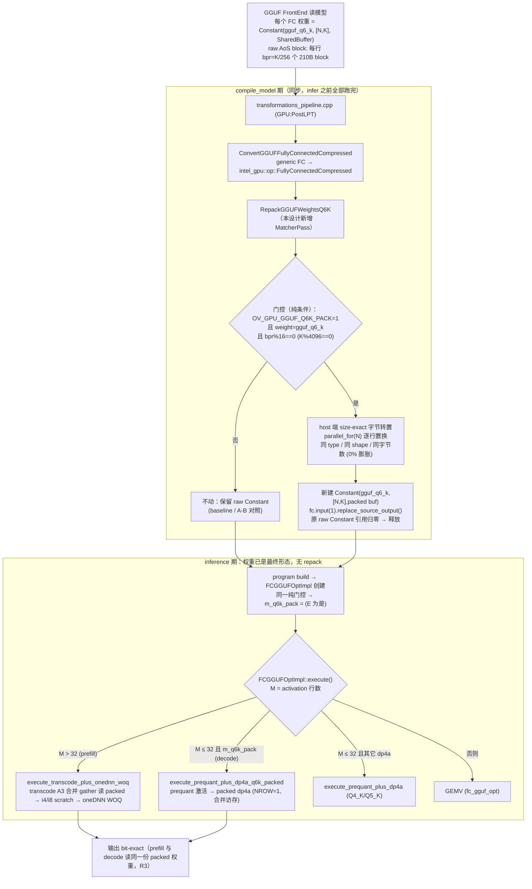
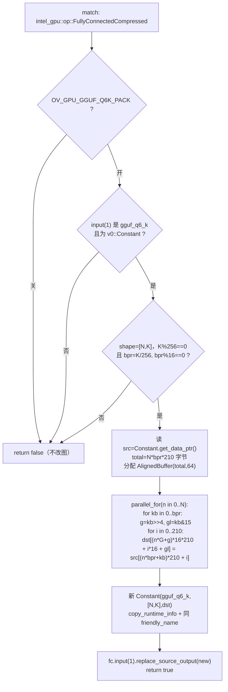
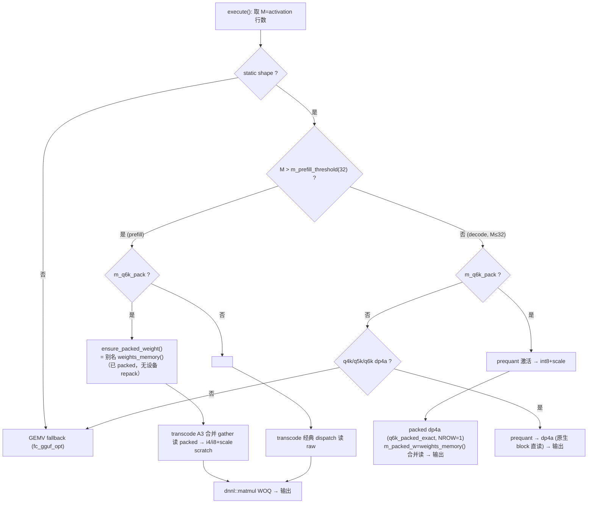

# GGUF 权重 Layout 重排设计文档

> 目标：在**不对权重做任何解压（dequant）操作**的前提下，对 GGUF block 量化权重的
> 物理排布进行一次性、无损的**重排（repack）**，使 `fc_gguf_opt` / `fc_gguf_dp4a` /
> `fc_gguf_transcode` 等 kernel 的访存与解包模式更接近 roofline。
> repack 只改变字节/位字段的**排列顺序**，不改变任何量化值——in-kernel 解码后必须与
> 现状 **bit-exact**，通过现有正确性门（`relL2≈2e-4, cos=1.0`，SPEC §7.3）。

**适用硬件**：Intel Arc B580（Battlemage / Xe2），DRAM 谱峰 456 GB/s、L2 18 MiB、
160 Xe-core、native SIMD = 16、cacheline = 64 B、INT8(dp4a) 59.39 TOPS、FP32 14.85 TFLOPS。
**适用模型**：Qwen3-8B-Q5_K_M.gguf、Qwen3-8B-Q4_K_M.gguf（实测主用 Q4_K/Q5_K/Q6_K，
配方还可含 Q8_0/Q4_0；框架同时支持 Q3_K/IQ2_*/IQ3_*）。
**关联文件**：
- decode kernel：[fc_gguf_opt.cl](../../../../../thirdparty/openvino/src/plugins/intel_gpu/src/graph/impls/ocl_v2/fc_gguf_opt.cl)、
  [fc_gguf_dp4a.cl](../../../../../thirdparty/openvino/src/plugins/intel_gpu/src/graph/impls/ocl_v2/fc_gguf_dp4a.cl)、
  [fc_gguf_prequant.cl](../../../../../thirdparty/openvino/src/plugins/intel_gpu/src/graph/impls/ocl_v2/fc_gguf_prequant.cl)
- prefill kernel：[fc_gguf_transcode.cl](../../../../../thirdparty/openvino/src/plugins/intel_gpu/src/graph/impls/ocl_v2/fc_gguf_transcode.cl)
- impl manager：`graph/impls/ocl_v2/gguf/fc_gguf_opt.{cpp,hpp}`
- 编译期 reorder 机制：`graph/graph_optimizer/post_optimize_weights.cpp`、`propagate_constants.cpp`、
  `kernel_selector/kernel_selector_common.h`（`WeightsReorderParams`）
- roofline 现状：[RESULTS.md](RESULTS.md)、[RESULTS_opt_evolve.md](RESULTS_opt_evolve.md)、[RESULTS_dp4a_evolve.md](RESULTS_dp4a_evolve.md)

> **本版相对上一版的增量**：(1) repack 在 **`compile_model` 时一次性执行并取代原始权重
> 数据**，在 **inference 开始前即已完成**，使 prefill 与 decode 消费**同一份**权重字节
> （§4，附 OV pass 时序的 file:line 实证）；(2) **覆盖全部 10 种受支持格式**的 repack 策略、
> 预期性能收益与 GPU 显存膨胀代价（§7、§8、§9）；(3) **保留非-repack（原始 AoS 直读）路径**
> 作为 A/B 对照——通过**编译期开关** `OV_GPU_GGUF_REPACK` 选择「repack」或「直读」，两条
> addressing 路径在 kernel 内由 `GGUF_PACKED` JIT 宏共存（R6、§4.3、§4.4）。

---

## 1. 现状回顾：为什么现有 kernel 难以接近 roofline

### 1.1 当前权重排布 = ggml 原生「行主序 + AoS block」

权重矩阵 `W[N, K]`（N=输出通道，K=归约维）以 **ggml 原生格式**原样进入 `ov::Constant`，
GPU kernel 直接把这块不透明字节当作 kernel 参数（无任何预处理 / reorder，见 §4 现状）。
每行 `n` 由 `B = K / block_elem` 个**自包含 block** 连续排列；每个 block 是一个
**AoS（Array-of-Structures）结构体**，标量元数据（`d` / `dmin` / scales）与量化负载
（`qs` / `ql` / `qh`）交织在同一结构体内：

| 格式 | block_elem | block_bytes | bpw | 结构体字段（按字节偏移） |
|---|--:|--:|--:|---|
| `Q4_0` | 32 | 18 | 4.50 | `d`(2) ‖ `qs`(16，4-bit×32) |
| `Q8_0` | 32 | 34 | 8.50 | `d`(2) ‖ `qs`(32，int8×32) |
| `Q4_K` | 256 | 144 | 4.50 | `d`(2) ‖ `dmin`(2) ‖ `scales`(12，6-bit packed) ‖ `qs`(128，4-bit×256) |
| `Q5_K` | 256 | 176 | 5.50 | `d`(2) ‖ `dmin`(2) ‖ `scales`(12) ‖ `qh`(32，高 1 bit-plane) ‖ `ql`(128，低 4-bit) |
| `Q6_K` | 256 | 210 | 6.56 | `ql`(128，低 4-bit) ‖ `qh`(64，高 2-bit) ‖ `scales`(16，int8×16) ‖ `d`(2) |
| `Q3_K` | 256 | 110 | 3.44 | `hmask`(32) ‖ `qs`(64，2-bit×256) ‖ `scales`(12，packed) ‖ `d`(2) |
| `IQ2_XS` | 256 | 74 | 2.31 | `d`(2) ‖ `qs`(64，32×uint16：9-bit grid idx+7-bit sign idx) ‖ `scales`(8) |
| `IQ2_S` | 256 | 82 | 2.56 | `d`(2) ‖ `qs`(32) ‖ `signs`(32) ‖ `qh`(8) ‖ `scales`(8) |
| `IQ3_XXS` | 256 | 98 | 3.06 | `d`(2) ‖ `qs`(64，grid idx) ‖ `scales_signs`(32) |
| `IQ3_S` | 256 | 110 | 3.44 | `d`(2) ‖ `qs`(64) ‖ `qh`(8) ‖ `signs`(32) ‖ `scales`(4) |

kernel 的工作划分（[fc_gguf_opt.cl:593-649](../../../../../thirdparty/openvino/src/plugins/intel_gpu/src/graph/impls/ocl_v2/fc_gguf_opt.cl)）：
一个 subgroup（16 lane）协作算一个（或 NROW 个）输出 `(n, bm)`；行 `n` 的 B 个 block
**条带式（striped）**分给 16 lane——lane L 处理 block `L, L+16, L+32, …`，最后
`sub_group_reduce_add` 收拢。

### 1.2 三类瓶颈（全部来自 layout）

实测 BW 利用率（[RESULTS.md](RESULTS.md)，4096-class，M=1）：Q4_K float 19–29%、Q5_K float 24.7%、
Q6_K float 18.9%、**Q4_0 仅 8.2%、Q8_0 仅 10.9%**、Q3_K/IQ* 6.6–10.4%。dp4a 路径
Q5_K 已达 size-matched 可达上限的 84–109%（**到墙了**），Q6_K 仍只有可达上限的 42–56%。

**瓶颈 A — 非合并、非 2 幂对齐的访存（首要、格式无关）。**
SIMD 取指希望 16 个 lane 读**连续地址**（16×4 B = 64 B = 一条 cacheline）。但 AoS 让 lane L
读它自己整块的 `block_bytes` 字节：第一条 load 让 16 lane 各读「自己 block 的 byte 0..3」，
地址相距 `block_bytes`（18 / 34 / 144 / 176 / 210），**互不相邻** → 16 条独立 cacheline 请求、
且因 block_bytes 非 64 约数而**跨线错位**。这正是 18 B 的 Q4_0（8.2%）、34 B 的 Q8_0（10.9%）
垫底的原因。

**瓶颈 B — AoS 把 scale 元数据塞进量化负载中间。**
`d/dmin/scales` 在结构体头/中部，128 B 的 `qs` 无法从 block 起点对齐成宽向量
（`vload4/vload16`）流式吞入，且强迫 kernel 为拿 scale 而把整块读进来。

**瓶颈 C — 跨字节、分平面位打包 → 解包 ALU 过重（decode-bound 格式根因）。**
ggml 为省位把同一权重的比特拆散：Q6_K 6 bit = `ql` 低 4 bit + 128 B 外 `qh` 高 2 bit；
Q5_K 第 5 bit 在独立 `qh`；Q4_K/Q5_K/Q3_K 的 6-bit sub-scale 靠 `get_scale_min_k4` 做跨字节
位手术；IQ* 每元素 grid 查表。[RESULTS_dp4a_evolve.md](RESULTS_dp4a_evolve.md) 实证：
**Q6_K K4096/K12288 N4096 不是 memory-bound 而是 Q6_K-decode-bound**——任何访存旋钮
（NROW/KSPLIT/WGSG/prefetch）都推不动（±2%），唯一杠杆是「更便宜的解码」。Q3_K 实测
`SPILL=1600`。这些都由**位打包形态**决定，可用「repack 时把比特重对齐/合并」直接攻击。

> **一句话诊断**：现有 layout 同时拖累 (A/B) memory-bound 格式拿不到带宽、(C) decode-bound
> 格式被解包 ALU 卡住。一次无损 repack 可同时缓解二者。

---

## 2. 设计约束（硬约束，逐条对齐 SPEC）

| ID | 约束 | 落地 |
|----|------|------|
| R1 | **绝不解压**：repack 只重排字节/位字段顺序，不施加 scale、不转 f16/f32、不改量化值 | 重排是纯置换 ＋ 可选「同值位平面重组」；in-kernel 解码后 bit-exact |
| R2 | **编译期一次性、取代原始权重**：`compile_model` 时 repack，产物替换原 Constant，原内存释放 | 复用 OV `WeightsReorderParams` → `post_optimize_weights` → `propagate_constants` 机制（§4） |
| R3 | **prefill 与 decode 共享同一份权重** | repack 产物是**唯一**的权重表示，GEMV / dp4a / transcode 三条路径都从它读（§4.3） |
| R4 | **bit-exact 可验证**：既有离线门，又有进程内 A/B 对拍 | per-format **离线** oracle：repack→decode 对拍 `ggml_dequantize`，`atol=1e-3, rtol=1e-2`（SPEC §7.3）＋ 置换可逆性检查；**额外**用 `OV_GPU_GGUF_REPACK=0`（直读）vs `=1`（repack）跨-binary/跨-compile 对拍输出（§10） |
| R5 | **显存预算可控**：repack 不得显著抬高 HBM 峰值/稳态 | Tier-1 ≈ 零膨胀；Tier-2 仅对 decode-bound 格式按需小幅膨胀（§9 给出全格式代价表） |
| R6 | **保留非-repack 直读路径做 A/B 对照** | 原始 AoS 直读取址与 packed 取址在 kernel 内由 `GGUF_PACKED` JIT 宏共存；**编译期**开关 `OV_GPU_GGUF_REPACK` 选择是否插入 repack reorder（默认 1）。直读=baseline，repack=candidate（§4.4） |

> R1 关键解释：把 ggml 分散在 `ql`/`qh` 的「低 4 bit + 高 2 bit」**合并**成连续 6-bit 码
> （仍是整数码、未乘 scale、未转浮点）属于**位平面重组**而非解压，但会改变字节数。故分两层：
> **Tier-1 严格保字节置换**（默认、全格式、零膨胀）＋ **Tier-2 位平面合并**（可选、仅
> decode-bound 格式、可控膨胀）。两层都保证**值 bit-exact**；Tier-1 额外保证**总字节不变**。

---

## 3. 设计原则

- **P1 — Lane 转置（lane-major / SoA-of-words）**：把「16 lane 同一归约步要读的 16 个 block」
  从 block-major 转置成 word-major，使「读第 w 个 word」在 16 lane 上落到 64 B 连续地址
  （一条 cacheline）→ 完全合并。**格式无关、收益最大的单项**，直接修复瓶颈 A。
- **P2 — 平面分离**：`d|dmin`、`scales`、`qs/ql`、`qh`、`signs` 拆成各自连续的 SoA 平面，
  每面独立对齐、独立宽读。scale/sign 面极小（每 group 读一次复用），quant 面是被流式吞入的主体。修复瓶颈 B。
- **P3 — scale 预解码（metadata-only，无损）**：把 Q4_K/Q5_K 的 6-bit packed `get_scale_min_k4`、
  Q3_K 的 12 B packed scales 在 repack 时**展开**成扁平 per-sub-block 字节。对已存储 scale 字节的
  无损变换（值不变），把热循环的跨字节位手术挪到一次性 repack。
- **P4 — 位平面对齐合并（Tier-2，攻击瓶颈 C）**：把跨平面 N-bit 码预合并成 SWAR/dp4a 友好的
  字宽整数码，使每 4 个权重重建变 1 次（甚至 0 次）`mask|shift|or`。**不乘 scale、不转浮点**。
- **P5 — 2 幂 / cacheline padding**：小 block（Q4_0 18 B、Q8_0 34 B）按 plane 自然字段粒度
  （quant 面 4 B word、scalar 面 2 B half）做 lane 内插，消除跨线错位。
- **P6 — NROW/KSPLIT 正交**：行维放最外层，lane 转置只在「行内 16-block 组」内，与多行/分 K
  旋钮完全正交；repack 后这些旋钮照常可调（需在 packed layout 上重新标定，§12 M6）。

---

## 4. 编译期 repack：取代原始权重，prefill/decode 共享（要求 1）

### 4.1 复用 OV 既有的编译期权重 reorder 机制

OV GPU 插件已有一套**编译期一次性权重变换**的标准设施，正好满足 R2/R3：

| 阶段 | 文件 | 作用 |
|---|---|---|
| 声明需要 reorder | `kernel_selector_common.h` `WeightsReorderParams`；`primitive_inst.h` `need_weights_reorder()/get_weights_reorder_params()` | impl 声明「我的权重要先变换」 |
| 插入 reorder 节点 | `post_optimize_weights.cpp`（impl 选定后扫描，给每个需变换的权重输入插入 reorder primitive） | 把变换接入计算图 |
| **编译期执行 + 取代常量** | `propagate_constants.cpp`：构子网 → `net->execute({})` 跑变换 → 用变换后内存建新 `data` 节点 → `p.replace(curr_node, new_node)` | 变换在 **compile_model** 期跑一次，**新 buffer 取代原 Constant**，原内存随引用归零而释放 |

标准（非 GGUF）的 compressed-FC 正是走这条路把 int4/int8 权重在编译期重排成硬件偏好布局。
**GGUF 现状没有用它**（decode 直读原始 block、prefill 临时 transcode 到 scratchpad）。本设计
让 GGUF FC 接入此机制：

```
compile_model 期（每个 GGUF FC 节点一次）
  原始 GGUF Constant W[N,K]  ──►  GGUF-aware repack reorder（fc_gguf_repack.cl）
        (mmap, 不可变)              纯置换 / 位平面重组 (R1)
                                    ▼
              propagate_constants:  新 data 节点 W_packed 取代原 Constant
                                    ▼  原 mmap 常量引用归零 → 释放 (R2)
  ───────────────────────────────────────────────────────────────────
  推理期：GEMV / dp4a / transcode 三路全部读 W_packed（唯一权重表示, R3）
```

落地要点：
1. **GGUF-aware reorder**：通用 reorder primitive 不认识 opaque 的 `gguf_*` element type，
   因此 repack 用一个 **GGUF 专用 reorder impl**（包 `fc_gguf_repack.cl`），通过
   `WeightsReorderParams`/`get_weights_reorder_kernel_params()` 接入 `post_optimize_weights`。
   这样既复用「编译期执行 + 取代常量 + 序列化缓存」的全部基础设施，又保留 GGUF 的格式语义。
2. **原始权重释放（R2）**：`propagate_constants` 用 `W_packed` 建新 `data` 并 `replace` 旧节点；
   旧 mmap Constant 无其他使用者后被移除，**稳态只剩一份 packed 权重**（不双存）。
3. **序列化友好**：reorder 几何随 `WeightsReorderParams::save/load` 持久化，blob 反序列化后
   仍知道 packed 布局（与标准 compressed-FC 一致）。

### 4.2 与现有 transcode/prefill 路径的关系（要求 1 的核心）

现状的**不一致**：decode 读原始 GGUF block，prefill 把原始 GGUF **临时 transcode** 成独立的
i4/i8 + scale scratchpad（[fc_gguf_transcode.cl](../../../../../thirdparty/openvino/src/plugins/intel_gpu/src/graph/impls/ocl_v2/fc_gguf_transcode.cl)）喂 oneDNN。
两条路从**不同字节**出发。

repack 后统一为：**唯一存储 = W_packed（无损重排的 GGUF）**。
- **decode（GEMV / dp4a）**：直接从 W_packed 读、in-register 解码（合并 + 轻解包）。
- **prefill（transcode + oneDNN WOQ）**：transcode 的 per-format 解码器改为**从 W_packed 读**
  （而非原始 block），其余 dequant→requant→oneDNN 逻辑不变。即 prefill 与 decode 的**输入权重
  字节完全相同**（R3），消除了「两份不同权重表示」的现状。

> 注意 transcode 内部的 dequant→requant 是 **prefill 路径的私有中间过程**（产物是临时 i4/i8
> scratchpad），**不**改变存储的 W_packed；W_packed 始终是无损的（R1）。「prefill 与 decode
> 用同一份权重」指的是二者都以 W_packed 为输入起点。

### 4.3 三路共享一套 packed 解码器（repack 路径）

为保证三条 kernel 路径对 W_packed 的解读一致，把 packed 取址 + 解码抽到一个共享头
`gguf/gguf_packed_decode.h`，被 `fc_gguf_opt.cl` / `fc_gguf_dp4a.cl` / `fc_gguf_transcode.cl`
共同 include。当走 repack 路径时，三个 kernel 的权重指针含义统一为 W_packed 平面基址，
`gguf_packed_decode.h` 是对权重的唯一解读来源（单一真源），避免三路解码器分叉。

repack 路径下被 packed 取址**取代**（而非删除——见 §4.4 双路共存）的原有直读寻址：

- `fc_gguf_opt.cl`：`gguf_block_dot()` 里「`blk + 固定偏移`」式字段取址（`blk+2`、`blk+4`、
  `blk+16`、`blk+48`、`blk+128`、`blk+192` …）与主 kernel 的
  `W + (n0+r)*blocks_per_row*GGUF_BLOCK_BYTES + kb*GGUF_BLOCK_BYTES` AoS 寻址
  （[fc_gguf_opt.cl:620-630](../../../../../thirdparty/openvino/src/plugins/intel_gpu/src/graph/impls/ocl_v2/fc_gguf_opt.cl)）。
- `fc_gguf_dp4a.cl`：`dp_block_dot_q5k/q6k` 的原始 `blk` 偏移与 `w_blk = W + (...)*GGUF_BLOCK_BYTES`
  （[fc_gguf_dp4a.cl:227-232](../../../../../thirdparty/openvino/src/plugins/intel_gpu/src/graph/impls/ocl_v2/fc_gguf_dp4a.cl)）。
- `fc_gguf_transcode.cl`：`tq_decode_block()` 的 `blk` 字段偏移。

### 4.4 保留非-repack 直读路径作为 A/B 对照（要求：可对比）

**为什么保留**：repack 的收益必须能被**干净地度量**——只有在「完全相同的 binary / 完全相同的
kernel 数学、仅权重 layout 不同」的前提下做 back-to-back A/B，才能把 repack 的净增益与编译器
版本、时钟漂移、其他无关改动隔离开。因此保留原始 AoS 直读路径作为 **baseline**。

**共存机制（编译期二选一，互不残留运行时开销）**：

| 层 | repack 开（candidate） | repack 关（baseline） |
|---|---|---|
| **编译期插入** | impl 声明 `WeightsReorderParams` → `post_optimize_weights` 插入 GGUF repack reorder → `propagate_constants` 在 compile_model 期执行、产物取代原 Constant（§4.1） | impl **不**声明 reorder；原始 GGUF Constant 原样进 kernel |
| **JIT 宏** | `GGUF_PACKED=1`：kernel 走 `gguf_packed_decode.h` 的平面取址 | `GGUF_PACKED=0`：kernel 走原始 AoS `blk+偏移` 取址（现状代码） |
| **开关** | `OV_GPU_GGUF_REPACK=1`（默认） | `OV_GPU_GGUF_REPACK=0` |

- 开关是 **compile-time** 的：它决定 impl 是否声明 reorder、以及 JIT 出哪条取址分支。一旦
  `compile_model` 完成，权重已是「packed」或「raw」之一，inference 期**不再有**分支判断或双份
  权重——两种配置各自是一个干净的、零额外开销的 binary 行为（A/B 公平）。
- `GGUF_PACKED` 的两条取址分支在 kernel 源码中以 `#if GGUF_PACKED ... #else ... #endif` 共存，
  编译期只保留一条，无运行时 `if`。
- 三路解码**数学完全一致**，仅「数据来源（packed 平面 vs 原始 block）」不同；这正是 A/B 要隔离的
  唯一变量。

> 与上一版的差异：上一版主张「删掉直读、只留 repack」。本版按需求**收回该决策**，直读路径
> 作为永久 baseline 保留；正确性既由 §10 的离线 oracle 把关，也由同一 binary 内
> `OV_GPU_GGUF_REPACK=0`（直读）vs `=1`（repack）的进程内 A/B 输出对拍二次确认（§10）。

### 4.5 确认：repack 在 compile_model 期执行、inference 前已完成（OV pass 时序实证）

repack 走 OV GPU 既有的 `WeightsReorderParams` 设施，其执行**严格发生在 `compile_model`
期、任何 `infer()` 之前**，已用 file:line 验证：

1. **同步调用链**（`core.compile_model(...)` 返回前全部跑完）：
   `Plugin::compile_model`（`plugin.cpp`）→ `CompiledModel` ctor（`compiled_model.cpp:64`，
   构造 `Graph`）→ `Graph::Graph`（`graph.cpp:47`，构造 `ProgramBuilder`）→
   `ProgramBuilder::build`（`program_builder.cpp:160`）→ `cldnn::program::build_program`
   → `program` ctor（`program.cpp:174`）调用 `build_program(is_internal)`。全程**同步、无异步/延迟**。
2. **pass 时序**（`program::build_program`，`program.cpp:493-515`）：
   `pre_optimize_graph` → `run_graph_compilation`（impl 选定）→ `post_optimize_graph`。
   在 `post_optimize_graph`（`program.cpp:600-637`）内**顺序**执行：
   `post_optimize_weights`（`:610`，**插入** repack reorder 节点）→
   `propagate_constants`（`:622`，**执行**它）。
3. **reorder 真在 build 期跑在 GPU 上**（`propagate_constants.cpp:227-269`）：
   构内部 `network`（`:237`）→ `net->execute({})`（`:253`，**repack kernel 在此真正执行**）→
   `net->reset_execution(true)`（`:254`，等 GPU 完成）→ `out->output_memory_ptr()`（`:265`，
   **取出已物化的 packed 内存 buffer**）→ 用它建新 `data` 节点 `replace` 原 Constant。
4. **静态-shape FC 不延迟**（`post_optimize_weights.cpp:44-65`）：GGUF FC 是 static-shape
   （`impl->is_dynamic()==false`），跳过 dynamic 的 early-return，**编译期就地插入并执行
   reorder**，绝不推迟到首次 inference。

**结论**：repack 是「编译期一次性物化、取代原始权重」，inference 阶段拿到的权重**已经是
packed 的**——这与要求一致，且与 transcode 的「prefill 临时 scratchpad」性质不同（后者是
推理期中间产物，前者是编译期持久权重）。

### 4.6 实际落地：Q6_K 编译期 repack 全流程（as-built 流程图）

> §4.1–4.5 描述的是**原计划**走 `WeightsReorderParams` → `post_optimize_weights` →
> `propagate_constants` 的路线。**实际落地**采用了更直接、等价的方式：一个 GPU plugin
> **图变换 MatcherPass**（`RepackGGUFWeightsQ6K`）在 `compile_model` 期、在 host 端直接对
> `gguf_q6_k` 权重 Constant 做 size-exact 字节置换并 `replace_source_output` 取代原节点。
> 二者都满足 R2/R3（编译期一次性、取代原权重、prefill/decode 共享同一份），但 MatcherPass
> 路线**无需**为 opaque gguf 类型写一个 GGUF-aware reorder primitive（通用 reorder 不认 gguf
> element type，见 §4.1 落地要点 1），host 端 `parallel_for` 置换更简单且零设备开销。
> 相关文件：[repack_gguf_weights.cpp](../../../thirdparty/openvino/src/plugins/intel_gpu/src/plugin/transformations/repack_gguf_weights.cpp)、
> [transformations_pipeline.cpp:1534](../../../thirdparty/openvino/src/plugins/intel_gpu/src/plugin/transformations_pipeline.cpp)、
> [fc_gguf_opt.cpp](../../../thirdparty/openvino/src/plugins/intel_gpu/src/graph/impls/ocl_v2/gguf/fc_gguf_opt.cpp)。

#### 4.6.1 全局视图：编译期一次置换，推理期单一权重三路共享



#### 4.6.2 编译期 repack 细节（`RepackGGUFWeightsQ6K` 回调）



要点（与代码逐条对应）：
- **纯置换**：只搬字节、不碰量化值 → in-kernel 解码 bit-exact（R1）。
- **size-exact**：组=16 block，组内字节连续重排，总字节数不变（0% 膨胀）；仅 `bpr%16==0`
  时精确同尺寸——Qwen3-8B 全部 Q6_K 张量（K∈{4096,12288}）满足，故恒为同尺寸。
- **N-无关**：置换公式只用行内的 `kb/i`，与 N 轴无关 → 即使后续有 N 轴重排也安全；且
  horizontal-FC fusion **跳过 gguf-block FC**（[fc_horizontal_fusion.cpp:69](../../../thirdparty/openvino/src/plugins/intel_gpu/src/plugin/transformations/fc_horizontal_fusion.cpp#L69)），
  不存在 Q6_K 权重沿 N 拼接。

#### 4.6.3 size-exact 字节转置映射（一个 16-block group）

```
raw（AoS，行内）:   [blk0:210B][blk1:210B]...[blk15:210B]   (kb=0..15, lane=kb)
                      b0 b1 ... b209 | b0 b1 ... b209 | ...

packed（同 group，3360B = 16×210，0 膨胀）:
  按"字节-index i"分桶，每桶放 16 个 lane 的同一字节，连续排列：
    [i=0:  lane0 lane1 ... lane15]   ← 16 个连续字节 = 解码时一次合并读
    [i=1:  lane0 lane1 ... lane15]
    ...
    [i=209:lane0 lane1 ... lane15]

  dst(group g, lane gl, byte i) = (n*G+g)*16*210 + i*16 + gl
  解码: lane gl 读 byte i 于 group_base + i*16 + gl
        → 一个 subgroup 的 16 lane 对每个 i 命中 16 个连续字节（cacheline 合并）
```

> 这正是 §5 LISA「lane-interleaved」思想的 size-exact 实例：把"每 lane 跨 210B 跳读"
> 改成"16 lane 连续读 16 字节"，把 strided gather 变 coalesced。**关键约束**：packed
> 解码路径 **NROW 必须=1**——NROW>1 让一个 subgroup 读多行，破坏 byte-transpose 的连续性，
> 实测 NROW=4 仅 19.6% BW（vs NROW=1 的 93%），故 generator 与 dispatch 硬编 NROW=1。

#### 4.6.4 推理期 dispatch（`FCGGUFOptImpl::execute()`，权重已 packed）



> **为什么 `ensure_packed_weight()` 不再做 repack**：权重已在 §4.6.1 的编译期被置换，
> `weights_memory()` 返回的就是 packed buffer，故此函数退化为一次别名绑定（`m_packed_w =
> weights_memory()`）。这消除了旧 lazy 版「首个 decode 内做 repack」的卡顿与第二份副本——
> 也正是旧版端到端看不到收益的根因（首 token repack 把平均 decode 拉平）。

---

## 5. Tier-1 核心方案：Lane-Interleaved SoA（LISA，严格保字节）

### 5.1 通用排布与索引公式

记 `SG=16`、每行 block 数 `B=K/E`、block-group 数 `G=ceil(B/16)`；group `g` 内 lane `L`
拥有 block `g*16+L`（与现状条带映射一致，P6）。把每个格式拆成若干**平面** `p`，平面 `p` 的
每-block 字段按其**自然元素粒度** `t_p`（quant 面 4 B word，scalar 面 2 B half）做 lane 内插：

```
addr(n, g, p, e, L) = plane_base[p]
                    + ((n * G + g) * NE_p + e) * (SG * t_p)   // 跨 L 连续 SG*t_p 字节
                    + L * t_p
// NE_p = 该平面每 block 的元素个数（按 t_p 计）；quant 面 t_p=4(word)→SG*t_p=64B=1 line；
// scalar 面 t_p=2(half)→SG*t_p=32B=半 line，仍 cacheline 对齐
```

- **读「平面 p 的第 e 个元素」**：subgroup 16 lane 落连续 `SG*t_p` 字节（64 B 或 32 B），
  **完全合并、对齐**。lane L 拿到「自己 block 在平面 p 的第 e 个元素」，用**与现状完全相同**
  的解码算式重建 → 值 bit-exact。
- **总字节不变**：按自然字段粒度内插（quant 4 B、scalar 2 B）使各平面零 pad，
  Σ平面字节 = 原 `block_bytes × N × B`（Tier-1 零膨胀，§9 表证实）。
- **与 NROW/KSPLIT 正交**（P6）：`n` 最外层；NROW 只改一个 subgroup 拥有几个 `n`，
  KSPLIT 只改谁求和哪段 K，都不动 `addr` 的平面内结构。

### 5.2 ASCII 示意（Q4_K，一个 16-block group）

```
现状 AoS（行内连续 16 个 144 B block）：
  [d dmin sc(12) qs(128)] [d dmin sc(12) qs(128)] ... ×16
  lane0 读第1个整块, lane1 读第2个整块 ... → 16 条相距 144B 的请求 (未合并, 跨线)

LISA Tier-1（同 group，三个平面）：
  平面 META  : 16 lane 的 [d,dmin](4B)      → 64 B = 1 line   (读1次)
  平面 SCALE : 16 lane 的 sc[8]|m[8](16B,预解码 P3) → 4 word×64B (读1次, 去 get_scale_min)
  平面 QS    : word0:[lane0..15 各自 qs[0..3]] ← 64 B 合并
               word1:[lane0..15 各自 qs[4..7]] ← 64 B 合并
               ...                               (32 word, 流式吞入)
  lane L 取 QS word w 即「block(g*16+L) 的 qs 第 w 个 4B」→ 解码不变, 每条 load 合并
```

### 5.3 kernel 侧改动（Tier-1）

- 取消「lane 一次性读整块」，改为「subgroup 协作流式读平面 word」；`gguf_block_dot` 解码算式
  **完全不变**，只把数据来源从 `blk + 固定偏移` 改为 `plane_base[p] + addr(...)`。
- scale 由 P3 预解码 → 删除热循环 `get_scale_min_k4`（Q4_K/Q5_K）与 12 B packed scale 解码
  （Q3_K），Q3_K 的 `dl[16]` 不再每 block 重算，缓解 SPILL。

---

## 6. Tier-2：位平面合并（仅 decode-bound 格式，攻击瓶颈 C）

对实证为 **decode-ALU-bound** 的格式，在 Tier-1 之上把分散位平面**预合并**成 byte/word 对齐
整数码，让解包退化为 1 次（或 0 次）操作。**仍不乘 scale、不转浮点**（值 bit-exact），但改变
密集平面字节数（受 R5 预算约束）。

- **Q6_K → i8 码合并（6b）**：把 6-bit 码（`ql` 低 4 + `qh` 高 2）合并展开成 int8（值 0..63，
  **未减 32、未乘 scale**——减 32 偏移仍由 kernel 对 all-ones 的 dot 折叠，符合 R1）。payload
  192 B → 256 B。dp4a 直读 int8 clean stream 喂 `dot_acc_sat_*`，**消灭 SWAR 解包**。Q6_K 是
  decode-bound，BW 小幅增加被吸收、ALU 大降 = 净赢。
- **Q3_K → i4 码合并**：2-bit 码 + `hmask` 校正位预合并为带符号 i4（值 ∈ {−4..3} ⊂ [−8,7]，
  仅整数码）。`hmask` 平面消失、`qs` 64 B → i4 128 B；解包退化为 1 次 nibble 提取，消除导致
  `SPILL=1600` 的私有数组与位手术。
- **IQ2_*/IQ3_*：仅索引/sign 平面分离对齐**。grid 码本查表**不能预查**（那是部分解压，违反 R1）；
  Tier-2 只把 9/10-bit grid index、7-bit sign-LUT index、per-ib32 scale nibble 拆成对齐独立平面，
  让查表输入流合并、sign 提取去分支。收益受 grid 查表延迟封顶，优先级低。

---

## 7. 全格式 repack 策略总表（要求 2）

| 格式 | block_bytes | 现状 roofline | Tier-1 策略 | Tier-2 策略 | dp4a 适配 | Qwen3-8B 占比 |
|---|--:|--:|---|---|---|---|
| `Q4_K` | 144 | 19–34% spec | LISA + scale 预解码 | — | 可新增 i4×int8（未来） | **高**（Q4_K_M 主体） |
| `Q5_K` | 176 | dp4a 84–109% 可达 | LISA + `ql`/`qh` 分面 + scale 预解码 | —（已到墙） | 保持，码与激活流对齐 | **高**（Q5_K_M 主体） |
| `Q6_K` | 210 | dp4a 42–56% 可达 | LISA + `ql`/`qh` 分面 | **i8 码合并(6b)** | int8 直读，无 SWAR | **高**（两模型 vocab/v/down） |
| `Q8_0` | 34 | 10.9% spec | LISA pad（修 34 B 错位） | —（已 int8） | 天然 int8 dp4a（未来） | 中（部分配方 token_embd） |
| `Q4_0` | 18 | 8.2% spec | LISA pad（修 18 B 错位） | — | i4×int8（未来） | 中 |
| `Q3_K` | 110 | 8.2% spec | LISA + scale 预解码 | **i4 码+hmask 合并** | — | 低（baseline 配方少见） |
| `IQ3_XXS` | 98 | 6.6% spec | LISA + 索引/sign 分面 | 平面对齐（grid 保留） | — | 低 |
| `IQ3_S` | 110 | 8.1% spec | LISA + 索引/sign 分面 | 平面对齐（grid 保留） | — | 低 |
| `IQ2_S` | 82 | 10.4% spec | LISA + 索引/sign 分面 | 平面对齐（grid 保留） | — | 低 |
| `IQ2_XS` | 74 | 7.8% spec | LISA + 索引/sign 分面 | 平面对齐（grid 保留） | — | 低 |

> 受支持格式 = GEMV 路径覆盖的 10 种（dp4a 另覆盖 Q5_K/Q6_K，transcode 覆盖全 10）。
> 元素类型全集 23 种中其余 13 种本期无 kernel，不在 repack 范围。

---

## 8. 预期性能收益（roofline 投影，要求 2）

投影遵循 [RESULTS_dp4a_evolve.md](RESULTS_dp4a_evolve.md) 的「size-matched 可达上限」
（11 MiB→189、33–39 MiB→256–272、487 MiB→428 GB/s）而非 456 spec——3–39 MiB 单权重物理上达不到
spec，故 Q5_K「持平」即最优。

| 格式 | 主攻瓶颈 | 现状 | repack 后（投影） | 单 kernel 加速 | 依据 |
|---|---|--:|--:|--:|---|
| `Q4_0` | A（18 B 错位） | 8.2% spec | **30–40% spec** | **×3.5–4.8** | 合并后逼近 9 MiB 工作集可达上限(~41%) |
| `Q8_0` | A（34 B 错位） | 10.9% spec | **30–45% spec** | **×3–4** | 同上，已 int8 无需解包 |
| `Q3_K` | A+C（SPILL+位手术） | 8.2% spec | **20–25% spec** | **×2.5–3** | 消 SPILL+i4 单 nibble 解包 |
| `IQ3_XXS` | A+C（grid 查表） | 6.6% spec | **14–18% spec** | **×2–2.5** | 合并索引/sign 流；grid 延迟封顶 |
| `IQ2_XS` | A+C | 7.8% spec | **15–20% spec** | **×2–2.5** | 同上 |
| `IQ3_S` | A+C | 8.1% spec | **16–20% spec** | **×2–2.5** | 同上 |
| `IQ2_S` | A+C | 10.4% spec | **18–22% spec** | **×1.8–2** | 同上 |
| `Q4_K` | A+B | 19–29% spec | **30–40% spec** | **×1.3–1.5** | 去 strided gather + 省 scale ALU；NROW 仍叠加 |
| `Q6_K` | C（解包 ALU） | 42–56% 可达 | **80%+ 可达** | **×1.4–1.9** | dp4a_evolve 明指「唯一杠杆是更便宜解码」 |
| `Q5_K` | —（已到墙） | 84–109% 可达 | 持平（保不回退） | ×1.0–1.1 | decode 已 roofline；Tier-1 仅保合并 |

**主战场**：A 类的 Q4_0/Q8_0（倍数级）与 C 类的 Q6_K/Q3_K（解锁 decode 墙）；Q4_K/Q5_K 锦上添花。
对 **Qwen3-8B-Q4_K_M / Q5_K_M 端到端**而言，权重以 Q4_K/Q5_K/Q6_K 为主：decode（TPOT）的增益
主要来自 **Q6_K Tier-2（vocab/down_proj/v_proj）** 与 Q4_K/Q5_K 的 Tier-1；prefill（TTFT）的增益
来自 transcode 改读已合并的 W_packed（更高的 block 读取带宽）。

---

## 9. GPU 显存膨胀代价（要求 2）

repack 在编译期**取代**原始权重，稳态**只存一份** W_packed（不双存）。逐格式代价：

| 格式 | 原 block_bytes | Tier-1 bytes | Tier-1 膨胀 | Tier-2 bytes | Tier-2 膨胀 | 说明 |
|---|--:|--:|--:|--:|--:|---|
| `Q4_0` | 18 | 18 | **0%** | — | — | qs 16B=4word、d 2B=1half，零 pad |
| `Q8_0` | 34 | 34 | **0%** | — | — | qs 32B=8word、d 2B，零 pad |
| `Q4_K` | 144 | 148 | **+2.8%** | — | — | scale 12B packed→16B 预解码(sc8+m8) |
| `Q5_K` | 176 | 180 | **+2.3%** | — | — | 同上；`ql`/`qh` 分面零 pad |
| `Q6_K` | 210 | 210 | **0%** | 274 | **+30.5%** | Tier-2: payload 192B→256B(i8 码) |
| `Q3_K` | 110 | 114 | **+3.6%** | 142 | **+29%** | T1: scale 12→16；T2: qs+hmask 96B→i4 128B |
| `IQ3_XXS` | 98 | 98 | **0%** | 98 | **~0%** | 仅平面分离，grid 保留 |
| `IQ3_S` | 110 | 110 | **0%** | 110 | **~0%** | 同上 |
| `IQ2_S` | 82 | 82 | **0%** | 82 | **~0%** | 同上 |
| `IQ2_XS` | 74 | 74 | **0%** | 74 | **~0%** | 同上 |

> Tier-1 用「自然字段粒度内插」（quant 面 4 B、scalar 面 2 B）做到零 pad；Q4_K/Q5_K/Q3_K 的
> 极小 +2~4% 全部来自 scale 预解码（可选——若关闭预解码则严格 0%，但保留热循环 ALU）。

**编译期峰值**：reorder 经 `propagate_constants` 构子网执行，期间该权重的原始 + packed 瞬时双份；
**逐 N-tile 流式 repack** 可把峰值控制在「原始全量 + 1 个 tile」≈ +单权重 tile（最大约 33–39 MiB），
远小于 HBM 余量。

**模型级稳态估算（Qwen3-8B）**：

| 模型 | 盘上大小 | 主导格式 | Tier-1 仅 | Tier-1 + Q6_K Tier-2(6b) |
|---|--:|---|--:|--:|
| Q4_K_M | ~4.7–5.0 GiB | Q4_K 主体 + Q6_K(~15–20% 字节) + 少量 Q8_0 | **+0~3%** | **+5~7%**（Q6_K 部分 ×1.305） |
| Q5_K_M | ~5.5–5.8 GiB | Q5_K 主体 + Q6_K(~20% 字节) | **+0~2%** | **+6~8%** |

整体稳态膨胀预算 **< +10% HBM**；峰值通过逐 tile 流式控制。若显存吃紧，可仅对 vocab/down_proj
等 Q6_K 大张量开 Tier-2、其余保持 Tier-1，把膨胀压到 +3% 以内。

---

## 10. 验证方案

> 因保留了非-repack 直读路径（R6/§4.4），A/B 可在**同一 binary** 内由编译期开关
> `OV_GPU_GGUF_REPACK={0,1}` 切换——repack=0 与 repack=1 仅权重 layout 与取址分支不同、
> kernel 数学完全一致，是最干净的 candidate-vs-baseline 对照。离线 oracle 与进程内 A/B 互为补充。

1. **bit-exact 离线门（R4）**：在 `gguf_kernels/harness` 离线 GPU evaluator 上，对每种格式构造随机
   `W_gguf[N=4096,K=4096]`，`repack(W_gguf)` → `decode_packed` 与
   `matmul(act, ggml_dequantize(W_gguf))` 对拍，`atol=1e-3, rtol=1e-2`。**外加置换可逆性检查**：
   Tier-1 packed 经逆置换应字节级等于原 Constant（证明零信息损失）。
2. **进程内 A/B 正确性（R4，利用保留的直读路径）**：同一模型分别用 `OV_GPU_GGUF_REPACK=0`
   （直读 baseline）与 `=1`（repack candidate）编译，对**逐层 FC 输出**与**最终 logits** 对拍——
   两者数学等价，差异应在 fp 重排误差内（`relL2≈2e-4, cos=1.0`）。这是直读路径作为 baseline 的
   核心价值：把 repack 的正确性锚定到「已验证的现状路径」。
3. **A/B 性能**：同一 binary，`OV_GPU_GGUF_REPACK={0,1}` 在 B580 back-to-back（L2 flush、
   120–150 iters、锁频）跑 [RESULTS.md](RESULTS.md) 全部 shape，更新 `% peak BW / % achievable`。
   因 inference 期两配置各自无额外分支（§4.4），A/B 公平。
4. **prefill/decode 同源（R3，repack=1 下）**：dump GEMV/dp4a 与 transcode 两路对同一权重读到的
   packed 基址与解码中间值，确认 W_packed 是二者唯一输入来源。
5. **E2E**：`source venv/bin/activate && cd .../openvino.genai/tools/llm_bench && source run_gguf.sh`
   跑 Qwen3-8B-Q5_K_M / Q4_K_M，对比 `OV_GPU_GGUF_REPACK={0,1}` 的 TTFT/TPOT/throughput；
   两配置 token 序列须**完全一致**（SPEC §7.2 token-equality）。

---

## 11. 风险与权衡

| 风险 | 说明 | 缓解 |
|---|---|---|
| 编译期 repack 开销 | compile_model 多一次权重遍历 | 一次性、可与权重上传重叠；走标准 `propagate_constants`，与 compressed-FC reorder 同量级 |
| GGUF opaque 类型 + 通用 reorder | 通用 reorder primitive 不认 `gguf_*` | 用 GGUF 专用 reorder impl 接入 `WeightsReorderParams`（§4.1.1） |
| Tier-2 BW 膨胀反噬 memory-bound 格式 | 误对 Q5_K 用 6b 会变慢 | Tier-2 严限 decode-bound 格式（§7 表），Q5_K/Q4_0/Q8_0 仅 Tier-1 |
| bit-exact 回归 | 位合并易 off-by-one | §10.1 双门（oracle + 置换可逆性）；先全量 Tier-1，再逐格式开 Tier-2 |
| 三路解码器分叉 | repack 路径下 opt/dp4a/transcode 对 packed 解读须一致 | 共享 `gguf_packed_decode.h`（§4.3），单一真源 |
| **双路维护成本** | 保留直读 baseline → 每个格式两条取址分支都要维护 | 直读分支即现状代码（已验证、零新增工作）；packed 分支用 `#if GGUF_PACKED` 隔离；CI 同时跑两配置防 bit-rot（§10.2） |
| 显存峰值 | repack=1 时编译期原始+packed 瞬时双份 | 逐 N-tile 流式 repack（§9）；repack=0 时无此问题 |
| 旋钮失效 | packed 后 NROW/KSPLIT 是否仍有效 | P6 保证正交；packed layout 上重跑 MAP-Elites 重标定（§12 M6） |

---

## 12. 实施路线图

> 落地顺序的核心约束（R6）：**直读路径始终保留**为 baseline；每个格式新增 packed 分支
> （`#if GGUF_PACKED`）并过 §10 双重验证（离线 oracle + 进程内 A/B 对拍直读）后才默认走 repack
> （`OV_GPU_GGUF_REPACK=1`）。任何阶段都能用 `=0` 退回直读做对照，不删除直读代码。

1. **M0 — 基建（双路开关）**：新增 `fc_gguf_repack.cl` ＋ GGUF 专用 reorder impl 接入
   `WeightsReorderParams` / `post_optimize_weights`（编译期执行、取代原 Constant，§4.5 已实证时序）
   ＋ 共享 `gguf_packed_decode.h` ＋ kernel 内 `#if GGUF_PACKED` 双路取址 ＋ 编译期开关
   `OV_GPU_GGUF_REPACK`（默认 1，可设 0 退回直读）。离线门用 `gguf_kernels/harness` 跑。
2. **M1 — Tier-1 主体格式（保字节）**：LISA word-major 取址（§5.1）＋ scale 预解码（P3）＋
   小 block padding（P5）。先做 Q4_K/Q5_K/Q6_K（Qwen3 主体）：每格式新增 packed 分支 → 过 §10.1
   离线门 + §10.2 进程内 A/B（vs 直读）→ 该格式默认 repack。直读分支保留。
3. **M2 — Tier-1 其余格式 + prefill 接入**：Q4_0/Q8_0/Q3_K/IQ*（A 类收益最确定）新增 packed 分支并过门；
   transcode 解码器在 repack=1 时改读 W_packed（repack=0 仍读原始 `blk`），确认 prefill/decode 同源（R3）。
   A/B 复测更新 RESULTS。
4. **M3 — Tier-2 Q6_K(6b)**：int8 码合并 + dp4a 直读 int8 流；目标 56%→80%+ 可达。
5. **M4 — Tier-2 Q3_K / IQ***：i4 合并消 SPILL / 索引-sign 分面（次要优先级）。
6. **M5 — 重标定旋钮**：packed layout 上重跑 NROW/KSPLIT MAP-Elites（P6），更新每-shape JIT 表。
7. **M6 — E2E**：Qwen3-8B-Q5_K_M / Q4_K_M 全链路 `OV_GPU_GGUF_REPACK={0,1}` token-equality +
   性能回归，写回 OPTIMIZE_RESULT。

---

### 附：关键索引公式速查

```c
// Tier-1 LISA：平面 p 的第 e 个元素，行 n、group g、lane L
//   t_p = 该平面元素粒度（quant 面 4B word；scalar 面 2B half）
//   G = ceil(B/16), B = K/E, NE_p = 每 block 该平面元素数
addr(n,g,p,e,L) = plane_base[p] + ((n*G + g)*NE_p + e)*(16*t_p) + L*t_p;  // 跨 L 连续 16*t_p 字节
// 解码算式与现状 gguf_block_dot / tq_decode_block 完全一致，仅数据来源换为 packed 平面 → bit-exact
// GEMV / dp4a / transcode 三路共享此取址（gguf_packed_decode.h），故 prefill 与 decode 同源
```
