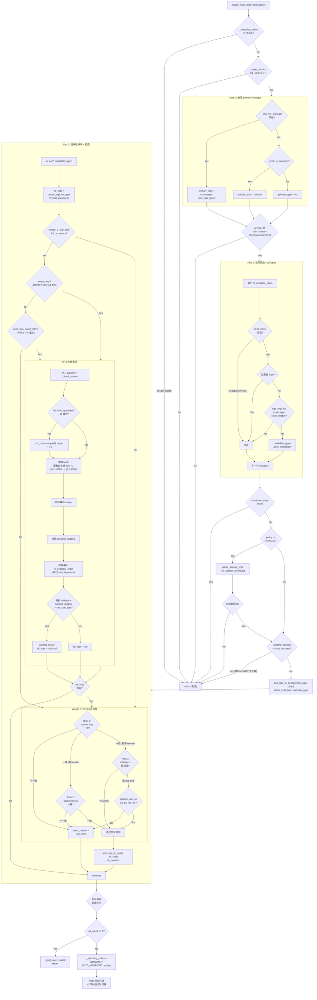

# enable_multi_impl_mode() 完整流程图

```mermaid
flowchart TD
    START["enable_multi_impl_mode(policy)"]
    
    CHECK_INIT{"_switching_policy<br/>!= NONE?"}
    START --> CHECK_INIT
    CHECK_INIT -- "Yes (已初始化)" --> RETURN_EARLY["return (跳过)"]
    CHECK_INIT -- "No" --> CHECK_FACTORY
    
    CHECK_FACTORY{"_impls_factory<br/>&& _impl 存在?"}
    CHECK_FACTORY -- "No" --> RETURN_EARLY
    CHECK_FACTORY -- "Yes" --> STEP1

    subgraph STEP1 ["Step 1: 确定 primary impl type"]
        S1_MANAGER{"_impl->m_manager<br/>存在?"}
        S1_MANAGER -- "Yes" --> S1_GET_TYPE["primary_type =<br/>m_manager->get_impl_type()"]
        S1_MANAGER -- "No" --> S1_FALLBACK{"_impl->is_onednn()?"}
        S1_FALLBACK -- "Yes" --> S1_ONEDNN["primary_type = onednn"]
        S1_FALLBACK -- "No" --> S1_OCL["primary_type = ocl"]
    end

    S1_GET_TYPE --> CHECK_GPU
    S1_ONEDNN --> CHECK_GPU
    S1_OCL --> CHECK_GPU

    CHECK_GPU{"primary 是<br/>GPU-native?<br/>(onednn/ocl/sycl/cm)"}
    CHECK_GPU -- "No" --> RETURN_EARLY
    CHECK_GPU -- "Yes" --> STEP2

    subgraph STEP2 ["Step 2: 收集候选 impl types"]
        S2_START["遍历 m_available_impls"]
        S2_START --> S2_GPU{"GPU-native<br/>后端?"}
        S2_GPU -- "No (cpu/common)" --> S2_SKIP["skip"]
        S2_GPU -- "Yes" --> S2_SEEN{"已有该 type?"}
        S2_SEEN -- "Yes" --> S2_SKIP
        S2_SEEN -- "No" --> S2_VALID{"has_impl_for<br/>(node, type,<br/>static_shape)?"}
        S2_VALID -- "No" --> S2_SKIP
        S2_VALID -- "Yes" --> S2_ADD["candidate_types<br/>.push_back(type)"]
        S2_SKIP --> S2_NEXT["下一个 manager"]
        S2_ADD --> S2_NEXT
    end
    
    S2_NEXT --> CHECK_CANDIDATES
    CHECK_CANDIDATES{"candidate_types<br/>为空?"}
    CHECK_CANDIDATES -- "Yes" --> RETURN_EARLY
    CHECK_CANDIDATES -- "No" --> CHECK_MANUAL

    CHECK_MANUAL{"policy ==<br/>MANUAL?"}
    CHECK_MANUAL -- "Yes" --> PARSE_MANUAL["parse_manual_impl<br/>_for_current_primitive()"]
    PARSE_MANUAL --> MANUAL_RULE{"有映射规则?"}
    MANUAL_RULE -- "No" --> RETURN_EARLY
    MANUAL_RULE -- "Yes" --> CHECK_FUSED
    CHECK_MANUAL -- "No" --> CHECK_FUSED

    CHECK_FUSED{"OneDNN primary<br/>+ fused post-ops?"}
    CHECK_FUSED -- "Yes (非OneDNN无法处理)" --> RETURN_EARLY
    CHECK_FUSED -- "No" --> ADD_PRIMARY

    ADD_PRIMARY["add_impl_to_pool(primary_type, _impl)<br/>active_impl_type = primary_type"]
    ADD_PRIMARY --> STEP3

    subgraph STEP3 ["Step 3: 逐候选编译 + 检查"]
        S3_START["for each candidate_type t"]
        S3_START --> S3_CREATE["alt_impl =<br/>create_impl_for_type<br/>(*_impl_params, t)"]
        
        S3_CREATE --> S3_SUBBYTE{"weight_is_sub_byte<br/>&& t ≠ primary?"}
        S3_SUBBYTE -- "No" --> S3_CONTRACT
        S3_SUBBYTE -- "Yes" --> S3_NEED_RETRY{"need_retry?<br/>(alt无效/非raw-sub-byte)"}
        S3_NEED_RETRY -- "No" --> S3_DYN_QUANT{"need_dyn_quant_retry?<br/>(W4A8 + i8 激活)"}
        S3_NEED_RETRY -- "Yes" --> S3_M1_RETRY

        S3_DYN_QUANT -- "No" --> S3_CONTRACT
        S3_DYN_QUANT -- "Yes" --> S3_M1_RETRY

        subgraph S3_M1_RETRY ["M=1 合成重试"]
            M1_COPY["m1_params = *_impl_params"]
            M1_COPY --> M1_DQ{"dynamic_quantized<br/>+ i8 激活?"}
            M1_DQ -- "Yes" --> M1_F16["m1_params.input[0].dtype = f16"]
            M1_DQ -- "No" --> M1_SHAPE
            M1_F16 --> M1_SHAPE
            M1_SHAPE["强制 M=1:<br/>所有非末维 dim = 1<br/>[40,1,4096] → [1,1,4096]"]
            M1_SHAPE --> M1_OUTPUT["同步输出 shape"]
            M1_OUTPUT --> M1_PAD["清除 dynamic padding"]
            M1_PAD --> M1_SCAN["直接遍历 m_available_impls<br/>(绕过 fake alignment)"]
            M1_SCAN --> M1_FIND{"找到 validate +<br/>support_shapes<br/>+ raw_sub_byte?"}
            M1_FIND -- "Yes" --> M1_COMPILE["compile kernel<br/>alt_impl = m1_impl"]
            M1_FIND -- "No" --> M1_FAIL["alt_impl = null"]
        end

        S3_M1_RETRY --> S3_CHECK_ALT
        M1_COMPILE --> S3_CHECK_ALT
        M1_FAIL --> S3_CHECK_ALT
        
        S3_CHECK_ALT{"alt_impl<br/>存在?"}
        S3_CHECK_ALT -- "No" --> S3_NEXT["continue"]
        S3_CHECK_ALT -- "Yes" --> S3_CONTRACT

        subgraph S3_CONTRACT ["Weight IO Contract 检查"]
            R1{"Rule 1:<br/>reorder flag<br/>一致?"}
            R1 -- "不一致" --> REJECT["reject_reason =<br/>rule 1/2/3"]
            R1 -- "一致, 都 reorder" --> R2{"Rule 2:<br/>source layout<br/>一致?"}
            R1 -- "一致, 都不 reorder" --> R3{"Rule 3:<br/>sub-byte +<br/>跨后端?"}
            R2 -- "不一致" --> REJECT
            R2 -- "一致" --> PASS_CONTRACT
            R3 -- "否 (≥8bit)" --> PASS_CONTRACT
            R3 -- "是 sub-byte" --> R3_CHECK{"primary_raw_ok<br/>&& alt_raw_ok?"}
            R3_CHECK -- "No" --> REJECT
            R3_CHECK -- "Yes" --> PASS_CONTRACT
        end

        PASS_CONTRACT["通过所有规则"]
        PASS_CONTRACT --> S3_ADD_POOL["add_impl_to_pool(t, alt_impl)<br/>alt_count++"]
        REJECT --> S3_NEXT
        S3_ADD_POOL --> S3_NEXT
    end

    S3_NEXT --> S3_DONE{"所有候选<br/>处理完毕"}
    S3_DONE --> CHECK_ALT_COUNT{"alt_count == 0?"}
    CHECK_ALT_COUNT -- "Yes" --> DISCARD["_impl_pool = nullptr<br/>return"]
    CHECK_ALT_COUNT -- "No" --> SET_POLICY["_switching_policy =<br/>(MANUAL ? AUTO_HEURISTIC : policy)"]
    SET_POLICY --> DONE["Pool 建立完成<br/>✅ 可以运行时切换"]
```
