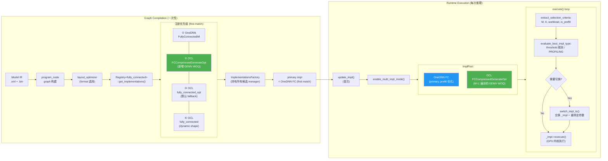
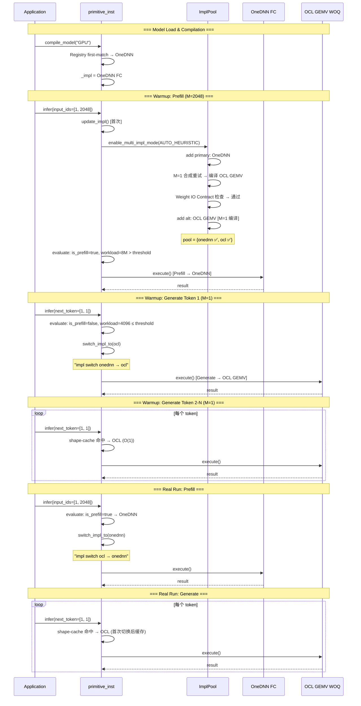
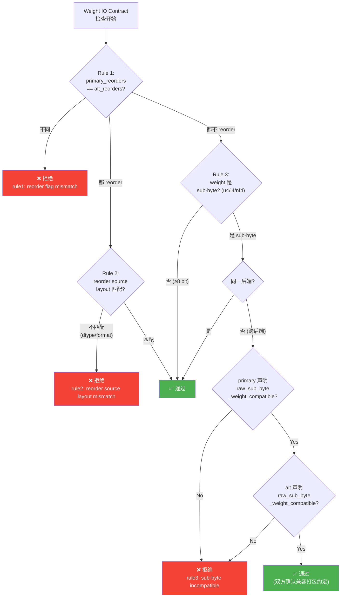
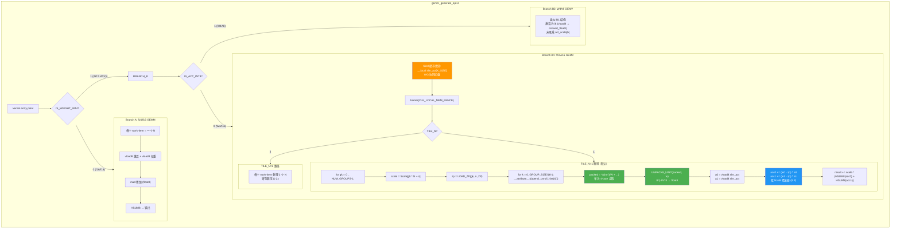
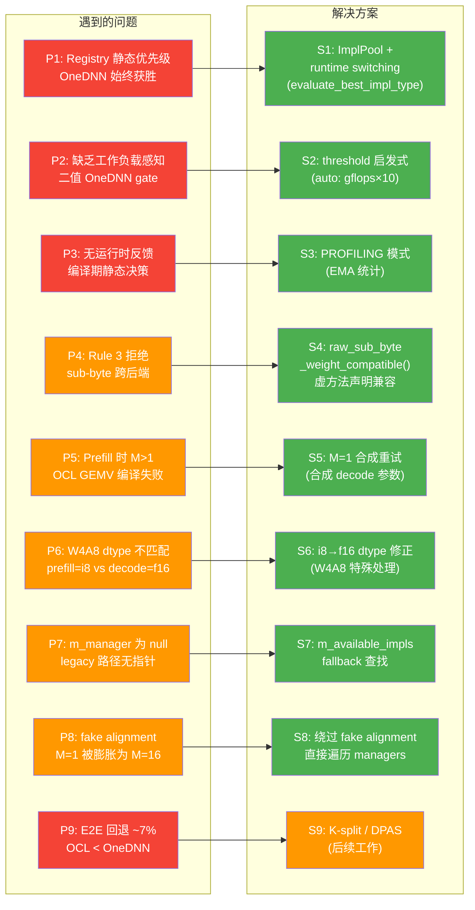

# 整体架构与 LLM 推理数据流图

## 1. 系统架构总览

```mermaid
flowchart LR
    subgraph COMPILE ["Graph Compilation (一次性)"]
        direction TB
        IR["Model IR<br/>.xml + .bin"] --> PROG["program_node<br/>graph 构建"]
        PROG --> LO["layout_optimizer<br/>(format 选择)"]
        LO --> REG["Registry&lt;fully_connected&gt;<br/>::get_implementations()"]
        
        subgraph REG_LIST ["注册优先级 (first-match)"]
            R1["① OneDNN<br/>FullyConnectedIM"]
            R2["② OCL<br/>FCCompressedGenerateOpt<br/>(新增 GEMV WOQ)"]
            R3["③ OCL<br/>fully_connected_opt<br/>(默认 fallback)"]
            R4["④ OCL<br/>fully_connected<br/>(dynamic shape)"]
            R1 --- R2 --- R3 --- R4
        end

        REG --> REG_LIST
        REG_LIST --> FACTORY["ImplementationsFactory<br/>(持有所有候选 manager)"]
        FACTORY --> PRIMARY["primary impl<br/>= OneDNN FC (first match)"]
    end

    subgraph RUNTIME ["Runtime Execution (每次推理)"]
        direction TB
        PRIMARY --> UPDATE["update_impl()<br/>(首次)"]
        UPDATE --> ENABLE["enable_multi_impl_mode()"]
        ENABLE --> POOL

        subgraph POOL ["ImplPool"]
            P_ONEDNN["OneDNN FC<br/>(primary, prefill 优化)"]
            P_OCL["OCL FCCompressedGenerateOpt<br/>(M=1 编译的 GEMV WOQ)"]
        end

        POOL --> EXEC

        subgraph EXEC ["execute() loop"]
            CRITERIA["extract_selection_criteria:<br/>M, K, workload, is_prefill"]
            CRITERIA --> HEURISTIC["evaluate_best_impl_type:<br/>threshold 规则 / PROFILING"]
            HEURISTIC --> SWITCH_Q{"需要切换?"}
            SWITCH_Q -- "Yes" --> DO_SWITCH["switch_impl_to()<br/>交换 _impl + 重绑定参数"]
            SWITCH_Q -- "No" --> GPU_EXEC
            DO_SWITCH --> GPU_EXEC["_impl->execute()<br/>(GPU 内核执行)"]
        end
    end

    style R2 fill:#4CAF50,color:#fff
    style P_OCL fill:#4CAF50,color:#fff
    style P_ONEDNN fill:#2196F3,color:#fff
```

## 2. LLM 推理生命周期 (Qwen3-8B)

```mermaid
sequenceDiagram
    participant App as Application
    participant PI as primitive_inst
    participant Pool as ImplPool
    participant OneDNN as OneDNN FC
    participant OCL as OCL GEMV WOQ

    Note over App,OCL: === Model Load & Compilation ===
    App->>PI: compile_model("GPU")
    PI->>PI: Registry first-match → OneDNN
    PI->>PI: _impl = OneDNN FC

    Note over App,OCL: === Warmup: Prefill (M=2048) ===
    App->>PI: infer(input_ids=[1, 2048])
    PI->>PI: update_impl() [首次]
    PI->>Pool: enable_multi_impl_mode(AUTO_HEURISTIC)
    Pool->>Pool: add primary: OneDNN
    Pool->>Pool: M=1 合成重试 → 编译 OCL GEMV
    Pool->>Pool: Weight IO Contract 检查 → 通过
    Pool->>Pool: add alt: OCL GEMV [M=1 编译]
    Note over Pool: pool = {onednn ✅, ocl ✅}
    
    PI->>PI: evaluate: is_prefill=true, workload=8M > threshold
    PI->>OneDNN: execute() [Prefill → OneDNN]
    OneDNN-->>PI: result

    Note over App,OCL: === Warmup: Generate Token 1 (M=1) ===
    App->>PI: infer(next_token=[1, 1])
    PI->>PI: evaluate: is_prefill=false, workload=4096 ≤ threshold
    PI->>PI: switch_impl_to(ocl)
    Note over PI: "impl switch onednn → ocl"
    PI->>OCL: execute() [Generate → OCL GEMV]
    OCL-->>PI: result

    Note over App,OCL: === Warmup: Generate Token 2-N (M=1) ===
    loop 每个 token
        App->>PI: infer(next_token=[1, 1])
        PI->>PI: shape-cache 命中 → OCL (O(1))
        PI->>OCL: execute()
        OCL-->>PI: result
    end

    Note over App,OCL: === Real Run: Prefill ===
    App->>PI: infer(input_ids=[1, 2048])
    PI->>PI: evaluate: is_prefill=true → OneDNN
    PI->>PI: switch_impl_to(onednn)
    Note over PI: "impl switch ocl → onednn"
    PI->>OneDNN: execute()
    OneDNN-->>PI: result

    Note over App,OCL: === Real Run: Generate ===
    loop 每个 token
        App->>PI: infer(next_token=[1, 1])
        PI->>PI: shape-cache 命中 → OCL (首次切换后缓存)
        PI->>OCL: execute()
        OCL-->>PI: result
    end
```

## 3. Weight IO Contract 决策树

```mermaid
flowchart TD
    START["Weight IO Contract<br/>检查开始"]
    
    START --> R1{"Rule 1:<br/>primary_reorders<br/>== alt_reorders?"}
    
    R1 -- "不同" --> REJECT1["❌ 拒绝<br/>rule1: reorder flag mismatch"]
    
    R1 -- "都 reorder" --> R2{"Rule 2:<br/>reorder source<br/>layout 匹配?"}
    R2 -- "不匹配<br/>(dtype/format)" --> REJECT2["❌ 拒绝<br/>rule2: reorder source layout mismatch"]
    R2 -- "匹配" --> ACCEPT["✅ 通过"]
    
    R1 -- "都不 reorder" --> R3{"Rule 3:<br/>weight 是<br/>sub-byte? (u4/i4/nf4)"}
    R3 -- "否 (≥8 bit)" --> ACCEPT
    R3 -- "是 sub-byte" --> R3B{"同一后端?"}
    R3B -- "是" --> ACCEPT
    R3B -- "否 (跨后端)" --> R3C{"primary 声明<br/>raw_sub_byte<br/>_weight_compatible?"}
    R3C -- "No" --> REJECT3["❌ 拒绝<br/>rule3: sub-byte incompatible"]
    R3C -- "Yes" --> R3D{"alt 声明<br/>raw_sub_byte<br/>_weight_compatible?"}
    R3D -- "No" --> REJECT3
    R3D -- "Yes" --> ACCEPT_RAW["✅ 通过<br/>(双方确认兼容打包约定)"]
    
    style ACCEPT fill:#4CAF50,color:#fff
    style ACCEPT_RAW fill:#4CAF50,color:#fff
    style REJECT1 fill:#f44336,color:#fff
    style REJECT2 fill:#f44336,color:#fff
    style REJECT3 fill:#f44336,color:#fff
```

## 4. OCL GEMV Kernel 内部结构

```mermaid
flowchart TD
    subgraph KERNEL ["gemm_generate_opt.cl"]
        ENTRY["kernel entry point"]
        ENTRY --> BRANCH{"IS_WEIGHT_INT4?"}
        
        BRANCH -- "0 (f16/f16)" --> BRANCH_A
        BRANCH -- "1 (INT4 WOQ)" --> BRANCH_B
        
        subgraph BRANCH_A ["Branch A: f16/f16 GEMM"]
            A1["每个 work-item = 一个 N"]
            A1 --> A2["vload8 激活 + vload8 权重"]
            A2 --> A3["mad 累加 (float8)"]
            A3 --> A4["HSUM8 → 输出"]
        end
        
        BRANCH_B --> ACT_CHECK{"IS_ACT_INT8?"}
        
        ACT_CHECK -- "0 (W4A16)" --> BRANCH_B1
        ACT_CHECK -- "1 (W4A8)" --> BRANCH_B2
        
        subgraph BRANCH_B1 ["Branch B1: W4A16 GEMV"]
            B1_SLM["SLM 缓存激活:<br/>__local slm_act[K_SIZE]<br/>WG 协同加载"]
            B1_SLM --> B1_BARRIER["barrier(CLK_LOCAL_MEM_FENCE)"]
            B1_BARRIER --> B1_TILE{"TILE_N?"}
            
            B1_TILE -- "1" --> B1_T1
            B1_TILE -- "2" --> B1_T2
            
            subgraph B1_T1 ["TILE_N=1 路径 (默认)"]
                T1_LOOP["for gk = 0 .. NUM_GROUPS-1:"]
                T1_LOOP --> T1_SCALE["scale = Scale[gk * N + n]"]
                T1_SCALE --> T1_ZP["zp = LOAD_ZP(gk, n, ZP)"]
                T1_ZP --> T1_INNER["for k = 0..GROUP_SIZE/16-1:<br/>__attribute__((opencl_unroll_hint(4)))"]
                T1_INNER --> T1_READ["packed = *(uint*)(W + ...)<br/>单次 4-byte 读取"]
                T1_READ --> T1_UNPACK["UNPACK8_UINT(packed, w)<br/>8个 INT4 → float8"]
                T1_UNPACK --> T1_ACT1["a0 = vload8 slm_act<br/>a1 = vload8 slm_act"]
                T1_ACT1 --> T1_MAC["acc0 += (w0 - zp) * a0<br/>acc1 += (w1 - zp) * a1<br/>双 float8 累加器 (ILP)"]
                T1_MAC --> T1_REDUCE["result += scale * (HSUM8(acc0) + HSUM8(acc1))"]
            end
            
            subgraph B1_T2 ["TILE_N=2 路径"]
                T2_NOTE["每个 work-item 处理 2 个 N<br/>寄存器压力 2x"]
            end
        end
        
        subgraph BRANCH_B2 ["Branch B2: W4A8 GEMV"]
            B2_NOTE["类似 B1 结构<br/>激活为 i8 (vload8 → convert_float8)<br/>末尾乘 act_scale[b]"]
        end
    end

    style B1_SLM fill:#FF9800,color:#fff
    style T1_READ fill:#4CAF50,color:#fff
    style T1_UNPACK fill:#4CAF50,color:#fff
    style T1_MAC fill:#2196F3,color:#fff
```

## 5. 问题与解决方案对应关系

```mermaid
flowchart LR
    subgraph PROBLEMS ["遇到的问题"]
        P1["P1: Registry 静态优先级<br/>OneDNN 始终获胜"]
        P2["P2: 缺乏工作负载感知<br/>二值 OneDNN gate"]
        P3["P3: 无运行时反馈<br/>编译期静态决策"]
        P4["P4: Rule 3 拒绝<br/>sub-byte 跨后端"]
        P5["P5: Prefill 时 M>1<br/>OCL GEMV 编译失败"]
        P6["P6: W4A8 dtype 不匹配<br/>prefill=i8 vs decode=f16"]
        P7["P7: m_manager 为 null<br/>legacy 路径无指针"]
        P8["P8: fake alignment<br/>M=1 被膨胀为 M=16"]
        P9["P9: E2E 回退 ~7%<br/>OCL < OneDNN"]
    end

    subgraph SOLUTIONS ["解决方案"]
        S1["S1: ImplPool +<br/>runtime switching<br/>(evaluate_best_impl_type)"]
        S2["S2: threshold 启发式<br/>(auto: gflops×10)"]
        S3["S3: PROFILING 模式<br/>(EMA 统计)"]
        S4["S4: raw_sub_byte<br/>_weight_compatible()<br/>虚方法声明兼容"]
        S5["S5: M=1 合成重试<br/>(合成 decode 参数)"]
        S6["S6: i8→f16 dtype 修正<br/>(W4A8 特殊处理)"]
        S7["S7: m_available_impls<br/>fallback 查找"]
        S8["S8: 绕过 fake alignment<br/>直接遍历 managers"]
        S9["S9: K-split / DPAS<br/>(后续工作)"]
    end

    P1 --> S1
    P2 --> S2
    P3 --> S3
    P4 --> S4
    P5 --> S5
    P6 --> S6
    P7 --> S7
    P8 --> S8
    P9 --> S9

    style P1 fill:#f44336,color:#fff
    style P2 fill:#f44336,color:#fff
    style P3 fill:#f44336,color:#fff
    style P4 fill:#FF9800,color:#fff
    style P5 fill:#FF9800,color:#fff
    style P6 fill:#FF9800,color:#fff
    style P7 fill:#FF9800,color:#fff
    style P8 fill:#FF9800,color:#fff
    style P9 fill:#f44336,color:#fff
    
    style S1 fill:#4CAF50,color:#fff
    style S2 fill:#4CAF50,color:#fff
    style S3 fill:#4CAF50,color:#fff
    style S4 fill:#4CAF50,color:#fff
    style S5 fill:#4CAF50,color:#fff
    style S6 fill:#4CAF50,color:#fff
    style S7 fill:#4CAF50,color:#fff
    style S8 fill:#4CAF50,color:#fff
    style S9 fill:#FF9800,color:#fff
```
