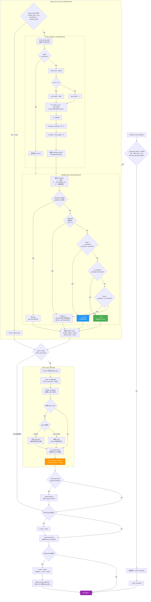

# 运行时 Impl 切换决策流程图

```mermaid
flowchart TD
    EXEC_START["primitive_inst::execute()"]

    EXEC_START --> CHECK_POOL{"_switching_policy != NONE<br/>&& _impl_pool != null<br/>&& !can_be_optimized()?"}
    CHECK_POOL -- "No" --> DIRECT_EXEC["直接执行 _impl->execute()"]
    CHECK_POOL -- "Yes" --> SELECT

    subgraph SELECT ["select_best_impl_for_inputs(params)"]
        SEL_CACHE{"shape-cache 命中?<br/>cached_impl != any<br/>&& shape == cached_shape"}
        SEL_CACHE -- "Yes → O(1)" --> SEL_RETURN_CACHE["return cached_impl"]
        SEL_CACHE -- "No" --> EXTRACT

        subgraph EXTRACT ["extract_selection_criteria(params)"]
            EX_SHAPE["从 input_layout[0]<br/>获取 PartialShape"]
            EX_SHAPE --> EX_DYNAMIC{"shape<br/>is_dynamic?"}
            EX_DYNAMIC -- "Yes" --> EX_DEFAULT["返回默认 criteria"]
            EX_DYNAMIC -- "No" --> EX_BATCH["batch_size = ps[0]"]
            EX_BATCH --> EX_SEQ{"rank >= 3?"}
            EX_SEQ -- "Yes" --> EX_SEQ_VAL["seq_length = ps[1]"]
            EX_SEQ -- "No" --> EX_SEQ_1["seq_length = 1"]
            EX_SEQ_VAL --> EX_M
            EX_SEQ_1 --> EX_M
            EX_M["M = batch_size × seq_length<br/>(rank≥3) 或 ps[0] (rank=2)"]
            EX_M --> EX_K["K = ps[last]"]
            EX_K --> EX_WORK["compute_workload = M × K"]
            EX_WORK --> EX_PREFILL["is_prefill = (seq_length > 1)"]
            EX_PREFILL --> EX_HISTORY["更新 workload_history<br/>(WorkloadPredictor)"]
        end

        EX_HISTORY --> EVAL
        EX_DEFAULT --> EVAL

        subgraph EVAL ["evaluate_best_impl_type(criteria)"]
            EV_THRESHOLD["解析 threshold:<br/>-1 → 禁用<br/>0 → auto (gflops×10)<br/>N → 直接使用"]
            
            EV_THRESHOLD --> EV_PROFILING{"PROFILING 模式<br/>&& 双方 ≥5 采样?"}
            EV_PROFILING -- "Yes" --> EV_PICK_FASTER["选 EMA<br/>avg_time 更小的"]
            EV_PROFILING -- "No" --> EV_TH_DISABLED{"threshold<br/>被禁用?<br/>(raw < 0)"}
            
            EV_TH_DISABLED -- "Yes" --> EV_FALLBACK
            EV_TH_DISABLED -- "No" --> EV_RULE1

            EV_RULE1{"Rule 1:<br/>is_prefill &&<br/>workload > threshold?"}
            EV_RULE1 -- "Yes" --> EV_ONEDNN["→ OneDNN<br/>(大矩阵吞吐)"]
            EV_RULE1 -- "No" --> EV_RULE1B{"!is_prefill &&<br/>workload ≤ threshold?"}
            
            EV_RULE1B -- "Yes" --> EV_OCL["→ OCL<br/>(低延迟 decode)"]
            EV_RULE1B -- "No" --> EV_RULE2{"Rule 2:<br/>workload > 2×threshold?"}
            EV_RULE2 -- "Yes" --> EV_ONEDNN
            EV_RULE2 -- "No" --> EV_FALLBACK

            EV_FALLBACK["Fallback:<br/>OneDNN (默认更高吞吐)<br/>或 OCL (无 OneDNN 时)"]
        end

        EV_PICK_FASTER --> SEL_UPDATE
        EV_ONEDNN --> SEL_UPDATE
        EV_OCL --> SEL_UPDATE
        EV_FALLBACK --> SEL_UPDATE

        SEL_UPDATE["更新 shape-cache:<br/>cached_shape = shape<br/>cached_impl = result"]
    end

    SEL_RETURN_CACHE --> COMPARE
    SEL_UPDATE --> COMPARE

    COMPARE{"best ≠ current<br/>active_impl_type?"}
    COMPARE -- "No (无需切换)" --> PRE_EXEC
    COMPARE -- "Yes" --> SWITCH

    subgraph SWITCH ["switch_impl_to(target)"]
        SW_FIND["从 pool 中查找 target impl"]
        SW_FIND --> SW_SWAP["_impl = pool[target]<br/>active_impl_type = target"]
        SW_SWAP --> SW_WEIGHTS["update_weights()<br/>(权重 reorder 同步)"]
        SW_WEIGHTS --> SW_EVENT{"新增 dep_event?"}
        SW_EVENT -- "Yes" --> SW_QUEUE{"queue 类型?"}
        SW_QUEUE -- "in-order" --> SW_DISCARD["丢弃 null event<br/>(提交顺序保证正确)"]
        SW_QUEUE -- "out-of-order" --> SW_KEEP["保留 event<br/>(barrier 机制序列化)"]
        SW_EVENT -- "No" --> SW_ARGS
        SW_DISCARD --> SW_ARGS
        SW_KEEP --> SW_ARGS
        SW_ARGS["set_arguments()<br/>(重绑定 kernel 参数)"]
        SW_ARGS --> SW_LOG["GPU_DEBUG_TRACE:<br/>'impl switch prev → target'"]
    end

    SW_LOG --> OOO_CHECK
    OOO_CHECK{"OOO queue &&<br/>actually switched?"}
    OOO_CHECK -- "Yes" --> OOO_FINISH["stream.finish()<br/>(drain async kernels)"]
    OOO_CHECK -- "No" --> PRE_EXEC
    OOO_FINISH --> PRE_EXEC

    PRE_EXEC{"PROFILING 模式?"}
    PRE_EXEC -- "Yes" --> RECORD_START["t_start = now()"]
    PRE_EXEC -- "No" --> KERNEL_EXEC

    RECORD_START --> KERNEL_EXEC
    KERNEL_EXEC["_impl->execute()<br/>(实际 GPU kernel 执行)"]
    KERNEL_EXEC --> POST_EXEC{"PROFILING 模式?"}
    POST_EXEC -- "Yes" --> RECORD_END["t_end = now()<br/>elapsed = t_end - t_start"]
    POST_EXEC -- "No" --> EXEC_DONE
    RECORD_END --> UPDATE_STATS["update_impl_statistics():<br/>EMA α=0.1 更新 avg_time"]
    UPDATE_STATS --> EXEC_DONE

    EXEC_DONE["执行完成 ✅"]
    DIRECT_EXEC --> KERNEL_EXEC_SIMPLE["_impl->execute()"]
    KERNEL_EXEC_SIMPLE --> EXEC_DONE

    style EV_OCL fill:#4CAF50,color:#fff
    style EV_ONEDNN fill:#2196F3,color:#fff
    style SW_LOG fill:#FF9800,color:#fff
    style EXEC_DONE fill:#9C27B0,color:#fff
```
