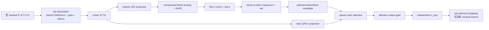
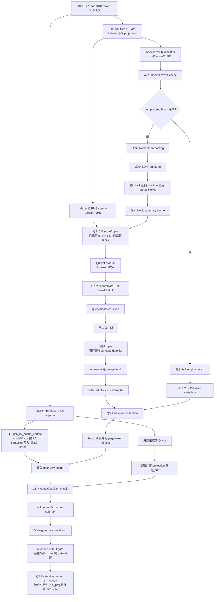
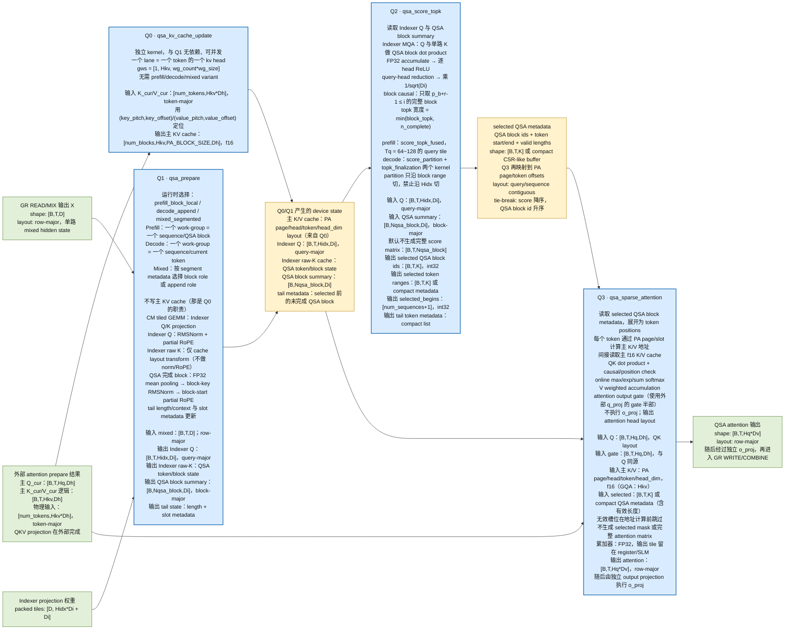
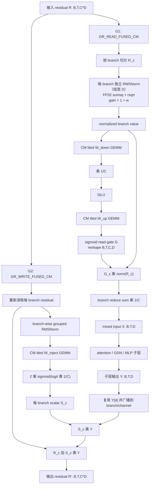

# OpenVINO MX Intel GPU Plugin 支持 QSA 与 Gated Residual 设计

## 1. 文档目的

本文面向 `/home/ov2022/workspace/qsa/openvino.mx/src/plugins/intel_gpu`，设计在 Intel GPU plugin 中支持 Qwen4-Exp/Qwen3.8-Flash-Next 类模型的两项核心机制：

- QSA（Qwen Sparse Attention）：indexer 选择少量 token/block，主 attention 只访问被选择的 KV。
- Gated Residual（GR/Hyper Connection）：把 residual 从 `[B,T,D]` 扩展为 `[B,T,C,D]`，通过 read gate 混合多个 branch，并通过 write gate 将子层输出写回各 branch。

本文是后端设计，不修改 OpenVINO 公共算子语义，也不把 PLE（hashed n-gram Per-Layer Embedding）错误地并入 QSA。

本设计有四个不可违背的约束：

1. QSA/GR 不能通过现有 OpenVINO 算子拼接实现。
2. 必须新增独立的 OpenVINO internal op、clDNN primitive、graph implementation 和实现选择入口。
3. 不复用 `paged_attention` 或 `scaled_dot_product_attention` 的 primitive、graph implementation 或 kernel；它们只能作为接口风格参考。
4. QSA/GR 专用 kernel 必须完全使用 CM 实现。包括矩阵乘法在内的全部计算都由新 CM kernel 完成，不调用 oneDNN GEMM；归一化、RoPE、top-k、gate、reduce、softmax、索引展开和 residual update 也必须在 CM 中完成。

## 2. 已有基础与设计原则

当前 GPU plugin 已有以下可复用设施：

- `scaled_dot_product_attention` primitive：支持 causal/mask/scale、转置以及 KV 压缩输入。
- `paged_attention` primitive：支持 paged KV cache、prefill/generate/mixed 阶段、XAttention 相关输入以及 KV cache 写入。
- `KVCache`、`KVCacheCompressed`、`IndirectSDPA`、`VariableStateIndirectKVCache` 和 `VariableStateIndirectKVCacheCompressed`。
- OpenCL v2 与 CM 两套 paged attention kernel，以及 kernel selector/JIT 常量机制。
- `src/plugin/ops` 中的 OpenVINO op 到 clDNN primitive lowering 入口。

因此需要新建 QSA 专用 attention runtime 和 GR 专用 residual runtime。现有 paged attention/SDPA 不能作为实现依赖；可以借鉴其 cache、shape 和 CM generator 的工程接口，但新 primitive 必须拥有自己的数据结构、dispatch 和 kernel。

核心原则：

1. **语义先于融合**：先保证与 Transformers 参考实现逐 token 一致，再优化 kernel 数量和访存。
2. **索引与 mask 分离**：mask 仅作为 correctness oracle；生产路径直接消费 selected indices。
3. **两类 cache 分离**：主 attention KV cache 与 QSA indexer 的 raw/compressed key cache 生命周期和布局不同，不应复用同一 state 槽位。
4. **C 编译期固定、T 运行期动态**：默认 `C=4`，建议把 branch 数作为 primitive 属性；序列长度、batch 和有效 token 数可动态。
5. **所有专用路径有安全回退**：不满足 head size、数据类型、动态 shape 或硬件约束时回退到新 primitive 自己的 dense/reference CM variant；不得回退到 PA/SDPA。

## 3. 目标模型语义

### 3.1 QSA

QSA 包含两个逻辑阶段：



Indexer 参考语义（与 `transformers/models/qwen4_exp`、SGLang 与 `llama.cpp` 一致）：

- indexer query/key 来自同一个独立线性层 `index_qk_proj`，输出沿最后一维切分为 `q: [B,T,Hidx,Di]` 与 `k_token: [B,T,Di]`；它不是主 attention 的 `q_proj/k_proj`。
- `indexer_kv_heads=1`，即 MQA：所有 indexer query heads 共享一个 key head；该字段在参考实现中被强制为 1。
- indexer query 先 RMSNorm 再按自身 token position 应用 RoPE；raw token key 不做 token 粒度 norm，也不在写 cache 前应用 RoPE。
- raw key 按 token 写入 indexer cache；完整 compressed block 先做 FP32 平均池化，再做 RMSNorm，最后按 **block 起始 token position** 应用 RoPE。
- RoPE 是 partial rotary：只有前 `rotary_dim` 个维度参与旋转（Qwen3.8 的 `Di=128`、旋转 64 维），其余维度直通；`rotary_dim <= Di` 由配置保证。位置编码为 Qwen3.5 风格的 interleaved mRoPE，使用 4 段 `rope_sections`。
- score 为多 query-head 点积、逐 head `ReLU`、求和后再统一缩放：

$$
I_{i,b}=\frac{1}{\sqrt{D_i}}\sum_{h=1}^{H_{idx}}\operatorname{ReLU}\left(q_{i,h}^{\mathsf T}\bar k_b\right)
$$

  缩放位于 ReLU 求和之后，不能改成先缩放每个 head 再 ReLU，也不能改成先 head reduction 再 ReLU。
- block 级 causal 条件是整个 block 已完整可见：`p_b + r - 1 <= i`，否则该 block 的 score 视为 `-inf`，不参与 top-k。
- block budget 由 token budget 推出：`block_topk = indexer_budget / indexer_compress_ratio`，配置保证 `indexer_budget % indexer_compress_ratio == 0`；实际取 `min(block_topk, n_complete)`。
- 未完成的 compressed tail block 不参与 block top-k，也不占用 block 名额，而是按 token 原样追加：

$$
S_i=\operatorname{Expand}\left(\operatorname{TopK}(I_{i,:})\right)\;\Vert\;\left\{\left\lfloor\frac{i+1}{r}\right\rfloor r,\ \ldots,\ i\right\}
$$

- 因此 selected token 的预分配宽度为 `indexer_budget + indexer_compress_ratio - 1`，不足部分用无效标记（参考实现用 `-1`）填充，必须保证无效槽位不会参与主 attention。
- 选择结果是 **per query token、跨主 attention head 共享** 的：indexer head 已被 reduce，主 attention 的所有 `Hq` 个 query head 使用同一个 selected 集合。
- 主 attention 仍有自己独立的 Q/K/V、RoPE 和 output gate；它们不能与 indexer 的投影或 gate 混为一谈。
- QSA 只作用于 `qwen_sparse_attention` 层；其余层是 Gated DeltaNet 线性注意力。参考导出把非 QSA 层的 `compress_ratio` 置 0，因此 `compress_ratio` 是 per-layer 属性而非全模型常量。

QSA 的输入边界必须明确：在生产模型路径中，GR 先对 widened residual 的多个 branch 执行 READ/MIX，得到单路 `mixed: [B,T,D]`；随后 QSA 使用这个 `mixed` 计算 indexer Q/K。因此，QSA 不是直接接收 `[B,T,C*D]` 的多个 branch，也不是在未经过 GR read 的 branch 上直接计算。attention 完成后输出 `[B,T,D]`，再交给 GR WRITE/COMBINE 将结果写回各 branch。

这里要区分两个 GR 阶段：`GR READ/MIX` 是 **attention 前的 branch merge**，负责把 `[B,T,C*D]` 变成 `[B,T,D]`；`GR WRITE/COMBINE` 是 **attention 后的 branch update**，使用 attention 输出和保存的 residual 信息生成 `[B,T,C*D]`。所以不能说 QSA 的输入是“GR write 合并后的结果”：同一个 attention 子层的 QSA 输入来自 GR read，而不是 GR write。

主 attention 的 Q/K/V projection 与 QSA indexer 的 Q/K projection 是两套独立的投影；前者属于主 attention 的输入准备，后者属于 QSA indexer。二者都不应被归入 GR，也不应把主 attention 的 head 组织方式作为 QSA 的核心设计内容。

### 3.2 Gated Residual

逻辑输入输出为：

- 输入：`R = [B,T,C,D]`，物理上推荐保存为 `[B,T,C*D]`。
- read 输出：`mixed = [B,T,D]`。
- 子层输出：`Y = [B,T,D]`。
- write gate：`S = [B,T,C]`。
- 写回：`R_c' = R_c + S_c * Y`。

归一化必须是 **branch-wise grouped RMSNorm**：把最后一维 reshape 成 `[..., C, D]` 后，每条 branch 在自己的 `D` 个通道上独立归一化，而不是对整个 `C*D` 向量做一次 RMSNorm。gain 的参数化是 `1 + w`（checkpoint 中 `w` 初始化为 0），lowering 时若已折叠成 `1 + w` 需在文档与 kernel 中保持一致，不得重复加 1。

记独立归一化后的 branch 为 $\bar R_c$，拼接为 $\bar R\in\mathbb{R}^{Cd}$。read 计算为：

$$
G = \operatorname{unvec}\left(\operatorname{sigmoid}\left(W_{up}\operatorname{SiLU}\left(\frac{W_{down}\bar R}{C}\right)\right)\right)
$$

$$
X = \frac{1}{C}\sum_{c=0}^{C-1} G_c \odot \bar R_c
$$

write gate 为：

$$
S = 2\operatorname{sigmoid}\left(\frac{W_{inject}\bar R}{C}\right)\in(0,2)^C
$$

其中 $W_{down}\in\mathbb{R}^{L\times Cd}$、$W_{up}\in\mathbb{R}^{Cd\times L}$、$W_{inject}\in\mathbb{R}^{C\times Cd}$，`L = hc_lowrank`（Qwen3.8 默认 320）。

三个 `1/C` 都不能省略：read gate 的低秩输入缩放、branch mean、write gate 的 logit 缩放。它们是模型语义的一部分，不是可折叠的常量优化，除非在 lowering 时显式折进权重并记录。

注意：read gate 是 per-channel、per-branch；write gate 是 per-branch scalar。实现不能把两者都简化成同一种 gate。attention 自身还有第三个 gate（`q_proj` 输出的一半，逐 channel 调节 attention 输出），三者必须区分。

## 4. OpenVINO 图与内部 primitive 设计

### 4.1 QSA op

推荐新增 GPU internal op：`ov::intel_gpu::op::QSA`，并在 GPU plugin 内部对应 `cldnn::qsa` primitive。该 op 不应作为 OpenVINO 公共标准 op 发布；模型转换器或模型专用 transformation 负责识别 QSA pattern 并生成它。

建议输入（逻辑输入）：

1. GR READ/MIX 输出的 `mixed: [B,T,D]`；生产路径不直接传入 `[B,T,C*D]` 的未混合 branch；
2. 外部 QKV projection 产生的当前主 K/V：逻辑上为 `[B,T,Hkv,Dh]`，物理输入与 `pa_kv_cache_update_ref.cm` 的未压缩路径一致，按 token flatten 为 `[num_tokens, Hkv*Dh]`，并通过 `key_pitch/key_offset`、`value_pitch/value_offset` 描述行间距；
3. 外部 QKV projection 产生的当前主 Q：逻辑上为 `[B,T,Hq,Dh]`，供后续 sparse attention 使用；Q 的具体连续布局由 Q3 的 query tile contract 固定，不写入 KV cache；
4. 主 attention 的 output gate：参考实现中 `q_proj` 输出 `2*Hq*Dh`，一半是 query、另一半是 gate，因此 gate 也是外部 projection 的产物，必须作为显式输入（或者在 QSA 之外应用），不能假设 Q3 能从 Q 中推出 gate；
5. indexer raw key/compressed key state 或其 cache state；
6. `past_lens`、`subsequence_begins`、`block_indices`、`block_indices_begins`；
7. position ids/RoPE 参数：包括 interleaved mRoPE 的 4 段 `rope_sections`、`rotary_dim`（partial rotary）、`freq_base/freq_scale` 等；多模态输入还需携带 2D position 分量；
8. indexer projection 权重、scale 以及 RMSNorm 参数；
9. 可选 attention mask、sink 等由主 attention 使用的输入；当前版本不传递 KV quantization scales/zp；
10. QSA 属性：`indexer_heads`、`indexer_kv_heads`（强制为 1）、`indexer_head_dim`、`indexer_rotary_dim`、`budget`、`compress_ratio`、`qsa_block_tokens`、`pa_block_size`、`block_topk`、`Causal`、数据布局。当前主 KV cache 固定为 f16，不包含 compression 参数。

属性约束必须在创建 primitive 时校验：`indexer_kv_heads == 1`、`budget % compress_ratio == 0`、`block_topk == budget / compress_ratio`、`qsa_block_tokens == compress_ratio`、`indexer_rotary_dim <= indexer_head_dim`。`compress_ratio` 是 per-layer 属性，`compress_ratio == 0` 表示该层不是 QSA 层（Gated DeltaNet 线性注意力），不应创建 QSA primitive。

主 attention 的 Q/K/V projection 由外部 attention prepare 路径完成；其中当前 `Q_cur/K_cur/V_cur` 作为 QSA runtime 的输入。QSA 不负责 projection，但负责把 `K_cur/V_cur` 按 `pa_kv_cache_update_ref.cm` 的未压缩 page-table contract 写入主 f16 KV cache。该参考 kernel 的物理布局是：输入 `key/value` 为 `[batch_size_in_tokens, num_kv_heads * head_size]` 的 token-major flat buffer，cache 为 `[num_blocks, num_heads, PA_BLOCK_SIZE, head_size]`；地址由 `block_indices`、`block_indices_begins`、`past_lens` 和 `subsequence_begins` 计算。当前版本不引入 scale/zp 或 adjusted compressed stride。`Q_cur` 不写入 cache，直接传递给后续 sparse attention。

输出建议：

- Q3 attention head 输出 `[B,T,Hq*Dv]`；`o_proj` 由后续独立 output projection 产生 `[B,T,D]`；
- 可选 selected indices/score，仅在调试、speculative decode 或上游需要时暴露；
- cache/state 更新应通过内部 state，不应把整块 cache 作为每次调用的临时输出。

`QSA` primitive 的 hash/equality/save/load 必须包含所有影响 kernel 选择和布局的属性，尤其是 `budget`、`compress_ratio`、`block_topk`、`pa_block_size`、indexer head/rotary 配置、cache layout 和数据类型。`C` 属于 GR，不应出现在 QSA 的属性集中：QSA 的输入已经是 GR read 合并后的单路 `[B,T,D]`。

### 4.2 GR op

必须新增：

- `ov::intel_gpu::op::GatedResidual`；
- `cldnn::gated_residual` primitive；
- `src/graph/impls/cm/gated_residual.*` CM implementation。

同一个 `gated_residual` primitive 通过 `mode={READ,WRITE,FINAL_MIX}` 表示三种调用方式，比把整个 transformer block 塞进一个 primitive 更稳妥：

- read 可以被 attention/GDN/MLP 前的 producer-consumer 融合；
- write 可以紧接子层输出执行，避免保存 `S*Y` 临时张量；
- `use_combine=false` 的最终 mixer 只执行 read/mix，不生成 write gate。

每一层有两组相互独立的 GR 权重（attention 前一组、MLP 前一组），模型末尾还有一个只做 read 的 final mixer；它取代了传统的 final norm，模型中不存在另一个独立的 output norm。模型入口把 token embedding 直接复制 `C` 份作为初始 residual，而不是用新的 `C*D` embedding 投影。

`READ` 的输入：

- `R: [B,T,C*D]`；
- branch grouped RMSNorm 权重 `[C*D]`（语义为 `1 + w`）；
- `W_down: [L,C*D]`、`W_up: [C*D,L]` 及 bias（如果模型有）；
- 可选 `W_inject: [C,C*D]`，用于在同一次读取中顺便生成 write gate；
- `hc_count=C`、`hidden_size=D`、`hc_lowrank=L`、epsilon。

输出：

- `mixed: [B,T,D]`；
- 可选 `S: [B,T,C]` write gate；参考实现在 `use_combine=true` 时由同一次 forward 产出 `(mixed, 原始 residual, injection weights)`，因此在 READ 中一并输出 `S` 可以避免 WRITE 重算归一化；
- 可选保存给 write 阶段的 normalized residual workspace。生产路径在“保存 `S`”与“WRITE 重算”之间二选一，按带宽与算力 benchmark 决定；两者必须使用完全相同的归一化定义。

`WRITE` 的输入：

- 原 residual `R: [B,T,C*D]`；
- 子层输出 `Y: [B,T,D]`；
- 要么直接接收 READ 产出的 `S: [B,T,C]`，要么接收 `W_inject`、grouped RMSNorm 权重和 epsilon 自行重算；
- `C`、`D`。

输出：`R': [B,T,C*D]`，支持 in-place 条件下的安全写回。

### 4.3 pattern transformation

建议新增 transformation，识别以下 pattern：

- branch reshape/concat → branch-wise grouped RMSNorm（分组宽度等于 `D`）；
- low-rank down → ×1/C → SiLU → up → sigmoid → broadcast/multiply → reduce mean；
- grouped RMSNorm → linear `W_inject` → ×1/C → `2*sigmoid` → branch scalar broadcast；
- branch residual add `R + gate * Y`。

转换前必须验证：

- `C` 是静态且位于支持范围，首版只支持 `C=4`；
- branch order 未被 transpose/reorder 改变；
- gate 的 broadcast 轴确实是 branch 轴；
- 没有其他消费者导致替换改变图语义；
- RMSNorm epsilon、weight 形状、activation 精确匹配。

无法证明匹配时保留原始通用算子图。

## 5. 纯 CM 下的最少 kernel 数量结论

在假设“一个 CM kernel 可以在寄存器/SLM 中完成 tiled matrix multiplication，并能在 kernel 内使用 work-group barrier”的前提下，推荐的完整实现数量为：

| Primitive | 最少 kernel family | kernel 边界 |
|---|---:|---|
| QSA | 4 个逻辑 kernel family | 主 KV cache update；indexer prepare/cache；score/top-k（decode 含 finalization）；sparse attention |
| GR | 2 | read/mix；write/combine |
| 合计 | **6** | 不含 PLE；不含 debug-only kernel |

这里的“最少”是面向任意动态上下文、动态 batch、prefill/decode/mixed 和独立 kernel 正确性的工程最小值。理论上可以在短上下文或固定 budget 下把 QSA 的 score/top-k 与 attention 合并，但这要求把完整 score 或候选表保存在同一 kernel 的 SLM 中，无法覆盖一般长上下文，因此不作为通用实现。

主 KV cache update 单独成一个 family，而不是并入 indexer prepare，是基于数据复用分析的结论（详见 6.8.6）：`K_cur/V_cur` 由外部 projection 产生，QSA 只做搬运，融合后流量不变，却会让两种完全不同的 dispatch 形状互相妥协。

## 6. QSA kernel：独立 CM、四个 kernel family

QSA 不提供由普通算子拼接的 baseline，也不调用 PA/SDPA。推荐四个 CM kernel family；每个 family 可根据 prefill/decode/mixed 采用不同 JIT variant。四个阶段记为：

```text
Q0  qsa_kv_cache_update      主 K/V 写入分页 cache
Q1  qsa_prepare              indexer projection / raw-K / pooling / summary
Q2  qsa_score_topk           block 评分与 top-k（decode 为 partition + finalization 两段）
Q3  qsa_sparse_attention     selected KV 稀疏 attention
```

依赖关系不是一条直线：**Q0 与 Q1 互不依赖**（indexer 不读主 KV，主 KV 写入也不需要 indexer 状态），可以并发下发或任意顺序排列；Q3 同时依赖 Q0（主 KV 已写入）和 Q2（selected metadata 已生成）；Q2 依赖 Q1。

```text
Q0 ─────────────────┐
                    ├─► Q3
Q1 ──► Q2 ──────────┘
```

把 Q0 独立出来的一个直接好处就是这个并发度：若 Q0 被塞进 Q1，则 Q3 对主 KV 的依赖会被人为地与 indexer 链路串联起来。

### 6.1 `qsa_kv_cache_update`

**主 KV cache update 使用独立 kernel，不与 Q1 融合。**

它的职责单一：把外部 QKV projection 产生的 `K_cur/V_cur` 按 PA page-table contract 写入分页 f16 cache。实现可以是 `pa_kv_cache_update_ref.cm` 未压缩路径的逐字节等价实现；注意“不复用 PA”的约束针对的是 primitive/impl 依赖关系，QSA 必须拥有自己的 kernel 实例与 JIT 配置，但其算法与地址公式应与参考 kernel 一致，不得自创一套布局。

输入与属性：

```text
key, value                 // token-major flat，用 (key_pitch, key_offset) / (value_pitch, value_offset) 定位
past_lens, subsequence_begins
block_indices, block_indices_begins
key_cache, value_cache     // [num_blocks, Hkv, PA_BLOCK_SIZE, Dh]，f16
batch_size_in_sequences
```

dispatch 沿用参考 kernel 的约定：

```text
gws = [1, Hkv, wg_count * wg_size]
lws = [1, 1, wg_size]          // wg_size 默认 16
wg_count = ceil(num_tokens / wg_size)
一个 lane = 一个 token 的一个 kv head
```

这个 kernel **不需要 prefill/decode/mixed 三种 variant**。它的工作单元是单个 token，token 归属哪个 sequence 由 `subsequence_begins` 在 kernel 内解析，因此混合 batch 天然被一次 launch 覆盖。这也是它不适合与 Q1 融合的原因之一：Q1 的自然工作单元是 QSA block 或 token tile，两者的 dispatch 形状不同。

主 KV cache 的唯一地址真相源必须是 PA contract，并且由 Q0 与 Q3 共同遵守。对 sequence `s` 的绝对 token position `p = past_lens[s] + local_token`：

```text
pa_page       = floor(p / PA_BLOCK_SIZE)
token_in_page = p % PA_BLOCK_SIZE
block_offset  = block_indices_begins[s] + pa_page
physical_page = block_indices[block_offset]
```

未压缩 K/V 的每个 head 起始地址分别为：

```text
base = (physical_page * KV_HEADS_NUM + head) * PA_BLOCK_SIZE * HEAD_SIZE
addr = base + token_in_page * HEAD_SIZE
```

其中 K/V 的 `HEAD_SIZE` 可以不同；当前 f16-only 版本不处理压缩量化、adjusted stride、scale/zp 或 quantization sub-block，主 cache 地址就是 PA page/head/token/head_dim 地址。

### 6.2 `qsa_prepare`

`qsa_prepare` 既不处理主 attention 的 QKV projection，也不再负责主 KV cache update（已拆到 Q0）。它的职责收窄为一条具有寄存器级数据复用的链路：

```text
Indexer Q/K projection
  → Indexer Q 的 RMSNorm + partial RoPE
  → Indexer raw-K 写入 cache
  → 完整 QSA block 的 FP32 mean pooling
  → block-key RMSNorm + block-start partial RoPE
  → summary 写入与 tail state 更新
```

这条链路内的中间结果（projection tile、raw-K、pooling 累加器）都可以留在寄存器/SLM 中，因此融合有真实收益；而主 KV 搬运与它之间没有任何数据复用，所以不属于这里。

当前版本暂不考虑 KV cache 压缩量化，主 K/V cache 一律使用 f16 保存；因此 PA block/page 仍然是主 KV cache 的物理分页单位，QSA block 是 Indexer 压缩、pooling 和 top-k 的逻辑 token 分组单位。二者可以选择对齐以便优化，但不能在语义上假设它们始终相等。

它的共同输入和输出契约如下：

- 输入 `mixed: [B,T,D]`，来自 GR READ/MIX；
- Indexer raw-K、block summary、tail metadata 使用独立的 QSA state；
- `K_cur/V_cur` 不是 Q1 的输入，`Q_cur` 也不由 Q1 重算，它们分别由 Q0 和 Q3 消费；
- Indexer projection 使用 CM tiled GEMM，不调用 oneDNN。

QSA 逻辑 block 另行定义。设 `QSA_BLOCK_TOKENS = compress_ratio`（或模型明确指定的 Indexer pooling group size），则对 sequence 的绝对 token position `p`：

```text
qsa_block_id = floor(p / QSA_BLOCK_TOKENS)
qsa_slot     = p % QSA_BLOCK_TOKENS
```

QSA summary 只按 `qsa_block_id` 组织；Q3 真正读取主 K/V 时，必须把 selected QSA block 展开成 token positions，再逐 token 使用上面的 PA 映射计算 page/slot。只有当 `QSA_BLOCK_TOKENS == PA_BLOCK_SIZE` 且两者起点一致时，selected QSA block 才能直接等价于一个 PA page。

QSA block 的分组还有三条必须遵守的规则，否则会产生与参考实现不一致的 selection：

1. **sequence 隔离**：block 的真实 key 是 `(sequence, logical block index)`，不是单独的 `p / r`。unified cache 中不同 sequence 的 token 可能落入相同的 position bucket，绝不能被 pool 到同一个 QSA block。
2. **只有完整 block 参与评分**：一个 QSA block 必须集齐全部 `r` 个 slot 才生成 summary。不完整 block 只更新 tail state，其 token 在 Q3 中作为 always-visible tail 追加。实现可用 `r <= 64` 的 slot 位图判定完整性。
3. **mRoPE 重复 position**：多模态输入中多个 token 可能共享同一个 `pos`。此时不能用 `pos` 直接分组，必须按与 causal mask 一致的全序 `(pos, ext.y, ext.x)` 先排名，再用 rank 代替 `p` 参与 `qsa_block_id`、tail 边界和 block 起始 RoPE position 的计算。否则 block 内会出现 slot 冲突，导致 pooling 丢 token。

这三条规则决定了 QSA metadata 必须携带 sequence 身份和（必要时）rank，而不能只携带一个全局 `qsa_block_id`。

`qsa_prepare` 是一个 kernel family/逻辑阶段名称。根据有效 token 的组织方式选择 JIT variant；“同一个 family”不等价于“所有场景只有一次 dispatch”。推荐至少定义 `prefill_block_local`、`decode_append` 和 `mixed_segmented` 三种 variant。

#### 6.2.1 Prefill：block-local fused variant

Prefill 的目标是批量产生完整 block 的 Indexer state。推荐的 work-group 映射为：

```text
一个 work-group = 一个 sequence 的一个 QSA compression block
```

每个 work-group 独占自己的 QSA block 输入区间、raw-K cache 区间和 summary slot，执行以下步骤：

1. 从 `mixed` 为 block 内 token 计算 Indexer Q/K projection；
2. 对 Indexer Q 执行 RMSNorm 和当前 token position 的 partial RoPE；对 Indexer K **只做 raw-K layout transform**，不做 token 粒度 RMSNorm，也不在此时应用 RoPE；
3. 写入 block 内 raw-K cache，并在同一 work-group 内用 FP32 做 pooling；
4. 对完成 block 依次执行 block-key RMSNorm、按 block 起始 position 的 partial RoPE 和 summary write；
5. 对不完整的末尾 block 只写 raw-K/tail state，不生成可供 Q2 使用的 block summary。

当 `QSA_BLOCK_TOKENS`、`compress_ratio` 和 `Di` 使 QSA block-local raw-K tile 能放入 SLM/register 时，上述步骤可以由一次 CM dispatch 完成。不同 sequence/QSA block 之间可以并行；不需要跨 work-group barrier，因为 pooling 只读取本 work-group 刚计算的 raw-K。

prefill variant 不能无条件承诺单 dispatch。对于超大的 QSA block、过大的 `Di` 或跨 work-group 的 QSA block 分片，应拆成同一 family 的多个 dispatch。拆分时必须保证 raw-K 完整写入后才执行 pooling/summary finalize；不能使用 CM barrier 替代 dispatch 边界。

#### 6.2.2 Decode：single-token append variant

Decode 通常每条 sequence 只追加一个 token，工作集远小于 prefill，优先减少 launch 和中间 state 访问。推荐的映射为：

```text
一个 work-group = 一个 sequence 的当前 append token
```

该 work-group 完成：

- 当前 token 的 Indexer Q/K projection、Q 的 RMSNorm 和 partial RoPE；
- raw-K cache append 和 tail length/context 更新；
- 若该 token 恰好补齐 compression block，则在 work-group 内读取该 block 的 raw-K，执行 FP32 pooling、block-key norm、block-start partial RoPE 和 summary write；
- 生成供 Q2 使用的当前 query state 或增量 metadata。

decode 的关键是区分“普通 tail append”和“block completion”：普通 append 不应扫描或重算整个历史 block；只有 block completion 才访问 block-local raw-K。多 sequence decode 可以在一次 dispatch 中并行，但每个 work-group 必须独占一个 sequence 的 append slot，避免 tail metadata 的写冲突。主 `K_cur/V_cur` 的 page append 不在这里，而在 Q0。

#### 6.2.3 Mixed：segmented sequence variant

Mixed batch 同时包含 prefill-like 的多 token sequence 和 decode-like 的单 token sequence，不能直接套用统一的连续 token/block 映射。推荐使用 `subsequence_begins` 把 flattened token buffer 划分为 sequence segment，并让 dispatch 同时携带每个 sequence 的：

- `past_lens`；
- 当前 token 数和 segment begin/end；
- `block_indices_begins`；
- 首个 partial block 的 tail 长度。

推荐的 work-group 角色如下：

```text
完整 compression block  → block-local role
单 token/短 tail        → append role
超出 block-local 资源   → segmented fallback role
```

同一 `mixed_segmented` dispatch 可以通过运行时 role/segment metadata 选择上述路径，但不能让一个 work-group 同时跨多个 sequence 或跨越不连续的 page mapping。完整 block 仍按 prefill 方式进行本地 pooling；单 token segment 只执行 decode append；跨越 partial block 的 sequence 则使用 tail-aware path。这样可以在一次 dispatch 中并行处理不同类型 sequence，但不要求所有 sequence 共享相同的 work-group 形状。

f16-only mixed path 不需要处理量化 tail、scale/zp 或 requantize；只需保证 partial QSA block 的 raw-K 与 summary 写入顺序正确。若首个 partial block 的 raw-K 由另一个 work-group 写入，则该 sequence 仍必须等待 raw-K finalize dispatch，不能与普通 block-local sequence 无序读取。主 KV 的页内写入不参与这里的角色划分，因为 Q0 以单 token 为单元，本身就对 mixed batch 透明。

#### 6.2.4 三种 variant 的 dispatch 与 fallback

| 场景 | 推荐 work-group 所有权 | 可融合内容 | 默认 dispatch 策略 |
|---|---|---|---|
| Prefill | 一个 sequence/QSA block | Indexer Q/K、Q 的 norm/RoPE、raw-K、pooling、block-key norm/RoPE、summary、tail | 固定 block 且 tile 足够小时单 dispatch，否则 prepare → finalize |
| Decode | 一个 sequence/current token | Indexer Q/K、tail update；block completion 时追加 pooling 与 summary | 单 dispatch；只在 block finalize 或资源超限时拆分 |
| Mixed | 一个 segment role：block 或 append | 各 sequence 选择对应局部路径 | 单 dispatch segmented variant；冲突或超限 sequence 走 fallback |

三种 variant 都属于 `qsa_prepare` family，均写入 Indexer Q、raw-K cache 和必要的 tail/summary state，**都不写主 KV cache**（那是 Q0 的职责）。Q2 只能在整个 Q1 dispatch 或其 finalize dispatch 完成后读取 summary；Q3 则需同时等待 Q0（主 KV 已写入）和 Q2（selected metadata 已生成）。

### 6.3 `qsa_score_topk`

`qsa_score_topk` 负责 block/query 点积、ReLU、query-head reduction、top-k 以及 selected metadata 写回。f16-only 不改变 QSA summary 的逻辑布局，主 KV cache 不参与 Q2。

必须严格保持的数值语义：

1. 逐 indexer head 先做点积，再 `ReLU`，最后 head reduction；不能交换 `ReLU` 与 reduction 的顺序。
2. `1/sqrt(indexer_head_dim)` 施加在 ReLU 求和之后，对总分统一缩放；它不改变排序，但会影响与 reference 的数值对齐，不得省略。
3. 点积累加使用 FP32；pooling 已在 Q1 以 FP32 完成。
4. block causal 条件是 `p_b + r - 1 <= i`：只有对当前 query 完整可见的 block 才参与 top-k；部分可见的 block 不能以“部分 token”形式参赛。注意这与 Q1 的“block 已写满”不同：Q1 判定的是 cache 中是否集齐，Q2 判定的是对某个 query 是否合法可见。
5. 实际 top-k 宽度是 `min(block_topk, n_complete)`，其中 `n_complete` 是当前 query 可见的完整 block 数；当可见 block 不足时不能用非法 block 补齐。
6. tie-break 固定为 `(score 降序, qsa_block_id 升序)`，否则相同分数下的选择不可复现，会产生难以定位的输出差异。

输出 metadata 的总宽度必须按 `budget + compress_ratio - 1` 预分配：`block_topk` 个完整 block 展开后的 `budget` 个 token，加上最多 `r-1` 个 tail token。未使用的槽位必须标记为无效（例如 `-1`），并由 `selected_begins` 或每 query 的有效长度描述，不得让无效槽位参与 Q3 的地址计算。

在依赖关系上，score 与 top-k **可以融合在一个 CM kernel dispatch 中**：让一个 work-group 独占一个 query（或 query tile），顺序扫描该 query 的全部合法 QSA summaries，在寄存器/SLM 中维护固定容量的 top-k candidate list；每个 summary 计算完成后立即参与 top-k，不需要把完整 score matrix 写回显存。因此不存在“每个 score 必须先经过独立 kernel 才能 top-k”的硬依赖。这也是避免参考实现中 prefill 阶段巨大 FP32 logits 矩阵的关键：SGLang 需要把 query rows 分块并把 workspace 限制在百 MB 量级，而 fused 路径只需寄存器/SLM 内的 candidate list。

但需要区分“一次 dispatch”和“一个 work-group 内一次完成”，而且两者的选择在 prefill 与 decode 下是相反的（量化依据见 6.8.3 与 6.8.4）：

- **prefill：`score_topk_fused`**。query 数量充足，应采用较大的 query tile（建议 `Tq = 64~128`）。query tile 越大，summary 读取被摊薄得越充分；在 `Tq ≈ 32` 处，融合路径开始优于物化 score 矩阵。
- **decode：`score_partition` + `topk_finalization` 两个 kernel**。`Tq` 只有 1（或 speculative 的少量 token），query-owned 单 work-group 只会产生一个 work-group、占一个 Xe-core，带宽利用率低一个数量级。**因此 decode 采用沿 block range 切 partition 的两段式，与 `pa_single_token.cm` + `pa_single_token_finalization.cm` 同构；这是 decode 的唯一主路径，不是 fallback。**

两段式的具体契约：

```text
score_partition:
    gws = [batch, 1, num_partitions]
    每个 WG 扫描 KV_PARTITION_SIZE / r 个 summary
    输出：partition 内的 score 分片 + 共享直方图/局部最大值

topk_finalization:
    由直方图求出全局阈值，压缩出 selected QSA block ids 与 token range
    输出：selected metadata + 每 query 有效长度
```

跨 partition 归并 top-k 不应采用“逐 partition 输出局部 top-`block_topk` 再归并”，那会产生 `num_partitions × block_topk` 条候选。推荐直方图/radix-select：pass 1 在扫描时顺便写出 `n_block` 个 fp32 score 并累积共享直方图，pass 2 由阈值压缩索引。额外流量相对 summary 读取只有百分之几（测算见 6.8.4），却换来确定性的精确 top-k 和干净的 tie-break。

无论哪种 variant，partition 只能沿 block range 切分，**禁止沿 `Hidx` 切分**：`ReLU` 位于 head reduction 之前，按 head 切分会让同一份 summary 被重复读取 `Hidx` 次，直接把 decode 的带宽主项放大四倍，且还需要额外的跨 head 累加。

### 6.4 `qsa_sparse_attention`

融合 selected block 展开、tail token 追加、主 f16 KV cache 间接读取、主 attention QK、causal/position 约束、online softmax、V 累加以及必要的 attention output gate。主 Q/K/V projection 结果由外部 attention prepare 路径提供。`o_proj` 明确移出 `qsa_sparse_attention`，由后续独立的 attention output projection 路径执行；Q3 输出仍保持 attention head layout，不在 Q3 内做 output projection。它必须直接消费 selected metadata，禁止生成巨大 4D selected mask。

三条影响并行化的关键性质：

1. selected 集合是 per query token 的，且被所有主 attention query head 共享（indexer head 已在 Q2 reduce）。因此一个 query 的 selected metadata 可以在多个 head 之间复用，适合以 `(query tile, head tile)` 为 work-group 划分。
2. 主 attention 是 GQA（`Hq != Hkv`），而 indexer 是 MQA。Q3 的 KV 地址计算使用 `Hkv`，不能沿用 indexer 的单 key head 假设。
3. selected metadata 中的无效槽位必须在地址计算前被跳过；不能依赖“让无效 index 读到某个哨兵位置再被 mask 掉”的做法，那会产生越界访存或无效 page 查表。
4. KV 取数必须以 QSA block（`r × Dh × 2` 字节）为粒度，而不是沿 `kv_step` 线性 tile；否则在高稀疏度下每个 16-token tile 平均只有四分之一有效，带宽直接浪费四倍。详见 6.8.5。
5. prefill 下应先在 query tile 内对 selected 集合取并集，再配 per-query 位掩码，以保留 FlashAttention 赖以高效的 query tile 内 K/V 复用。

实现可以参考 `src/plugins/intel_gpu/src/graph/impls/cm/` 下的 `xattn_gemm_qk.cm`、`xattn_find_block.cm` 和相关 post-processing：使用按 query/head 的 tiled QK、SLM 中的局部归约、FP32 online softmax 状态以及间接 KV 访问。不同之处是 QSA 的 Q2 已经产生 selected QSA metadata，因此 Q3 不需要照搬 XAttention 的 `kq_max_wg`、block mask、`find_block` 和 mask merge 阶段；Q3 直接遍历 selected token/page range 即可。若一个 query 的 selected range 过大，可像 XAttention 一样拆成多个 partial tile，并在 Q3 内维护或通过显式 finalize 合并 `(max, exp_sum, weighted_value)`，但这属于 attention tile 归约，不是重新执行 top-k。

QSA 的推荐最少数量为 **4 个 CM kernel family**。不能把它们合成一个通用 kernel：Q2 需要 Q1 已完成的 block summary，Q3 需要 Q2 产生的动态 selected 地址，二者都需要跨 work-group 的阶段边界；Q0 与 Q1 虽然可以并发，但 dispatch 形状不同，合并只会损失各自的最优映射。Q2 内部在 prefill 采用 score/top-k fused dispatch，在 decode 采用 partition + finalization 两个 kernel。

当 sparse 路径不适合短上下文时，可选择 QSA 自己的 dense CM variant，但不得转调 `paged_attention` 或 `scaled_dot_product_attention`。dense variant 仍属于 Q3 kernel family 的 JIT variant，而不是新增 primitive。

### 6.5 QSA 详细计算流程图



### 6.5.1 QSA 优化融合流程图

下面的流程图把生产路径压缩为 4 个 CM kernel family。图中的四个大方块分别对应 `qsa_kv_cache_update`、`qsa_prepare`、`qsa_score_topk` 和 `qsa_sparse_attention`；中间的数据节点只表示 kernel 之间必须传递的 cache、metadata 或 workspace，不代表额外 kernel。`o_proj` 不属于 Q3，而是在 QSA attention output 之后的独立路径执行。



#### 融合边界与 layout 约束

- **Q0 / kv cache update**：唯一职责是把外部 `K_cur/V_cur` 按 PA contract 写入分页 f16 cache，输入侧保持 `[num_tokens,Hkv*Dh]` token-major flat layout，输出侧是 `[num_blocks,Hkv,PA_BLOCK_SIZE,Dh]`。它与 Q1 无数据依赖，可并发下发；`o_proj` 之前的任何阶段都不读它，只有 Q3 依赖它。
- **Q1 / prepare**：Indexer projection、Indexer Q 的 norm/RoPE、Indexer raw-K cache append、QSA block pooling（及其后的 block-key norm/RoPE）和 metadata update 在同一个 token/QSA-block dispatch 中完成，因为它们之间存在寄存器级的数据复用。**Q1 不写主 KV cache**（依据见 6.8.6）。注意 norm/RoPE 只作用于 Indexer Q 和 pooled block key，raw-K 写入 cache 时保持原始值。主 Q 以 `[B,T,Hq,Dh]` 的 query-major layout 由外部直接提供给 Q3。QSA summary 使用独立的 `[B,Nqsa_block,Di]` block-major layout；QSA block 不直接等价于 PA page，只有完成 QSA block 才写入 summary，未完成部分只更新 tail state。
- **Q2 / score-top-k**：只读取 Q1 已完成的 summary，并把候选表放在寄存器/SLM 中。`[B,T,Nqsa_block]` 的完整 score tensor、通用 sort 和巨大 selected mask 都不生成；最终 metadata 使用 query-contiguous 的 `[B,T,K]` 或 compact CSR-like layout，并携带每 query 的有效长度。decode 下展开为 `score_partition` + `topk_finalization` 两个 kernel。
- **Q3 / sparse attention**：直接消费 Q2 的 selected QSA metadata，将 selected QSA block 展开为 token positions，再通过 PA page table 逐 token 计算 f16 K/V 地址；无效槽位在地址计算前跳过，不把 selected block materialize 成连续的 4D K/V 或 mask。QK、causal 检查、online softmax、V 累加和 output gate（使用外部 `q_proj` 提供的 gate 半部）在同一个 kernel 中完成；`o_proj` 移到 Q3 之后的独立 output projection 路径。
- 阶段边界只有三条：Q0→Q3 的主 KV 可见性、Q1→Q2 的 block-summary 可见性、Q2→Q3 的 selected-metadata 可见性；不增加 reorder、full-score、mask 或独立 GEMM kernel。

QSA 的阶段依赖是 `(Q0 ∥ Q1) → Q2 → Q3`，其中 Q3 同时等待 Q0 与 Q2。Q1 内部可以并行处理 token 和 block，但 block summary 只有在完整 block 写入后才对 Q2 可见；Q2 完成 selected metadata 后，Q3 才能安全计算间接 cache 地址。

### 6.6 QSA 单 kernel 内部结构

Q1 的 Indexer Q/K 使用二维 tiled GEMM：一个维度映射当前 work-group 所拥有的 token tile，另一个维度映射 Indexer projection output tile。由于 `index_qk_proj` 是一个线性层，它的输出应按 `Hidx*Di` 与 `Di` 切分为 Q 与 raw K；两路分支的后续处理不同，Q 继续做 RMSNorm/partial RoPE，raw K 直接写入 indexer cache。投影结果留在寄存器或 SLM，立即执行各自的后处理。主 `K_cur/V_cur` 由外部 projection 产生，并由 Q1 按 PA-compatible token-major 输入和 paged cache 地址写入；主 `Q_cur` 保持在 Q3 可消费的 query layout。

Q1 的 kernel 内部循环由运行时 variant 决定：

- `prefill_block_local` 以完整 compression block 为局部归约单位，只有在 raw-K 写入和 pooling 都由同一 work-group 完成时才使用 work-group barrier；
- `decode_append` 以单 token 为局部更新单位，只有 block completion 才访问已有 raw-K tail 并生成 summary；
- `mixed_segmented` 根据 segment role 在 block-local 和 append 路径之间分流，所有 page/tail 写入必须由 sequence 独占；
- 超出 SLM 的 block 或跨 work-group 的 pooling 使用 dispatch 边界，而不是伪造跨 work-group barrier；当前 f16-only 路径不执行量化 tail dequant/requant。

因此，单 kernel 是某些 variant 的优化结果，不是 Q1 的语义要求。Q2 使用每个 query 的局部 candidate list，tie-break 固定为 `(score 降序, block_id 升序)`。Q3 采用 online softmax，避免保存完整 attention score 矩阵；Q3 直接写出 attention head output，之后由独立 output projection 执行 `o_proj`。

### 6.7 与现有 CM PA/XAttention kernel 的 layout 对齐

QSA 的 Q/K/V/O 布局应与 `src/plugins/intel_gpu/src/graph/impls/cm/` 下现有 PA kernel **完全一致**，这样 host 侧的 pitch/offset 计算、dispatch 映射和 2D block descriptor 都可以直接复用，不需要为 QSA 插入任何 reorder。

**Q 与 O 的布局**。`pa_multi_token.cm` 的约定是 `Q/O[B, L, H, S]`，即 token-major、head 连续：

```text
q_offset = (token_idx * Hq + h) * Dh          // 元素为单位
o_pitch  = Hq * Dh * sizeof(half)
```

`pa_single_token.cm` 使用同样的 `[seq_idx, seq_num, head_num, head_size]` 约定。QSA 的 Q3 应沿用它，输出也保持 `[num_tokens, Hq, Dv]`。

**Q 的 pitch 与 offset 必须是运行时标量，而不是硬编码**。现有实现已经预留了这一点：

```text
q_pitch = is_q_fused ? (Hq + 2*Hkv) * Dh * sizeof(half) : o_pitch
```

也就是说 fused QKV（同一个 buffer 里依次放 Q、K、V）已经被支持。这一机制对 Qwen4Exp 特别重要：它的 `q_proj` 输出 `2*Hq*Dh`，每个 head 是 `[query(Dh) | gate(Dh)]` 交错排列。用同样的参数化即可零拷贝消费：

```text
q_pitch    = 2 * Hq * Dh * sizeof(half)
q_offset   = (token_idx * Hq * 2 + h * 2) * Dh
gate_offset = q_offset + Dh
```

因此 Q3 应接收 `(q_pitch, q_offset, gate_offset)` 三个标量，而不是要求上游把 query 和 gate 拆成两个连续张量。这与 `pa_kv_cache_update_ref.cm` 用 `(key_pitch, key_offset, value_pitch, value_offset)` 描述 K/V 的做法是同一套思路，host 侧也已经有 `get_simple_pitch/get_simple_offset` 从 layout padding 推导这些标量的实现可以借鉴。

**K/V 输入与 cache 布局**。QSA 的主 KV 写入直接沿用 KV cache update 的契约：输入 token-major flat、用 `(pitch, offset)` 定位，cache 为 `[num_blocks, Hkv, PA_BLOCK_SIZE, Dh]`，`hkv = h / (Hq / Hkv)`。`PA_BLOCK_SIZE` 由现有宏给出，legacy 为 16、XAttention 路径为 256；QSA 应直接读取同一个配置而不是自定义。

**必须继承的约束**：

- `head_size % 16 == 0`；16/32/64/96/128/256 有专门的向量化路径，其余走 16 元素循环；Indexer 的 `Di=128` 落在快速路径上；
- head size 为 256 时，CM 编译器的 8192 字节矩阵上限会触发 lo/hi 拆分，`K_HEAD_SIZE == 256` 的分支已有先例，QSA 若支持大 head 需要同样处理；
- Xe1/Xe2 的差异通过 `CM_HAS_LSC_UNTYPED_2D` 分流：Xe2 用 `svmptr_t` + `block_2d_desc`，Xe1 用 `SurfaceIndex` stateful 访问。QSA 的三个 kernel 都应保留同样的双路径，不要只实现 Xe2。

**dispatch 约定也应对齐**。`pa_multi_token.cm` 用 `gws = [1, num_heads, wg_count * wg_size]`、`lws = [1, 1, wg_size]`，并通过 host 预先构造的 `blocked_q_starts_and_subseq_mapping`（`[block_start_pos, subsequence_id]` 数对）让一次 launch 内混合处理多个 subsequence。QSA 的 Q3 面对的是同样的 prefill/decode/mixed 问题，应该复用同一份 mapping 数组和同一套 `subsequence_begins/past_lens/block_indices_begins` 解析逻辑；Q1 的 `mixed_segmented` variant 也可以用它来分配 segment role，而不是另造一套 metadata。

### 6.8 Xe2/Xe3 上的分组、fusion 与 roofline 可行性

本节回答两个问题：前面定义的 kernel 分组在 Xe2/Xe3 上是否可实现，以及能否逼近硬件 roofline。结论先行：

> **可实现，但 roofline 的“屋顶”在长上下文小 batch 下是 DRAM 带宽而不是 DPAS 峰值；三个 kernel 中只有 prefill 的 Q2/Q3 会进入算力屋顶。要接近 roofline，必须修改前面草案中的两处分组假设：decode 的 Q2 不能用 query-owned 单 work-group，Q3 的 KV 取数粒度必须是 QSA block 而不是 `kv_step` tile。**

#### 6.8.1 硬件与现有 kernel 给定的固定量

以下量不是假设，而是现有 CM 代码在 Xe2 上的编译期常量：

```text
REG_M = RepeatCount   = 8          // DPAS repeat
REG_K = 8 * 2         = 16         // systolic depth × VNNI
REG_N = CM_GRF_WIDTH/32 = 16       // Xe2 512-bit GRF；Xe1 为 8
kv_step = REG_K = 16
q_step  = REG_N = 16
wg lanes = 16（head_size < 256）；head_size=256 时 8 team × 2 worker
SLM ring: ring_depth = 4（head_size=256 时 3），K/V 各一份
```

因此 `head_size=128` 时 K/V 的 SLM 驻留量是 `2 × 4 × 16 × 128 × 2 B = 32 KB`，还要给 Q2 的 candidate 结构和 Q3 的 online-softmax 状态留余量。这个 32 KB 是后面所有 tile 尺寸讨论的硬约束起点。

关键的粒度矛盾在于：**QSA 的选择粒度是 `r = 4` 个 token，而 DPAS 的 K 维粒度是 `kv_step = 16`**。二者相差 4 倍，这是 QSA 在本架构上最主要的效率风险点，6.8.5 给出解法。

#### 6.8.2 各 kernel 的算术强度

用一组代表性参数做量化（记为示例，实际值以 checkpoint 为准）：`D=2048, Hq=16, Hkv=2, Dh=128, Hidx=4, Di=128, r=4, budget=2048, L_qsa=12`。

**Q0**。纯 streaming copy，每 token 读 `2*Hkv*Dh*2 = 1 KB` 写 1 KB，算术强度为 0。它永远带宽受限，但因为访存完全规整（token-major 读、page 内连续写），可以轻松跑到峰值带宽的 85–95%。这也从另一个角度说明了它不应与 Q1 合并：把一个能跑满带宽的 copy kernel 塞进一个寄存器压力很大的 GEMM kernel，只会拖累前者。

**Q1**。indexer projection 是一个 `M=num_tokens, N=Hidx*Di+Di=640, K=D` 的瘦 GEMM。decode 时 `M=batch`，权重 `D×640×2 B = 2.6 MB` 每层，完全是权重驻留带宽受限；prefill 时 `M` 大，转为算力受限。

**Q2**。每个 (query, block) 的计算是 `Hidx × Di` 次 MAC，读入一个 summary 需要 `Di × 2 = 256 B`：

$$
\mathrm{AI}_{Q2}=\frac{T_q\cdot H_{idx}\cdot D_i\cdot 2}{D_i\cdot 2}=2H_{idx}T_q
$$

`Hidx=4` 时 `AI ≈ 8·Tq` flops/byte。decode 且 `Tq=1` 时 AI=8，远低于 Xe2 的机器平衡点（fp16 DPAS 峰值/带宽通常在 50–200 flops/byte），**完全带宽受限**。

**Q3**。每个 (kv token, kv head) 读 K+V 共 `2·Dh·2 = 512 B`，被 `Hq/Hkv = 8` 个 query head 和 `Tq` 个 query token 复用，每次 QK+PV 共 `4·Dh` flops：

$$
\mathrm{AI}_{Q3}=\frac{(H_q/H_{kv})\cdot T_q\cdot 4D_h}{4D_h}= \frac{H_q}{H_{kv}}T_q
$$

即 `AI ≈ 8·Tq`，与 Q2 巧合地同量级。decode `Tq=1` 时同样带宽受限；prefill `Tq=16` 时 `AI≈128`，进入算力屋顶。

#### 6.8.3 decode 的带宽预算：Q2 才是主项

`L = 128k` 时每层每个 decode step 的 DRAM 流量：

| 阶段 | 流量 | 说明 |
|---|---:|---|
| Q2 summary 扫描 | `(L/r) × Di × 2` = **8.0 MB** | 32768 个 summary × 256 B |
| Q1 indexer 权重 | 2.6 MB | 与 batch 无关，可跨 batch 摊薄 |
| Q3 selected KV | `2051 × 1 KB` = 2.1 MB | budget + tail |
| Q0 主 KV 写入 | 1 KB | 可忽略 |
| 合计 | ≈ 12.7 MB/层 | ×12 层 ≈ **152 MB/token** |

同参数下 dense attention 每层要读 `L × 1 KB = 134 MB`，12 层为 1.6 GB。**QSA 把 decode 流量降到约 1/10，但其中 63% 来自 Q2 的 summary 扫描，Q3 只占 17%。**

这个结论直接决定优化重心：**Q2 是 QSA decode 的 roofline 决定者**，且它的流量在模型语义下不可再压缩（summary 已经是 `1/r` 压缩的结果，且被所有 `Hidx` 和 `Hq` 共享）。除非引入模型没有定义的二级索引，8 MB/层就是下界。

好消息是 Q2 的访问模式极其规整：summary cache 在 page 内连续（`PA_BLOCK_SIZE=256, r=4` 时一个 page 是 `64 × 128 × 2 = 16 KB` 连续段），可以用 `block_2d_desc` 顺序流式读取，无依赖、无回写。这类 kernel 达到峰值带宽的 80–90% 是现实目标。因此 **QSA decode 可以逼近 roofline，只是这个 roofline 是带宽屋顶**。

#### 6.8.4 decode Q2 的 partition + finalization

**decode 的 Q2 采用 partition + finalization，不使用 query-owned 单 work-group。**

原因是占用度：在 `Tq=1, batch=1` 时，query-owned 方案只会产生 1 个 work-group，占用 1 个 Xe-core，实际带宽只有峰值的几十分之一。采用与 `pa_single_token.cm` + `pa_single_token_finalization.cm` 同构的两段式：

```text
pass 1 (score_partition):     按 block range 切分 partition，每个 WG 扫描 KV_PARTITION_SIZE / r 个 summary
pass 2 (topk_finalization):   跨 partition 归并出全局 top-k
```

`L=128k, r=4` 时 32768 个 summary，取 partition = 512 个 summary 可得 64 个 WG，配合 batch 与层内并行足以填满 Xe-core。partition 划分只能沿 block range，**禁止沿 `Hidx` 切分**：`ReLU` 在 head reduction 之前，按 head 切分会导致 summary 被重复读取 `Hidx` 次，直接把主项流量放大 4 倍。

跨 partition 归并 top-512 是这里唯一的非平凡部分。逐 partition 输出局部 top-512 再归并的代价过高（64×512 条候选）。采用 **直方图/radix-select**：pass 1 在扫描时顺便写出 `n_block` 个 fp32 score（32768×4 = 128 KB）并累积一个共享直方图，pass 2 由直方图求出阈值后压缩出索引。额外流量 `2×128 KB = 256 KB`，相对 8 MB 的 summary 读只有 **3%**，换来的是确定性的精确 top-k 和干净的 tie-break。

**prefill 的 Q2 不按 query 独立物化 score。**

prefill 若为每个 query 写出 `[Tq, n_block]` 的 fp32 score，单 query 的 score 流量是 `2 × n_block × 4 = 256 KB`，而 summary 读被 `Tq` 摊薄后只有 `8 MB / Tq`。两者在 `Tq = 32` 处交叉：**query tile 小于 32 时物化 score 更便宜，大于 32 时融合更便宜**。因此 prefill 的 Q2 应使用较大的 query tile（建议 `Tq = 64~128`），并把 per-query 的粗粒度直方图放在 SLM 中（128 query × 64 bin × 2 B = 16 KB，仍在 SLM 预算内）。

另外 prefill 有一个 decode 没有的红利：**同一 sequence 的 summary 数组对所有 query tile 是同一份**，8 MB 量级基本可以驻留 L2。因此 prefill 中多次扫描 summary 的 DRAM 代价接近一次，two-pass 结构几乎免费。decode 则相反，`batch × 8 MB` 很快超过 L2，必须按 DRAM 流量核算。

#### 6.8.5 Q3 的取数粒度与 query tile 复用

**取数粒度。** 若沿用 `kv_step = 16` 的线性 KV tile，则由于选择粒度是 4，一个 16-token tile 平均只有 1 个 QSA block 命中（budget 2048/128k 的密度约 1.6%，相邻 block 同时命中的概率很低），有效数据只占 1/4，Q3 的 2.1 MB 会膨胀到约 8.4 MB，直接把 Q3 从 17% 抬到与 Q2 同量级。

解法不是接受浪费，也不是逐元素 gather，而是**按 QSA block 粒度发起 2D block load**：

```text
一次 load = r × Dh × sizeof(half) = 4 × 128 × 2 = 1 KB 连续
4 个 selected QSA block → 拼成一个 kv_step=16 的 DPAS tile
```

1 KB 是 LSC 友好的事务尺寸，不存在带宽浪费，代价只是 load 指令数变成 4 倍（每条仍搬 1 KB）。现有 `pa_lsc_u8` 的 SLM ring 结构完全适用：只需把“线性遍历 block_indices”换成“遍历 selected 列表”，staging 到 SLM 后再喂 DPAS。**这是 Q3 能否接近 roofline 的决定性实现细节。**

**query tile 复用。** FlashAttention 的效率来自一个 query tile 共享 K/V 载入。QSA 的选择是 per query 的，天然破坏这一复用。参考实现中 XAttention 的做法值得直接借鉴：`xattn_post_proc.cm` 用 `MERGED_Q_NUM` 把相邻 query 的 block mask 做 OR 合并，`pa_multi_token.cm` 再消费 `sparse_block_mask` 与 WG 级的 `sparse_block_mask_wg` 两级掩码。QSA 应采用同构策略：

```text
per-query top-k  →  query tile 内取并集  →  tile 级 selected 列表 + per-query 位掩码
```

因果 prefill 中相邻 query 的选择高度重叠，并集通常只比单 query 大 1.5–2 倍，却换回完整的 `Tq` 倍 K/V 复用，净收益明显。注意 QSA 的掩码粒度是 `r=4`，与 `SPARSE_BLOCK_SIZE ∈ {128,256}` 的 `OPTIMIZED_SPARSE_PIPELINE` 不兼容，因此只能借鉴其两级掩码结构，不能直接复用该路径。

#### 6.8.6 为什么主 KV cache update 必须独立成 kernel

从数据复用角度看，把主 KV cache update 融进 Q1 的**收益接近零**：`K_cur/V_cur` 由外部 projection 产生，Q1 既不复用它们也不改变它们，读一次写一次的流量与独立 kernel 完全相同。唯一可能的收益是省一次 launch。

而代价是真实的，有三条：

1. **dispatch 形状冲突**。indexer GEMM 的自然映射是 `(token tile × output tile)`，`N = Hidx*Di + Di = 640` 会切成约 40 个 N-tile；KV 拷贝的自然映射是 `(token × kv_head)`。强行合并只有两种结果：40 个 N-tile 重复搬运同一份 KV，或只让 N-tile 0 执行拷贝而造成严重负载不均。
2. **人为串联依赖**。Q3 依赖主 KV 已写入，Q2 依赖 indexer summary。二者本来互不相干，可以并发下发；一旦把 KV 写入塞进 Q1，Q3 对主 KV 的依赖就被绑到了整条 indexer 链路上，反而拉长关键路径。
3. **variant 爆炸**。Q1 需要 prefill/decode/mixed 三种 variant，而 KV 拷贝以单 token 为单元、对 mixed batch 天然透明、一种实现即可。合并后 KV 拷贝逻辑要在三个 variant 中各写一遍，测试面也随之扩大三倍。

因此设计确定为：**主 KV cache update 是独立的 `qsa_kv_cache_update` kernel（Q0），不提供与 Q1 合并的 variant**。Q1 内部真正值得融合的是 `indexer projection → Q 的 norm/RoPE → raw-K 写入 → block pooling → summary 写入` 这条链，因为它们之间存在寄存器级的数据复用。

#### 6.8.7 Q1→Q2 依赖的松弛

Q2 依赖 Q1 产生的 summary，但在 decode 中这个依赖只涉及**至多一个新完成的 block**，历史 summary 早已在 cache 中。因此可以让扫描历史区间的 Q2 partition 与 Q1 并发下发，只把最后一个 block 的处理留给依赖 Q1 的那一个 partition。这不是必须项，但在 decode 中 Q1 很小、launch 与依赖开销占比高时值得做。Q2→Q3 的依赖则是真实的数据依赖，无法松弛。

#### 6.8.8 Xe3 带来的变化

Xe3 对 QSA 的两个瓶颈都有正面作用：更灵活/更大的寄存器分配缓解 Q2 的 candidate 结构与 Q3 的 `rO` 累加器压力（`head_size=256` 时现有代码已被迫做 lo/hi 拆分）；SLM 容量与带宽的提升允许更深的 ring 和更大的 query tile，从而把 6.8.4 中 `Tq=32` 的交叉点向更有利的方向推移。但**这些都不改变 6.8.3 的结论**：decode 的屋顶仍是 DRAM 带宽，Q2 的 8 MB/层仍是不可压缩的主项。

#### 6.8.9 可达性小结

| 场景 | 屋顶 | 现实可达 | 主要制约 |
|---|---|---|---|
| Q0 prefill/decode | 带宽 | 85–95% | 纯 streaming copy，无计算 |
| Q1 prefill | DPAS | 60–75% | 瘦 GEMM，`N=640` 偏小 |
| Q1 decode | 带宽（权重） | 80–90% | 纯权重流式读 |
| Q2 prefill | DPAS / L2 | 50–70% | summary 可 L2 驻留，top-k 归约占用 XVE |
| Q2 decode | **DRAM 带宽** | **80–90%** | 需 partition+finalization 才能填满 |
| Q3 prefill | DPAS | 45–65% | 索引间接 + 并集密度 + softmax 占用 XVE |
| Q3 decode | DRAM 带宽 | 70–85% | 1 KB 粒度 gather，指令数偏高 |

综合来看，**QSA 在 Xe2/Xe3 上以“接近带宽 roofline”的形态落地是可行的**，前提是落实 6.8.4 的 decode partition + finalization、6.8.5 的 1 KB gather 粒度与 query tile 并集、以及 6.8.6 的 Q0 独立 kernel。反过来，如果沿用“每个 query 一个 work-group 全量扫描”和“按 `kv_step` 线性取 KV”的直觉实现，decode 会因占用不足损失一个数量级，Q3 会因粒度失配额外损失 4 倍带宽——两者都与 roofline 无关，属于实现缺陷。

## 7. Cache、state 与并发

### 7.1 必须分离的 state

建议扩展 `MultiTensorState`，新增 `VariableStateQSA`，至少包含：

1. 主 K cache；
2. 主 V cache；
3. indexer raw K cache（未归一化、未旋转）；
4. indexer compressed/block K cache 或 block summary（已 pooling、已 norm、已按 block 起始 position 旋转）；
5. selected block/token metadata；
6. beam table 与必要的 sequence mapping；
7. pending tail/ring buffer；
8. 多模态场景下的 mRoPE rank/排序辅助信息。

pending tail 的作用是避免 decode 时重新扫描历史 token。SGLang 为每个 request 维护 `r` 个 slot 的环形缓冲：

```text
slot = request_id * r + (position % r)
```

当一个完整 group 形成时，读取这 `r` 个 pending raw key，做 FP32 mean pooling，norm/RoPE 后写入 summary cache，并清空该 group 的 pending 状态。这也是 `decode_append` variant 中“普通 append”与“block completion”两条路径的来源。

但如果按下一小节的方案把 raw-K 也做成分页 cache，则**不需要单独的 ring buffer**：tail 的 `r-1` 个 raw key 已经就在当前 PA page 的连续位置上，`decode_append` 直接回读即可，同时自动获得 seq_cp/seq_rm/beam reorder 的正确性。ring 只在确定不保留完整 raw-K（极端显存受限）时才需要，并且必须把深度扩到能覆盖最大回滚长度。

`VariableStateIndirectKVCacheCompressed` 只能作为 beam table、state 生命周期和序列映射的接口参考；QSA 应实现自己的 state 类型和 cache 管理，不能把 indexer raw key 伪装成主 KV 的 compression scale state。建议给每个子 state 赋明确名称和独立 reset 语义。

#### 7.1.1 PA block 与 QSA block 的绑定规则

两类 block 的关系应定义为“**逻辑独立、地址绑定**”：

1. PA block/page 决定主 K/V cache 的物理分配、`block_indices` 查表和 page 内 token offset；它必须完全服从 `pa_kv_cache_update_ref.cm`。
2. QSA block 决定 Indexer raw-K 的 pooling、summary、top-k 和 tail 语义；它可以小于、等于或跨越一个 PA page。
3. QSA selected metadata 不得直接把 `qsa_block_id` 当作 `block_indices` 下标。它必须携带或能够恢复 sequence、QSA block 的 token start/end；Q3 再将每个 token 映射为 PA page 和 `token_in_page`。
4. QSA raw-K cache 和 summary 可以采用独立的连续布局；主 K/V cache 不应为了适配 QSA block 而重排成 QSA layout。
5. 只有在 `QSA_BLOCK_TOKENS == PA_BLOCK_SIZE`、sequence 起点对齐、且未引入压缩 page stride 差异时，才允许使用 QSA block 到 PA page 的一一映射优化。

当前首版固定为 f16 KV cache：每个 token/head 可直接按 PA page/slot 写入，QSA block work-group 可以并行写不同 token；不定义 PA quantization sub-block、scale/zp 或 quantization ownership。未来重新引入 KV compression 时，必须恢复独立的 compression layout 和 sub-block ownership 设计，不能把未来量化约束隐式混入当前 f16 contract。

因此，QSA block 与 PA block **不能完全独立到互不感知**，也不应强制设计成同一个 block。正确边界是：QSA 负责逻辑 token 分组，PA contract 负责主 cache 物理地址；两者通过 token range 和 sequence mapping 连接。

#### 7.1.2 Indexer cache 的分页管理

**结论：indexer cache 应该完全沿用主 KV cache 的分页管理方式，并且直接复用同一张 page table，不单独分配、不单独回收、不单独搜索 slot。**

理由是 indexer 的生命周期与主 KV 完全一致：每一个写入主 KV cache 的 token，恰好对应一个 indexer raw key。若两套 cache 各自 `find_slot`，一旦占用情况不同就会漂移，而漂移的后果是 selection 与实际 KV 错位，且数值上很难发现。参考实现也是这么做的：indexer cache 直接接管 attention cache 的 slot 布局，并断言两者 `n_kv` 相等。

具体方案：**一张 page table，四个缓冲区**。`block_indices` 只是一个 page 索引，每个缓冲区用自己的 per-page 字节数换算基址；现有 `k_cache`/`v_cache` 已经在用这个机制（两者 `ADJUSTED_*_HEAD_SIZE` 不同），扩展到四个缓冲区不需要新机制：

| 缓冲区 | 形状 | 元素 | 寻址 |
|---|---|---|---|
| 主 K cache | `[num_blocks, Hkv, PA_BLOCK_SIZE, Dh]` | f16 | `(block_indices[o]*Hkv + hkv)*PA_BLOCK_SIZE*Dh` |
| 主 V cache | `[num_blocks, Hkv, PA_BLOCK_SIZE, Dv]` | f16 | 同上（`Dv` 可不同） |
| indexer raw-K | `[num_blocks, 1, PA_BLOCK_SIZE, Di]` | f16 | `block_indices[o]*PA_BLOCK_SIZE*Di` |
| QSA summary | `[num_blocks, 1, PA_BLOCK_SIZE/r, Di]` | f16 | `block_indices[o]*(PA_BLOCK_SIZE/r)*Di` |

四个缓冲区共用 `past_lens`、`subsequence_begins`、`block_indices`、`block_indices_begins`，且 `num_blocks` 相同。indexer 只有 key，没有 value；也不需要 indexer 自己的 beam table。

summary 能否照搬同一张 page table，取决于一个条件：

```text
PA_BLOCK_SIZE % compress_ratio == 0
```

满足时，一个 PA page 恰好容纳 `PA_BLOCK_SIZE / r` 个完整 QSA block，且 QSA block `b` 的全部成员 token 都在同一个 page 内：

```text
summaries_per_page = PA_BLOCK_SIZE / r
pa_page            = b / summaries_per_page
slot_in_page       = b % summaries_per_page
block_offset       = block_indices_begins[s] + pa_page
addr = (block_indices[block_offset] * summaries_per_page + slot_in_page) * Di
```

现有实现中 `PA_BLOCK_SIZE` 取 16（legacy）或 256（xattention），而 `r` 典型为 4，条件自然成立。如果未来出现不整除的配置，只能退到独立的 summary block table，不能静默地用错误的算术映射。

显存开销是可接受的。只有 QSA 层才持有 KV cache 和 indexer cache（其余层是线性注意力），设这类层数为 `L_qsa`，则每 token 每层：

```text
主 KV       : 2 * Hkv * Dh * 2 B
indexer raw-K: Di * 2 B
QSA summary  : Di * 2 B / r
```

以 `Hkv=8, Dh=128, Di=128, r=4` 为例，主 KV 为 4096 B，raw-K 为 256 B，summary 为 64 B，合计额外开销约 **7.8%**。相比之下，为了省这 7.8% 而引入一套独立的 ring/分配器所带来的一致性风险并不划算。

与主 cache 统一管理后，以下行为自动正确，不需要额外代码：分配/释放、`seq_rm`、`seq_cp`（beam fork）、`seq_keep`、`seq_add/div`（位置平移）、state save/load。但有三个必须额外处理的点：

1. **K-shift 不能作用于 raw-K**。主 K cache 存的是已旋转的 key，位置平移时需要重新旋转；而 indexer raw-K 存的是未旋转值，必须跳过旋转。参考实现直接把 indexer cache 的 `rope_type` 设为 `NONE` 来表达这一点。反之，summary 存的是已按 block 起始 position 旋转的值，位置发生平移时必须要么重新旋转、要么从 raw-K 重建。
2. **summary 是派生数据，回滚时必须失效**。speculative/MTP 拒绝会回退若干 token；如果这些 token 曾经让某个 QSA block 变完整，该 block 的 summary 必须被丢弃，并在下次补齐时从 raw-K 重新 pooling。因为 raw-K 与主 KV 使用同一张 page table，回滚 `past_len` 后这些 raw key 仍然在原位，重建代价只是一次 pooling。这正是不建议只保留 `r` 深度 ring 的主要原因：ring 无法覆盖大于 `r` 的回滚。
3. **有效 summary 数量要单独描述**。`n_kv` 是对齐过的，而每个 sequence 的完整 block 数是 `past_len_total / r`。Q2 必须使用这个值而不是 `ceil(n_kv / r)`，否则会把尚未写入的 summary slot 当成合法 block。

访存形式也因此变得规整：raw-K 在 page 内按 token 行连续存放，一个 QSA block 的 `r` 个 raw key 是 `r*Di` 的连续段，可以用一次 2D block load 取回；summary 在 page 内按 block 行连续存放，Q2 扫描某 sequence 的全部 summary 时，访存模式与现有 PA kernel 遍历 K cache 完全一致，可以直接复用同样的 `block_2d_desc` 循环骨架。

### 7.2 Prefill、decode、mixed

- **Prefill**：Q1 选择 `prefill_block_local`，一个 work-group 独占一个 sequence/QSA block，批量生成 raw indexer key 与 block summary；Q2 选择 `score_topk_fused`（`Tq = 64~128`）；主 KV 由 Q0 写入。固定 QSA block/tile 可单 dispatch，资源或跨 work-group pooling 时拆分 finalize。
- **Decode**：Q1 选择 `decode_append`，一个 work-group 负责一个 sequence/current token，只追加 raw key，只有 block completion 才执行 pooling/summary finalize；Q2 选择 `score_partition` + `topk_finalization`，沿 block range 切 partition 以填满 Xe-core。
- **Mixed**：Q1 选择 `mixed_segmented`，依据 `subsequence_begins`、`past_lens` 和 segment metadata 将完整 block 分配给 block role、短 append 分配给 append role；发生 partial-block raw-K 读写冲突时，对该 sequence 使用多-dispatch fallback。Q0 不需要区分场景。
- **Beam/reorder**：beam table 同时作用于主 KV 与 indexer state；只复制映射，不复制大块 cache。主 KV cache、indexer raw-K cache 和 QSA summary 必须在同一次操作中保持一致；任何一个被单独 reorder 都会使 selection 与实际 KV 错位。参考实现的做法是让 indexer cache 直接采用主 attention cache 的 slot 布局，而不是自己独立地分配 cell；这样 seq_rm/seq_cp/seq_keep/seq_add/state save-load 只需同步执行，不会出现两套独立搜索造成的漂移。
- **Reset**：reset 必须清除所有 QSA state（含 pending ring 与 selected metadata），避免新 request 读取旧 selected indices。部分恢复失败时应把三类 cache 一起回退到一致状态，不得只回退其中一部分。

一个 request 内的 indexer 计算必须先于 sparse main attention；不同 layer 的 QSA state 不可共享，除非模型明确声明同一层 cache。

### 7.3 动态 shape

运行时动态的推荐范围：`B`、有效 token 数、`past_lens`、sequence 数、最大上下文长度。建议编译期固定：`C`、主 attention head 数、KV head 数、head dim、QSA compression ratio、QSA block token 数、PA cache page size 和 budget 上限。当前不设置 `pa_sub_block_size`；`pa_block_size` 与 `qsa_block_tokens` 不应共用一个无语义前缀的 `block_size` 属性。

对于无法静态推导 selected metadata 上限的图，应分配：

- `max_selected_tokens = budget + compress_ratio - 1`；
- `selected_begins: [num_sequences + 1]`；
- 实际长度由 device buffer 写回。

不要让 selected index buffer 的逻辑长度被误认为主 attention 序列长度；两者必须分别参与 shape inference 和 dispatch。

## 8. GR kernel：独立 CM、最少两个 kernel family

### 8.1 推荐布局

内部统一使用 row-major 的 `[B*T, C*D]`，branch `c` 的 channel 连续：

`R[row * C * D + c * D + d]`。

这样可使：

- GR read 在同一 row 内顺序读取 branch；
- branch-wise RMSNorm 使用连续向量；
- output projection 与普通 `[B*T,D]` matmul 对接；
- GR write 对每个 branch 复用同一 `Y[row,d]`。

如果上游使用 `[B,T,C,D]` 的 strided view，优先在 fusion 中直接消费 stride；只有在 kernel 不支持时才插入 reorder。

### 8.2 `gr_read` 融合 kernel

不提供 OpenCL 实现；QSA/GR 专用路径统一使用 CM。建议只保留两个 kernel family：

- branch-wise grouped RMSNorm（分组宽度为 `D`，每条 branch 独立归一化），累加平方和时使用 FP32；
- `W_down` matmul；
- 对低秩结果乘 `1/C`；
- SiLU；
- `W_up` matmul；
- sigmoid read gate；
- gate 与 normalized branch residual 相乘；
- branch reduce mean（乘 `1/C`）；
- 输出 `[B*T,D]`。

`W_down` 和 `W_up` 必须使用 CM tiled GEMM；不得调用 oneDNN。投影 tile 应留在寄存器/SLM 中，紧接执行 SiLU、第二次 CM GEMM、sigmoid、broadcast、逐 branch 乘法和 reduce，避免写出完整的 read gate tensor。低秩很大时使用分块循环，低秩较小时使用完全展开的 JIT variant。

### 8.3 `gr_write` 融合 kernel

`gr_write_fused_cm` 对每个 row/channel/branch 执行：

1. 计算 branch-wise grouped RMSNorm（与 READ 使用同一定义）；
2. 执行 `W_inject`；
3. `S = 2 * sigmoid(W_inject * R̄ / C)`；
4. `R[c,d] += S[c] * Y[d]`。

READ 与 WRITE 使用同一个 `R̄`（归一化后的 residual）：参考实现中同一次 forward 同时产出 mixed 输入、保留原始 residual 并计算 injection weights。因此实现上有两种选择：在 READ 中顺便算出 `S` 并保存为小张量 `[B,T,C]`，或者在 WRITE 中重算 `R̄`。两者必须二选一并保持一致；不能在 WRITE 中使用与 READ 不同的归一化定义。

`W_inject` 必须使用 CM tiled GEMM；norm、sigmoid、scalar gate、broadcast 和 residual add 在同一个 CM kernel 中完成。应使用 FP32 计算 norm、sigmoid 和乘加，再转换回 FP16/BF16。支持非 in-place fallback；只有当输入 residual 没有其他活跃消费者且 buffer 唯一拥有时才允许 in-place。

GR 的推荐最少数量是 **2 个 CM kernel family**：一个 READ/MIX、一个 WRITE/COMBINE。FINAL_MIX 复用 READ/MIX，不增加 kernel family。READ 与 WRITE 不能合并，因为二者之间存在 attention/GDN/MLP 子层依赖。

### 8.4 GR 详细计算流程图



GR 的 READ kernel 内部必须保持 `grouped RMSNorm → W_down → ×1/C → SiLU → W_up → sigmoid → gate multiply → branch mean` 的局部数据流；不要把 read gate 写回为独立的 `[B,T,C,D]` tensor。WRITE kernel 内部保持 `grouped RMSNorm → W_inject → ×1/C → 2*sigmoid → scalar broadcast → residual add`，不要单独生成完整的逐 channel gate 输出（`[B,T,C]` 的 scalar gate 很小，若选择在 READ 中算好并传递则可以保留）。

### 8.5 数值要求

- RMSNorm 的平方和、倒数平方根和 gate 计算至少用 FP32 accumulation；
- sigmoid 极端值应使用稳定实现；
- `2*sigmoid` 的范围是 `(0,2)`，不能错误裁剪到 `(0,1)`；
- 模型权重中的 GR norm 参数若语义为 `1 + weight`，应在 lowering 或 kernel 中明确处理，不能默认直接使用 `weight`。

## 9. PLE 边界

PLE 位于 widened residual 注入点，并发生在 GR read 之前；它会改变 GR 的输入，但不是 QSA primitive 的组成部分。

两个来自参考实现的约束需要在 lowering 阶段校验：参考实现只支持单一 PLE 层（全局 hash 常量只有一份）；且 PLE 层必须是线性注意力层，因为 PLE 的 conv 历史依赖 recurrent state。因此 PLE 与 QSA 在同一层内不会共存，不存在二者 state 相互干扰的情况。

建议分阶段处理：

- 第一阶段：PLE 保留为通用 OpenVINO 算子组合，确保 QSA/GR primitive 接收已经注入 PLE 的 residual。
- 第二阶段：增加独立 `PLE` internal op，管理 hashed n-gram context、dilated depthwise convolution 和三类 state。
- 第三阶段：根据 profiling 决定是否将 PLE 与 `gated_residual_read` 做 producer-consumer fusion。

PLE state（GDN causal conv、PLE dilated conv、n-gram context）必须与主 KV、indexer cache 和 GR workspace 分离。

## 10. 文件级落地建议

以下是推荐的新增/修改位置，名称可按仓库现有命名规范调整：

### OpenVINO op 与 primitive

- `src/plugins/intel_gpu/include/intel_gpu/op/qsa.hpp`
- `src/plugins/intel_gpu/include/intel_gpu/op/gated_residual.hpp`
- `src/plugins/intel_gpu/include/intel_gpu/primitives/qsa.hpp`
- `src/plugins/intel_gpu/include/intel_gpu/primitives/gated_residual.hpp`
- `src/plugins/intel_gpu/include/intel_gpu/plugin/primitives_list.hpp`
- `src/plugins/intel_gpu/src/plugin/ops/qsa.cpp`
- `src/plugins/intel_gpu/src/plugin/ops/gated_residual.cpp`

### Graph 与实现选择

- `src/plugins/intel_gpu/src/graph/qsa.cpp`
- `src/plugins/intel_gpu/src/graph/gated_residual.cpp`
- `src/plugins/intel_gpu/src/graph/include/qsa_inst.h`
- `src/plugins/intel_gpu/src/graph/include/gated_residual_inst.h`
- `src/plugins/intel_gpu/src/graph/registry/qsa_impls.cpp`
- `src/plugins/intel_gpu/src/graph/impls/cm/qsa/`

该目录下建议的 CM kernel 文件（与 6.1~6.4 的四个 family 一一对应）：

```text
qsa_kv_cache_update.cm          // Q0，独立 kernel
qsa_prepare.cm                  // Q1，prefill/decode/mixed 三个 JIT variant
qsa_score_topk_fused.cm         // Q2 prefill
qsa_score_partition.cm          // Q2 decode pass 1
qsa_topk_finalization.cm        // Q2 decode pass 2
qsa_sparse_attention.cm         // Q3
```

现有 `paged_attention.hpp/.cpp`、`scaled_dot_product_attention.hpp/.cpp`、`paged_attention_opt.*` 和 `multi_tensor_variable_state.hpp` 应作为接口与实现参考，而不是被大范围重写。

### Transformation 与测试

- `src/plugins/intel_gpu/src/plugin/transformations/qsa_gr_fusion.cpp/.hpp`
- `tests/unit/transformations/qsa_gr_fusion_test.cpp`
- `tests/unit/test_cases/qsa_gpu_test.cpp`
- `tests/unit/test_cases/gated_residual_gpu_test.cpp`
- dynamic shape、cache reset、beam reorder、prefill/decode/mixed 应分别增加测试。

## 11. Fallback 与错误处理

以下情况必须回退而不是静默产生错误结果：

- `indexer_kv_heads != 1` 但 kernel 仅实现 MQA；
- `budget % compress_ratio != 0`，或 `block_topk != budget / compress_ratio`；
- `indexer_rotary_dim > indexer_head_dim`，或 rotary section 配置与 mRoPE 不一致；
- budget、compression ratio、block size 不满足整除或上限约束；
- selected index 的动态上限无法安全分配；
- head dim、`C`、数据类型或 RoPE 维度不在 kernel 支持范围；
- 多模态 2D position 出现重复 `pos`，但 kernel/metadata 未实现 `(pos, ext.y, ext.x)` 排名；
- cache layout 与 kernel 期望的 token-major/head-major 布局不一致；
- beam table、subsequence begins 与 cache page mapping 不一致；
- GR pattern 的 branch 广播轴、分组 norm 宽度或 norm 参数无法静态确认。

fallback 优先级建议：

1. QSA specialized sparse path；
2. QSA 自己的 dense/reference CM variant；
3. 若模型本身不允许 dense fallback，则在 compile 阶段给出明确错误，而不是运行时截断 selected indices。

## 12. 测试矩阵

### 正确性

- indexer score：对比 FP32 reference，覆盖完整 block、未完成 tail、EOS/边界位置；单独验证 `ReLU` 在 head reduction 之前、`1/sqrt(Di)` 在求和之后；
- pooling/norm/RoPE 顺序：验证 raw-K 未被提前 norm/rotate，pooled key 使用 block 起始 position，且 partial rotary 只旋转前 `rotary_dim` 维；
- block causal：验证 `p_b + r - 1 <= i` 的 block 才参与 top-k，部分可见 block 被排除且其可见 token 仍以 tail 形式保留；
- top-k：覆盖重复分数、`n_complete < block_topk`、budget 等于上下文长度、tail 追加、无效槽位填充；
- sparse attention：与 selected mask + eager attention 对比；并验证无效槽位不产生越界访存；
- 选择共享性：验证同一 query 的所有主 attention head 使用相同 selected 集合；
- 主 attention output gate：确认使用 `q_proj` 的 gate 半部，不与 indexer/read/write gate 混淆；
- GR read：逐 branch、逐 channel 对比 reference；单独验证 branch-wise grouped RMSNorm、`SiLU(W_down R̄ / C)` 中的 `1/C`、以及 branch mean；
- GR write：验证 `2*sigmoid(W_inject R̄ / C)` 的 scalar gate、`(0,2)` 范围和原地/非原地结果；
- GR norm 参数：验证 `1 + w` 的处理只发生一次（lowering 或 kernel，不能重复）；
- final mixer：验证模型末尾的 `use_combine=false` mixer 替代了普通 final norm；
- cache：prefill→decode、mixed、reset、beam reorder，以及 indexer cache 与主 KV cache 的同步性；
- 多模态：包含重复 2D position 的图像 token 序列，验证 block 分组与 tail 边界；
- 精度：FP32、FP16、BF16；若已有支持，再覆盖 INT8/INT4 主 KV cache。

### Shape 与实现选择

- batch 1/多 batch；
- 单序列/多序列；
- prompt 长度小于、等于、大于 block size；
- 动态 token 数和动态 max context；
- Q/K/V head size 不同；
- CM sparse、CM dense/reference fallback；
- Q2 的 prefill fused variant 与 decode partition+finalization variant 结果一致性（含 partition 数量变化、partition 边界刚好落在 block 中间的情况）；
- C=4，另加非法 C 和不匹配 layout 的负测试。

### 性能

记录至少：

- indexer projection、block score、top-k、expand、sparse attention 的单独耗时；
- Q0 单独耗时，以及 Q0 与 Q1 并发下发时的重叠收益；
- decode 下 Q2 的 partition 数量扫描曲线（占用度 vs 归并开销）；
- 端到端 prefill/decode latency 和 token/s；
- global memory read/write bytes；
- selected token 数与 dense token 数比例；
- GR 中间 tensor 的显存峰值；
- kernel occupancy、register spill、SLM 使用量。

## 13. 分阶段实施计划

### Phase 0：reference 与图契约

建立 Python/C++ reference，固定 QSA selected indices、GR read/write 的输入输出契约，补充静态和动态 shape 单测。

### Phase 1：可用 baseline

- 加入 `GatedResidual` internal op 和独立 CM implementation；
- 加入 QSA internal op；先实现独立的 Q0 `qsa_kv_cache_update`（算法与 `pa_kv_cache_update_ref.cm` 未压缩路径一致），它可以先行单独验证；
- 再加入 Q1 与 Q2 CM kernel 和 selected metadata；
- 使用独立 QSA cache/state，不依赖现有 PA/SDPA implementation；
- 完成 prefill/decode/reset correctness。

### Phase 2：独立 QSA metadata/cache

- 加入 `VariableStateQSA`；
- 实现 block pool、score、top-k、expand；
- 实现 decode 的 `score_partition` + `topk_finalization` 两段式，并验证其结果与 prefill fused variant 逐位一致；
- 将 selected metadata 与主 KV state 解耦；
- 支持 mixed 和 beam reorder。

### Phase 3：稀疏主 attention

- 实现 Q3 `qsa_sparse_attention`，包括 CM tiled QK/V、online softmax 和必要的 output gate；`o_proj` 由 Q3 之后的独立 output projection 路径执行；
- 在新 kernel 中实现 online softmax、主 attention 的 K/V cache 间接读取以及量化 cache 读取；主 attention Q/K/V projection 由外部 attention prepare 完成；
- 根据硬件能力增加 CM kernel variant；
- 通过 kernel selector 选择 sparse/dense/fallback。

### Phase 4：GR 深度融合与 PLE

- 融合 `gr_read` 的 norm、低秩 gate、reduce；
- 融合 `gr_write` 的 gate 与 residual add；
- PLE 保持独立 primitive，再评估与 GR read 的融合收益。

## 14. 关键风险与未决问题

1. **模型导出契约**：需要确定 QSA 是由前端直接导出 internal op，还是由 GPU transformation 从标准图识别。
2. **selected metadata 生命周期**：speculative/MTP 场景可能需要复用 indexer 结果，需定义 token position、request id 和 beam version。
3. **cache 布局兼容性**：现有 OCL 与 CM 对 block/token-major 的布局不同，QSA metadata 必须携带 layout/version，避免隐式假设。
4. **top-k 可复现性**：相同 score 的 tie-break 规则需要与 reference 固定，否则会出现输出微小但难以定位的差异。
5. **稀疏 kernel 收益阈值**：上下文较短或 budget 较大时，QSA 自己的 dense CM variant 可能更快，必须由 selector 按序列长度和 selected ratio 决定。
6. **GR workspace 与内存复用**：重算 gate 可降低 workspace，但增加算力；应通过实际 GPU profiling 选择。
7. **PLE 与 request state**：PLE 的 n-gram context 与 QSA indexer cache 都依赖 token position，但更新顺序不同，不能共用一个 ring buffer。

## 15. 推荐结论

最稳妥的实现路径不是一次性实现一个“QSA-GR 超级 kernel”，而是：

1. 新建独立 QSA op/primitive/runtime，借鉴现有 cache 接口但不依赖 `paged_attention`、`scaled_dot_product_attention` 或 `KVCacheCompressed` 实现；
2. 以独立 `GatedResidual` read/write primitive 表示 GR，保证 `[B,T,C*D]` 布局和 gate 语义清晰；
3. correctness 使用 selected mask 作为独立 reference，生产路径使用 selected block/token 直接驱动新建的 CM sparse attention；
4. 通过 CM kernel selector 做硬件选择，所有不满足约束的情况安全回退到新 primitive 自己的 CM variant；
5. 将 PLE 保持为独立模块，先保证其输出正确注入 GR read 之前，再进行融合优化。

在完全不使用 oneDNN GEMM 的前提下，QSA 需要 4 个 CM kernel family，GR 需要 2 个 CM kernel family，合计 6 个专用 kernel family。QSA 的四个阶段是 `kv_cache_update ∥ prepare → score/top-k → sparse attention`，其中 `kv_cache_update` 与 `prepare` 互不依赖可并发，`score/top-k` 在 decode 下展开为 partition + finalization 两个 kernel；GR 的两个阶段是 `read/mix → write/combine`。这是支持通用动态场景并保持 kernel 边界清晰时的推荐最小方案。

这样可以在不破坏现有 GPU plugin attention/cache 体系的前提下，逐步从“可运行”推进到“真正利用 QSA 稀疏性和 GR 融合收益”。

## 16. 参考实现对照

本设计的语义基准按以下优先级确定：

1. `transformers/models/qwen4_exp`：模型语义、张量形状和 checkpoint 参数含义的权威来源；
2. Qwen3.8-Flash-Next 技术报告与 HF `config.json`：超参取值与设计意图；
3. SGLang：page-based KV、pending ring、packed sparse kernel 与 speculative 复用等工程优化；
4. `llama.cpp`：cache/state 分离、block 分组 metadata 与 correctness fallback；
5. `pa_kv_cache_update_ref.cm`：主 KV cache 的地址契约。

各参考实现在 QSA 执行层的差异必须被区分，不能直接当作本设计的实现依据：

| 方面 | Transformers | SGLang | llama.cpp | 本设计 |
|---|---|---|---|---|
| QSA 选择输出 | selected-token attention mask | packed token indices | top-k cell indices → mask | selected QSA metadata（block id + token range + 有效长度） |
| 主 attention 执行 | 标准 attention + mask | 真正的 sparse GQA kernel | dense MHA + mask（sparse 参数当前被注释） | selected-metadata 驱动的 CM sparse attention |
| compressed key | forward 中按可见 token 动态 pooling | compressed cache + page table + pending ring | indexer KV cache + block gather | 独立 raw-K cache + QSA summary + pending ring |
| GR 执行 | PyTorch 模块 | fused mix/combine | ggml 算子拼接 | 2 个专用 CM kernel family |

由此得出三条必须坚持的结论：

1. “生成 selected mask 再跑 dense attention”只能作为 correctness oracle。它在 Transformers 和当前 `llama.cpp` 中都是实际路径，但完全不能带来 QSA 的访存收益，不能作为 OpenVINO 的生产实现。
2. SGLang 的 compressed page table、pending ring 和 captured sparse indices 是优化手段，不是模型语义；可以借鉴结构，但不能反推成 reference 必然存在的状态。
3. `llama.cpp` 的 host 端 `O(n_kv)` 逐 cell 重建 block mapping 在 CPU reference 中可接受，但在 GPU plugin 中必须改为增量维护：decode 只更新 tail，prefill 一次性建立，共享同一 `compress_ratio` 的层复用同一份 metadata。
